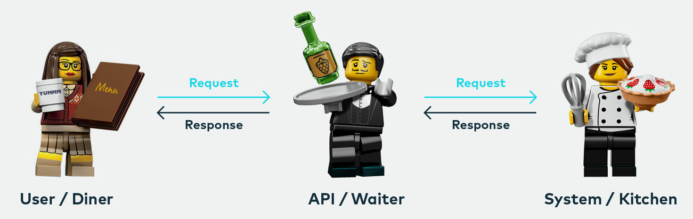

# Giriş

### Tanışlıq

Adım Emil Abbasovdur. Hazırda Mərkəzi Bankda Ani Ödənişlər Ssiteminin şöbə müdiri vəzifəsində işləyirəm. Komandamız ilə birlikdə sistemin inkişafı, bir çox proqram tətbiqlərinin yazılması və texniki infrastrukturunu təmin edirik. Bunlardan əlavə bir neçə start up üzrəində işləmişəm. Onlardan bəziləri fərqli səbəblərdən fail olub, bəziləri real mühitdədir, bəziləri isə bu yaxınlarda istismara veriləcəkdir.

Bütün bu layihələrdə IT komandası ilə sıx əməkdaşlıq etmişəm və bir çox sahələrdə onlara dəstək göstərmişəm.

Çox detallara enmirəm, kurs müddəti ərzində kimin nə sualı olsa hər zaman verə bilər.

Sizləri tanımağı çox istərdim. Çox qısa olaraq, Adınız, işlədiyiniz müəssisə və sahəni bildirərdiniz.

### Course information and Learning Path

İndi isə kurs haqqında məlumat vermək istərdim.

Ümumiyyətlə biz layihələri edərkən çox üsullardan istifadə etmişik. Hər layihə zamanı komanda ilə müzakirə edib developeri necə rahat başa sala bilərik sualları ilə mübarizə aparımışıq.&#x20;

Əvvəllər bütün məsələləri detallı yazıb ötürərdik. Amma yenədə istədiyimizə nail olmurduq, çünki developerlər sənədi oxumurdu. Nəhayət növbəti üsulumuz API First yanaşması oldu. Bu yanaşmanı öyrənərkən artıq bizdə əminlik yaranırdır ki, developerlərlə aramızda anlaşılmazlıq olmayacaq. Həqiqitəndə belə oldu, işlədiyimiz layihələr çox qısa zamanda baş ağrısız ərsəyə gəlirdi.

Təbii ki, bütün tələbləri API First formasında developerə çatdıra bilməzsən, bunun üçündə fərqli üsullardan istifadə etdik.

Və mənim çoxdankı arzum idiki, bu üsulları IT Analtiklər ilə bölüşüm. Fikir verirsinizsə sırf IT analitiklər deyirəm. Çünki bu gün işlədilən Biznes Analitik sahəsi çox genişdir. Bir qolu IT dən başlayıb, sistem analitik, biznes analitik IT ilə az işləyən və s kateqoriyalara bölener. Bu mövzunun dərininə getmək istəmirəm.&#x20;

Bu kursdakı əsas məqsədim sizlərə lazımı texniki biliklərimi ötürmək, təcrübələrimizi bir birimizlə bölüşmək və ən əsası ölkədə API First yanaşmalı analtikaya keçid etməkdir.&#x20;

&#x20;

> Kursu ümumi olaraq 3 hissəyə bölmüşəm.
>
> 1. Tech  Writing&#x20;
>
> **Birinci hissədə,** API-ın hazırlanmasından onun kodlaşdırılmasına kimi prosesləri əhatə edəcəyik. Həmçinin də, API və documentasiya üzrə sıfırdan sona kimi bütün prosesləri bitirəcəyik.
>
> Bu kursda mücərrrəd uzun uzadı danışmaq əvəzinə praktiki yanaşma ilə sizlərə biliklərimi çatdırmağa çalışacağam.
>
> Saytlarda aviabilet, hotel qiymətləri üzrə ən ucuzu seçimlərin necə edildiyini və saytlarda necə yerləşdirmək lazım olduğunu əyani formada izah etməyə çalışacam.
>
> API-dən istifadə etdikcə siz endpoints, parameters, data types, authentication, curl, JSON, the command line, Chrome’s Developer Console, JavaScript və s. haqqında öyrənəcəksiniz. İdeya ondan ibarətdir ki, nağıl formasında bu anlayışları öyrənməkdənsə, siz real senarilər əsasında proseslərin necə getdiyinin şahidi olacaqsınız. Qarşılaşdığınız proseslərin hansı formada həyata keçdiyini real nümunələr ilə görmək sizə texnologiyaların iş prinsipini daha rahat qavramağa kömək edəcəkdir.
>
> Daha sonra REST API-lar üçün standartlara, alətlərə və spesifikasiyalara keçəcəyik. Siz API sənədlərində tələb olunan bölmələr haqqında öyrənəcək, müxtəlif şirkətlərin REST API sənədlərinin nümunələrini təhlil edəcəksiniz
>
> Həmçinin də daha yuxarı səviyyədə analitika üçün Data Base üzrə ümumi modeli, həmçinində IT analitik üçün lazım olan SQL sorğularını görəcəksiniz.
>
> Siz həmçinin müxtəlif yollar ilə REST API sənədləşməsinin publish olunmasına, yeni tool-ların, GitHub kimi spesifikasiyaların, Gitbook kimi statik sayt generatorları və başqa docs-ad-codes yanaşmalarını öyrənəcəksiniz.
>
> Biz həmçinin OpenAPI spesifikasiyası və Swagger UI (OpenAPI spesifikasiyası üçün vasitələr) detallarına düşmüş olacağıq.&#x20;
>
> Bu kurs boyu mən bu anlayışları praktiki fəaliyyətlər və demolarla real, tətbiq oluna bilən kontekstlərə göstərəcəyəm.
>
>
>
> **Practice. Software development case studies**
>
> Hər bir mövzumuzu real keyslər üzrəindən başa salacam. Əlavə olaraq Software development case studies mövzularında özümüz real olaraq analitika ilə məşğul olub, layihələr üzrə API lar dizayn edəcəyik və developer Portallar yaradacağıq.
>
>
>
> **BA skills**\
> **Burada isə,** Vasitə və texnologiyalardan savayı biz proses və metodologiyaları dərindən araşdırıb, böyük və kiçik sənədləşmə layihələrini necə idarə etməyi, sənədlərlə bağlı rəyləri necə toplamağı və maraqlı tərəfləri necə məmnun etməyi öyrənəcəyik.
>
> Həmçinində burada sizə Project managementdə Agile-ın tətbiqi, Scrum Kanban framevorkları üzrə məlumat verib real proyektlər üzrə izah edəcəyəm.
>
>
>
> **Practice. Software development case studies**
>
> Növbəti hissədə, yenədə özümüz real olaraq analitika ilə məşğul olub, layihələr üzrə API lar dizayn edəcəyik və developer Portallar yaradacağıq.

> Kurs üzrə bildirdiyim kimi real layihələri işləyəcəyik. Bunlara Mobile banking app development, Open banking API-lar və s də aiddir.
>
> Bu kursda çalışcam ki, sizi yormadan məlumatları rahat şəkildə sizə çatdırım. Sırf bölgünün bu formada təşkilidə bunun üçündür, yəni ilk olaraq biz bilikləri əldə edib sonradan onlar üzərindən metodologiya və standartlara baxırıq.

### Proqramlaşdırma bacarıqları tələb olunmur 

> Bu kursda iştirak etmək üçün sizə hər hansı bir proqramlaşdırma təcrübəsinin olmasına ehtiyac yoxdur. Amma HTML və JavaScript, həmçinin də texniki baza biliklərinin olması sizə prosesləri daha yaxşı anlamağa kömək edəcəkdir. Bunları isə biz kurs daxilində ümumi olaraq öyrənəcəyik.
>
> JavaScript REST API sənədləşməsi zamanı ən çox istifadə edilən və ən asan başa düşülən proqramlaşdırma dillərindən biridir. JavaScript bizə kodları sadəcə brauzerdə açmaqla yoxlamağa imkan verir, yəni proqramın IDE-də işə salınmasına ehtiyac qalmır.&#x20;
>
> Kurs ərzində JavaScript-dən istifadə etdikcə ümumi prinsiplə sizi tanış edəcəm.

### API Tech Writer və ya Tech Writer nə üçün lazımdır

> Burada biz Tech Vriter anlayışından çox istifadə edəcəyik. Bu nə deməkdir bəs&
>
>  Bu anlayışı ölkəyə ilk dəfə biz gətirəcəyimizə görə gəlin onun nə üçün lazım olduğun qısa müzakirə edək.
>
> Bu məsələ ilə əlaqədar mən bir yazı yazmışdım və orada bu günə kimi qarşılaşdığım və şahidi olduğum əsas problemləri necə həll edə bilərik onu qeyd etmişdim.&#x20;

> Yazımda qeyd etmişdim ki,  ölkəmizdəki bir çox klassik təşkilatlarda “**API Tech Writer**” üzrə mütəxəssis çox azdır, düzü görməmişəm ola bilər olsun deyə yazdım.
>
> Bu işi görən olmadıqda isə, developer-ə düzgün tapşırıq verilmir. Belə ki, çox vaxt developer-ə ümumi prosesləri əhatə edən bir sənəd verilir, bəzən isə heç bu da verilmir və birbaşa maraqlı şəxslərlə developer-i ünsiyyətə çıxarırlar. Konkret task olmadıqda isə, developerlə saysız hesabsız müzakirələrin, "call"-ların sayı artır, məhsulu dəflərlə onlara izah etməyə ehtiyac yaranır və developer yenidən məhsulun analitikasını aparmağa məcbur qalır. Nəticədə developer həm analitik, həm kommunikasiyanı təşkil edən, həm də mübahisəli məsələ yarandıqda onu danışıqlar yolu ilə həll edən şəxs olur. Ən sonda isə öz işi, yəni devlopment ilə məşğul olmağa çox az vaxtı qalır və bütün problemlərdə "analitika yoxdur" deyərək günahları analitikanın üzərinə atır .
>
> Amma developerin öz dilində ona məlumatlar verəndə, artıq developerin bəhanə etməyə imkanı qalmır. Nəsə problem olsa biz hazırlaığımız analitikada ola bilər. Ona görə bu iş bizim işimizi dəfələrlə azaltasada məsuliyyətimizi bir o qədər də çoxaldır.&#x20;
>
> Bu kursun əsas məqsədi API-First yanaşmasının tətbiq edilməsi, API sənədləşməsinin hazırlanması və nəticədə proqramçılara aydın və dəqiq tələbləri onlara daha rahat formada çatırmaqdan ibarətdir. Həmçinin də, hazırlanmış proqram təminatının tələblərə uyğun hazırlanmasının yoxlanılmasıdır. Biz bu keyfiyyətləri mənimsəmək üçün proseslərin dərinliyinə enəcəyik.&#x20;
>
> Sadalanan keyfiyyətlərə malik olan şəxslərə isə bu gün tələblər daha yüksəkdir və artıq xaricdə Tech Writer tələbləri ilə kifayət qədər xeyli vakansiyalar mövcuddur. Əminəm ki, qısa zamanda ölkəmizdə də sırf belə mütəxəssislər axtaracaqlar.
>
> Aşağıda real iş imkanlarından bəzilərini görə bilərsiniz:
>
> Məhz bu səbəblərdəndə siz interüntdə axtarış etsəz son zamanlar məşhur şirkətlərin TEch Vriter, API Tech vakansiyalarına tələblərinin çoxaldığın görərik.

### API nədir?

> API akronimi yəni açılışı Application Programming İnterfeysdir. Yəni iki proqram təminatının bir biri ilə danışmasına xidmət edir. Hər dəfə siz telefonunuzda YouTuba, Facebook-a daxil olanda, mesaj göndərəndə və ya hava proqnozuna baxanda API-lardan istifadə edirsiniz.

### API nümunəli izah

> Gəlin real nümunə üzrə başa düşməyə çalışaq.
>
> Məsələn, Siz telefonunuzda hər hansı bir tətbiqi işlətdiyiniz vaxt nə baş verir?
>
> Bu sxemdə bizim mobil telefonumuz və serverimiz vardır. Server məlumatların emal olunduğu yer kimi başa düşək, növbəti dərslərdə daha yaxşı başa düşəcəksiniz.
>
> Deməli bizim telefon və serverimiz vardır. Telefondakı tətbiqimizi açdıqdıa, təsəvvür edək ki, bu mobil bankşılıqdır, tətbiqimiz internetə bağlanır və məlumatları serverə göndərir.&#x20;
>
> Server məlumatları aldıqdan sonra lazımı prosesləri icra edir və məlumatları yenidən sizin telefonunuza daha dəqiq telefonunzdakı tətbiqinizə qaytarır.&#x20;
>
> Tətbiq daha sonra həmin məlumatları emal edir və istədiyiniz məlumatları oxunaqlı şəkildə sizə təqdim edir.
>
>
>
> Bunu daha yaxşı izah etmək üçün digər çox məhşur olan real həyatla müqayisədəki API nümunəsi ilə tanış olaq.
>
> Təsəvvür edin ki, siz restoranda oturmusunuz və qarşısınızda bir çox seçim olan menyu vardır. Mətbəx isə sizin sifarişlərinizi hazır edən "sistemin" bir hissəsidir. buradan çatışmayan məsələ seçdiyiniz sifarişin mətbəxə çatdırılması və hazırlanmış sifarişin mətbəxdən sizə gətirilməsidir. Sırf burada isə bizim köməyimizə ofisiant və ya API gəlmiş olur. Ofisiant sorğunuzu və ya sifarişinizi qəbul edən və mətbəxə – sistemə nə etməli olduğunuzu söyləyən vasitə və ya API-dir. Yekunda ofisiant cavabı sizə çatdırır; yəni bizim keysimizdə yeməyi bizə gətirir.
>
> Burada biz - mobil telefondakı tətbiq, mətbəx - server, ofisiant - API və menyudakı seçimlər isə API parametrləridir.

> Real həyatda biz artıq bir çox yerdə rastlaşırıq ki, yemək isfarişlərini online və ya restoran daxilində elektron cihazdan (planşet, mobil telefon və s) vermək mümkündür və bu sifarişlər mətbəxdə yerləşən cihaza necə çatdırılır.
>
> Burada proses bəs necə qurulmuşdur?&#x20;
>
> Məsələ çox sadədir, biz istədiyimiz sifarişi elektron cihazdan seçib təsdiq etdikdən sonra, cihaz internet üzərindən bizim sorğumuzu mətbəxdə yerləşən cihaza çatdırır. Aşpaz həmin cihaza baxaraq bizim nə sifariş etdiyimiz ilə tanış olur. Aşağıdakı şəkildə bunun texniki təsvirini daha yaxşı görə bilərsiniz. Burada biz mətbəxə bir ədə burgeri mobil cihaz üzərindən sifariş veririk.
>
> Bizim sifarişimiz mətbəxə çatdıqdan sonra dərhal mobil tətbiqimizə qayıdır ki, burgeriniz hazırlanır. Müəyyən müddətdən sonra sifarişimi zhazır olan kimi mətbəx bizim mobil tətbiqimizə hazırdır qaytarır.

> Növbəti mövzularda real nümunələr ilə daha da prosesi aydın formada izah edəcəyəm.

### API əsas üstünlükləri

> API-ların əsas üstünlüklərindən və məqsədlərindən biri də ondan ibarətdir ki, sistemin daxildə necə işlədiyini gizlətmək və yalnız proqramçılara (inteqratorlara) lazım olan hissələrə kənara çıxarmaqdır. Yəni, sistemdən API vasitəsilə istifadə edən tərəflərə dəyişiklikləri bildirməməklə sistemin daxili tələbləri və funksiyalarını sonradan dəyişməyin mümkünlüyüdür. Məsələn bizim nümunəmizdə - mətbəxdəki işçilərin dəyişdirilməsi, yemək hazırlanma standartlarının dəyişdirilməsi nə biz (yəni müraciət edən tətbiq), nə də ofisiant (yəni API) tərəfdə hər hansı dəyişikliyə səbəb olmur.&#x20;

### Kurs üçün hansı vasitələr (tools) lazım olacaqdır?

> * **Kompüter**.
> * **Text editor -** Əgər sizin hazırda istifadə etdiyiniz text editor yoxdursa [Sublime Text](https://www.sublimetext.com/) istifadə edə bilərsiniz (həm Mac, həm də Windows üçün pulsuzdur). Əgər başqa editor-lardan (məs, [Visual Studio Code](https://code.visualstudio.com/), [Atom](https://atom.io/) və ya [Notepad++](https://notepad-plus-plus.org/)) istifadə etməyinizdə kifayətdir.&#x20;
> * **Chrome browser -** [Chrome](https://www.google.com/chrome/browser/desktop/index.html) JSON formatında göndərilmiş sorğuları rahatlıqla analiz etmək üçün Javascript Console təmin etdiyi üçün Chrome-dan istifadə edəcəyik. Həmçinin də JSON cavablarını daha rahat oxumaq üçün [JSON Formatter](https://chrome.google.com/webstore/detail/json-formatter/bcjindcccaagfpapjjmafapmmgkkhgoa?hl=en) yekləməlisiniz.
> * **Postman -** [Postman](https://www.getpostman.com/) applikasiyası bizə vizual interfeys üzərindən sorğuları göndərib və alınan cavabları görmək imkanı verir. _Chrome extension əvəzinə Postman applikasiyasın yüklədiyinizdən əmin olun._
> * **curl -** [curl](https://curl.haxx.se/)  command line-dan endpoint-lərə sorğuların göndərilməsi üçün əsas vasitədir. curl MAC-da by default qurulmuş olur, amma Windows-da by default deyildir ( bəzi Windows 10-dakı Powershell-də vardır).  Windows-da Command Prompt-u açıb `curl -V` qeyd edin. Əgər qurulu deyilsə [confusedbycode.com/curl](http://confusedbycode.com/curl) səhifəsindən yükləyə bilərsiniz ( “With Administrator Privileges (free), 64-bit”). Command Prompt-u bağlayıb yenidən açın və `curl -V` yazıb nəticəsinə baxın.
> * **Gi**<mark style="color:red;">**t**</mark><mark style="color:red;">.</mark> [<mark style="color:red;">Git</mark>](https://git-scm.com/) <mark style="color:red;">is a version control tool developers often use to collaborate on code. For Windows, see</mark> [<mark style="color:red;">https://gitforwindows.org/</mark>](https://gitforwindows.org/) <mark style="color:red;">to set up Git and the Git BASH terminal emulator. For Mac, see</mark> [<mark style="color:red;">Downloading Git</mark>](https://git-scm.com/download/mac)<mark style="color:red;">.</mark>&#x20;
> * **GitHub account**. [GitHub](https://github.com) müxtəlif fəaliyyətlər üçün, bəzən Git-də iş prosesini nümayiş etdirmək üçün, bəzən isə müxtəlif developer tool-lara daxil olmaq üçün autentifikasiya vasitəsi üçün istifadə edilir.  Əgər GitHub hesabınız yoxudrsa, yaradın.
> * Gitbook - [Gitbook](https://www.gitbook.com/) İstifadəçilər və ya proqramçılar üçün sənədləşmə yaratmağa imkan verin. Bu sənədləşmə də, API First tələblərini rahatlıqla auditoriyaya çatdırmaq mümkündür. həmçinin də, platforma avtomatik olaraq sizə URL təqdim edir və bu URL ilə istənilən yerdən sənədləşmə ilə tanış olmaq mümkün olur. Həmçinin də, platfomra GitHub ilə sinxorinizasiya olunaraq məlumat itkisinin qarşısı alınır.
> * Swagger - [Swagger](https://swagger.io/) API dizayn və sənədləşməsi üçün istifadə olunan vasitədir. Hazırda ən geniş istifadə olunan Open API vasitəsidir.
> * Stoplight
> * Apigee API Management - [Google Cloud API](https://cloud.google.com/apigee) proqramçılara cloud üzərindən çox rahatlıqla API yaratmaq, publish etmək onların monitorinqi aparmağa imkan verir.&#x20;
>
> Bunların hamsını sizin üçün hazırlamışam, evdə yükləyib hazır edərsiniz. Həmçinində yoxlanılma üsulun qeyd etmişəm
