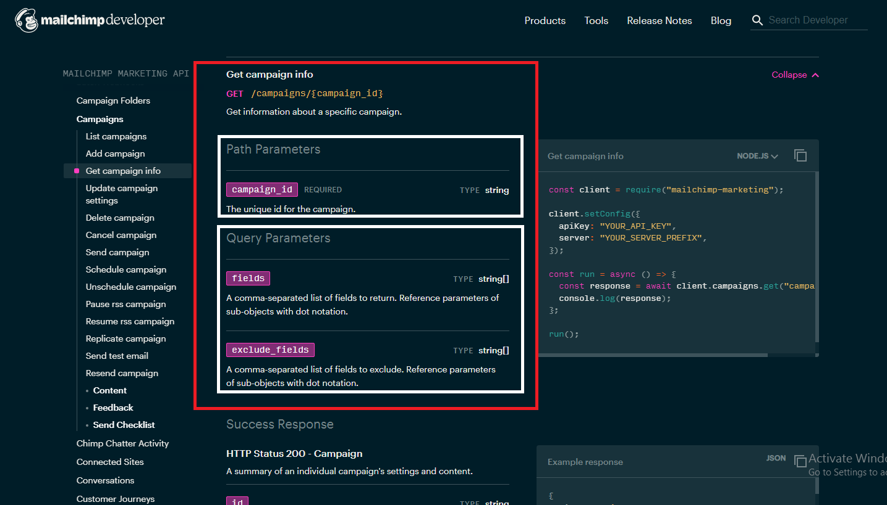
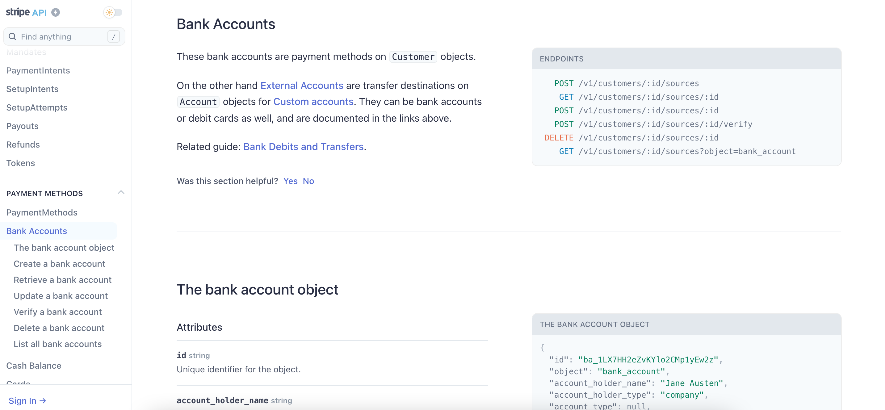

# Parametrlər

> **Parameter**-lər **Endpoint** ilə göndərə biləcəyiniz dəyərlərdir. Bu dəyərlər qayıdan cavabda (bundan sonra **Response**) hansı dəyərlərin olmasını və ya **Response**-un formatını təyin edir.&#x20;
>
> Br neçə **parametr** növü vardır:
>
> * **Header parameter.**
> * **Path parameter.**
> * **Query string parameter.**
>
> Bunlardan əlavə olaraq, [**Request body**](parametrl-r.md#request\_bodies) (sorğunun mətni) də vardır və parametr funskiyasını daşıyır, amma texniki olaraq parametr deyildir.&#x20;
>
> Yuxarıda göstərdiymiz **Parameterin** müxtəlif növləri adətən sənədləşmələrdə növlərinə aid qruplaşmalarda göstərilir. Məsələn **Header parameter**-ləri.


Nəzərə alın ki, **Endpoint**-lərdə 3 növ Parametrin də göstərilməsi məcburi deyil.


### Parametr nümunələri

> Aşağıdakı şəkildə [Mailchimp üzrə](https://mailchimp.com/developer/marketing/api/campaigns/get-campaign-info/) dizayn olunmuş **Parameter** nümunələrin göstərmişəm.



> Bu nümunədə **Parameter**-lər növlər üzrə qruplaşdırılmışdır. **Path parameter-**ləri və **Query Parameter**-ləri. Həmçinin də, gördüyünüz kimi **Path parametr**i olan <mark style="color:orange;">`{campaign_id}`</mark> **Endpoint**-də tanınması üçün <mark style="color:orange;">{fərqli verilmişdir}</mark> (fiqurlu mötərizədə).

#### [YouTube Parameters](https://developers.google.com/youtube/v3/docs/comments/list)

> Aşağıdakı nümunə YouTube-dandır. Gördüyünüz kimi burada **Parameter**-lər fərqli formada verilmişi və `required`, `optional` olmasına görə qruplaşdırılmışdır. Parameter növü şərh daxilində göstərilmişdir (<mark style="color:green;">yaşıl ilə işarələmişəm</mark>).


> Siz fərqli formalarda **Parametrləri** göstərə bilərsiniz. Bu mövzumuzun məqsədi **Parametrləri** öyrənmək və onların fərqlərini bilməkdir. Bu səbəbdən də, növbəti mövzularda "**Best Practice**" sənədləşmələri göstərəcəm.


**Parameter**-ləri hansı formada verməyinizdən asılı olarmayaraq tövsiyyə edirəm ki, onları qruplaşdırıb gözə çarpan formada istifadəçilərə çatdırasınız.&#x20;


### Parameter növləri

> REST API-nin qeyd etdiyimiz kimi bir neçə parameter növü vardır:
>
> * **Header parameter:** Request header-ə əlavə olunan dəyərlərdir və adətən avtorizasiya/autentifikasiya ilə əlaqəli olur. Bundan əvvəlki [API təhlükəsizlik mövzusunda](https://multibank.gitbook.io/api-security/) buna istinad etmişdik.
> * **Path parameter:** Endpoint daxilində query string <mark style="color:orange;">**(?)**</mark> işarəsindən əvvəl gələn dəyərlərdir. Adətən fiqurlu mötərizə <mark style="color:orange;">**({})**</mark> ilə göstərirlər.
> * **Query string parameter:** Endpoint-in query string dəyərləridir. Query string <mark style="color:orange;">**(?)**</mark> işarəsindən sonra gəlir.


**Request body** adətən yalnız **`CREATE`** və **`PUT`** metodları ilə istifadə olunaraq **JSON** obyektində göstərilir.


### Parametrlər üzrə qeyd edilməli məqamlar

> **Parametr**-ləri göstərərkən onların aşağıdakı xassələrini də mütləq qeyd edin.
>
> * [Data type](parametrl-r.md#undefined) (Məlumat növü)
> * [Max və min dəyər](parametrl-r.md#max\_min\_values)

#### Data type (Məlumat növləri)

> #### Parametrlər üçün Data type-lar
>
> Əgər **API** parametrinin **Data type**-ı və ya formatı düzgün olmazsa, bu zaman **API**-lar proqramlaşdırıldıqdan sonra dəyərlər emal olunmayacaqdır.&#x20;
>
> Bu səbəbdən də, bütün dəyərlərin [**Data type**](parametrl-r.md#value-uezr-data-type-lar)-larını qeyd etmək lazımdır.&#x20;


Əgər sizin Parameter-lərinizdən birinin formatı **string** olmalıdırsa və siz sənədləşmədə onu **integer** göstərirsinizsə, API hazırlandıqdan sonra ora daxil edilmiş dəyər emal olunmayacaq və nəticədə Proqram təminatı işləməyəcəkdir.&#x20;

Məsələn, nümunədə bizə Credit kartımızın balansı lazımdır və biz parameter kimi CreditCard yazıb göndəririk. Amma yazılmış proqram bu **Parametr** üçün bizdən yalnız rəqəm gözləyir və CreditCard sözünə **error** qaytarır.


### JSON üzrə ümumi məlumat

**JSON**, _**JavaScript Object Notation**_ deməkdir. **JSON** məlumatları **Strukturlaşdırılmış Məlumat** kimi təqdim etmək üçün insan və maşın tərəfindən oxuna bilən formatdır. JSON **əsasən** məlumatları bir kompüterdən digərinə və ya hətta eyni kompüterdəki müxtəlif proqramlar arasında ötürmək üçün istifadə olunur.

> <mark style="color:orange;">**object**</mark><mark style="color:orange;">:</mark> JSON formatı üzrə object (obyekt) **key-value** cütlüyünü bildirir. **Key-value** cütlərinin bu kolleksiyası <mark style="color:orange;">{fiqurlu mötərizlərin açılması və bağlanması ilə}</mark> <mark style="color:orange;">{ }</mark> qruplaşdırılır.
>
> Obyektin yaz;lmas; qaydalar:
>
> * _**Key-value** cütlüyü **vergül**  **,** ilə ayrılmalıdır_
> * _Hər bir **obyekt** Fiqurlu mötərizənin açılması <mark style="color:orange;">{</mark> ilə **başlamalıdır**_
> * _Hər bir **obyekt** Fiqurlu mötərizənin bağlanması <mark style="color:orange;">{</mark> ilə **bitməlidir**_
>
> Aşağıdakı nümunə **Person** obyektidir. **Person** obyektində qeyd olunan qaydalara əməl edilmişdir.

```javascript
{
 "FirstName" : "Anar",
 "Age"  : 32,
 "isMan"       : true,
 "Profession": "Developer"
}
```

> Burada <mark style="color:blue;">iki nöqtədən :</mark> solda olanlara **`key`** , sağda olanlara isə **`value`** deyilir. Yəni - <mark style="color:blue;">`"FirstName"`</mark> **Key**, `"Anar"` isə **value**-dir.

> * <mark style="color:orange;">**array**</mark>: Dəyərlərin listi.
>
> Arrays are similar to Arrays that you know from any other programming language. In JSON an Array is collection of Values separated by Comma. Here are the rules to write an Array
>
> Proqramlaşdırma dillərində istifadə olunana Array anlayışı ilə eynilik təşkil edir. **JSON**-da **Array** _Vergül_ ilə ayrılmış dəyərlər toplusundan ibarətdir.&#x20;
>
> **Array**-in hazırlanması üçün qaydalar:
>
> * _**Array** düz mötərizənin açılması **\[** ilə başlayır_
> * _Array düz mötərizənin bağlanması **]** ilə bitir_
> * _Array-dəki məlumatlar Vergül **,** ilə ayrılır_
>
> Array-i tam başa düşmək üçün gəlin aşağıdakı nümunəyə baxaq.
>
> Deyək ki, Anarın **hobbisi**-də vardır və biz onu **Person Object**-nə əlavə etməliyik. Onun hobbisi _Video oyunlarıdır_. Gəlin object-ə `key-value` əlavə edək

```javascript
{
 "FirstName" : "Anar",
 "Age"  : 32,
 "isMan"       : true,
 "Profession": "Developer",
 "Hobbies"   : "Videos games"
}
```

> Göründüyü kimi burada bir problem yoxdur. Bəs Anarın 1-dən artıq hobbisi olsa nə edəcəyik? Məsələn - _Video oyunları, Komputer, Musiqi_. Bunun üçün **Person Object**-in 3 dəfə təkrarlayacağıq?

```javascript
{
 "FirstName" : "Anar",
 "Age"  : 32,
 "isMan"       : true,
 "Profession": "Developer",
 "Hobbies"   : "Videos games"
}
{
 "FirstName" : "Anar",
 "Age"  : 32,
 "isMan"       : true,
 "Profession": "Developer",
 "Hobbies"   : "Computers"
}
{
 "FirstName" : "Anar",
 "Age"  : 32,
 "isMan"       : true,
 "Profession": "Developer",
 "Hobbies"   : "Music"
}
```

> <mark style="color:red;">**XEYR.**</mark> Bunun üçün **Array**-dən istifadə edilməlidir.

```javascript
{
 "FirstName" : "Anar",
 "Age"  : 32,
 "isMan"       : true,
 "Profession": "Developer",
 "Hobbies"   : ["Videos games", "Computers", "Music"]
}
```

> Bu nümunə JSON üzrə Array-dən düzgün istifadə olunan nümunədir.

### Value üzrə data type-lar

> * <mark style="color:orange;">**string**</mark><mark style="color:orange;">:</mark> Hərflərdən və ya rəqəmlərdən ibarət dəyərlər.
>
> Məsələn - nümunədəki `"Anar"` <mark style="color:orange;">string</mark>-dir.

> * <mark style="color:orange;">**integer**</mark><mark style="color:orange;">:</mark> Mənfi və müsbət tam ədədlər
>
> Məsələn - nümunədəki `32` <mark style="color:orange;">integer</mark>-dir.

> * <mark style="color:orange;">**boolean**</mark><mark style="color:orange;">:</mark> true və ya false dəyəri (yalnız iki dəyər olur, təsdiq və inkar)
>
> Məsələn - nümunədəki `true` <mark style="color:orange;">boolean</mark>-dır.


Proqramlaşdırmada daha çox data type (məlumat növləri) vardır. Əgər sizin xüsusi ilə qeyd etmək istədiyiniz məlumat növü varsa bunu mütləq sənədləşmədə qeyd edin.&#x20;

Məsələn, Java dili üzrə proqramlaşdırma edərkən icazə verilən məlumat növünü qeyd etmək vacibdir, çünki Java verilənlərin ölçüsünə əsasən yaddaş sahəsi ayırır. Beləliklə, Java ölçülərin daha dəqiq olmasını xoşlayır. Məsələn, byte, short, int, double, long, float, char, boolean, və s. var.&#x20;

Bununla belə, siz **REST API** sənədləşməsində bu səviyyədə detala düşməli deyilsiniz. bunları proqramçı arxitektlər təyin edirlər. Amma proqramlaşdırma biliyiniz varsa və əminsinizsə, qeyd etməyiniz çox yaxşı olar.

Məsələn, mən hər zaman sənədləşmələrdə **enum** məlumat növünü göstərirəm. **Enum** məlumat növü o halda istifadə olunurki, sizin daxil etmək üçün bəlli sayda dəyəriniz olur. Məsələn, yuxarıda göstərdiyimiz nümunədə biz Credit kartı üzrə balansı əldə etdik. Bizə kartın növləri (CardType) üzrə 2 fərqli seçim verilə bilər - **CreditCard, DebitCard**.&#x20;

Əgər bizim CardType üzrə bəlli sayda seçimimiz olursa bu məlumat növü **enum** adlanır..&#x20;


#### Max and min values for parameters <a href="#max_min_values" id="max_min_values"></a>

> **Data type**-ları müəyyən etməkdən savayı, həmçinin də **parametrlər** üzrə **minimum**, **maximum** və olduğu təqdirdə **icazə verilən** dəyərləri göstərməliyik.&#x20;
>
> Bununla belə, hər parametrin _maksimum_ və _min_ dəyərlərini göstərməyə bəzən ehtiyac olmur: Məsələn,
>
> * <mark style="color:orange;">**Booleans**</mark>: Bu dəyər üzrə yeganə seçimlər **true** və ya **false**-dur. Bu səbəbdən də burada _max/min_ göstərməyə ehtiyac yoxdur.
> * <mark style="color:orange;">**Enums**</mark>: Bundan əvvəldə qedy etdiyimiz kimi, əgər string mümkün dəyərləri (an enumerated list) tələb edərsə bu zaman _max/min_ göstərməyə ehtiyac yoxdur. Məsələn, API-da yarımkürə dəyərlərimiz varsa burada mümkün 4 dəyər ola bilər - _şimal, cənub, şərq və qərb_. Bu səbəbdən də burada max/min dəyərlərinə ehtiyac olmur..
>
> Ümumiyyətlə proqram ilkin testləşdirmə üçün hazır olduqdan sonra, <mark style="color:orange;">boolean</mark> və <mark style="color:orange;">enum</mark>-la yanaşı digər **data type**-lara icazə verilən parameter-ləri (məs, <mark style="color:orange;">string</mark>, <mark style="color:orange;">integer</mark>) yoxlayın. Məsələn, API-da ID sahəsi olarsa həmin sahəyə 300 simvol uzunluğunda, əgər fayl əlavə edə bilərsinizsə 100 MB həcmində əlavə etməyə çalışın. Əmin olun ki, API normal qaydada sorğularınızı emal edəcəkdir.


Bizim vəzifəmiz proqramçıların işini tam rahatlaşdırmaq və dəqiq tələblər verməklə sonradan yaranacaq qarışıq situasiyaların qarşısını almaqdır. Bu səbəbdəndə, sahələr üzrə tətbiq olunan məhdudiyyətləri mütləq göstərin. Çünki onları sizdən yaxşı bilən olmayacaqdır.

Çox vaxt nə proqramçılar, nə məhsul komandanız nə də QA komandanız bu məhdudiyyətləri düzgün təyin etmir və ya testləşdirmir və nəticədə əsas mühitdə istifadəçilər kobud səhvlər ilə qarşılaşırlar.



API-ları prqramçılardan təhvil alıb testləşdirən zaman mütləq fərqli formalarda parametrlər ilə yoxlayın. Məsələn, tələb olunan parametrdən az və ya çox, səhv parametr və s. Düzgün formada error cavablarının qayıtdığından əmin olun.&#x20;

_Tesləşdirmə, qayıdan error kodları və s.haqqında növbəti məqalələrimizdə danışacağıq_.


### Header parameter-i

> **Header parametr**-ləri sorğu başlığına (request header) əlavə edilir. Adətən bu dəyərlər bütün **endpoint**-lərə aid olmaqla avtorizasiya parametrləri olur. Yəni header parametri sənədləşmədə bir dəfə göstərilir və o bütün endpoint-lərdə təkrar göstərilmir. Buna baxmayaq, Header parametrləri üzrə avtorizasiya detalları sənədləşmədə ayrıca bölmə kimi adətən **avtorizasiya tələbləri** bölməsində göstərilir.


Avtorizasiya və Authentifikasiya üzrə detallı məlumat ilə bundan əvvəlki mövzumda tanış ola bilərsiniz. [API Təhlükəsizliyi](https://multibank.gitbook.io/api-security/)


### Path parameter-i

> **Path parametri endpoint**-in bir hissəsi olur və daxil edilməsi zəruridir. Məsələn, aşağıdakı endpoint-də <mark style="color:orange;">`{user}`</mark> və <mark style="color:orange;">`{bicycleId}`</mark> dəyərləri path parameter-ləri kimi zəruri dəyərlərdir.


```javascript
/user/{user}/bicycles/{bicycleId}
```


> **Path parameter**-ləri adətən qeyd etdiyimiz kimi fiqurlu mötərizədə <mark style="color:orange;">{}</mark> göstərilir. Amma bu mütləq qayda deyil, bəzi API doc dizaynda path parametri iki nöqtədən <mark style="color:orange;">:</mark> sonra, bəzilərində isə fərqli formada göstərilir.
>
> Aşağıdakı şəkildə Stripe API üzrə path parametrinin iki nöqtədən <mark style="color:orange;">:</mark> sonra əlavə edildiyini görə bilərsiniz.&#x20;



#### Path parametrinin rəngli formada göstərilməsi <a href="#color-coding-the-path-parameters" id="color-coding-the-path-parameters"></a>

> Endpoint-də Path parameter-lərin fərqli rənglə göstərməyiniz onları daha başa düşülən formaya salacaqdır. Path parametrlərin rəngli göstərəndə dərhal bilmək olur ki, endpoint-də path parametrləri hansılardır.&#x20;
>
> Məsələn sizin aşağıdakı Mailchimp API nümunəsindəki kimi path parameter-ləri göstərməyiniz i tövsiyyə edirəm.&#x20;


> Sonrada bu rənglər ilə parametrlərin təsvirini verə bilərsiniz. Məsələn,

| Path Parameter	                                  | Description        |
| ------------------------------------------------ | ------------------ |
| <mark style="color:orange;">**user**</mark>      | Description user   |
| <mark style="color:orange;">**bicycleId**</mark> | Description bcycle |

### Query string parameter-i

> Query string paramter-ləri endpoint-ə sual işarəsindən <mark style="color:orange;"></mark> <mark style="color:orange;"></mark><mark style="color:orange;">`(?)`</mark> <mark style="color:orange;"></mark><mark style="color:orange;"></mark> sonra əlavə edilir. Sual işarəsindən <mark style="color:orange;"></mark> <mark style="color:orange;"></mark><mark style="color:orange;">`(?)`</mark> sonra gələn parametrlər və onların dəyərləri **"query string"** adlanır.&#x20;
>
> **Query string**-də hər bir parametr bir birinin ardınca siyahılanır və  ampersand <mark style="color:orange;">(</mark><mark style="color:orange;">`&`</mark><mark style="color:orange;">)</mark> işarəsi ilə bir birindən ayrılır.


Query string parameter-lərinin sıra ardıcıllığı zəruri deyildir.


> Məsələn:

> `/surfreport/{beachId}?days=3`<mark style="color:orange;">`&`</mark>`units=metric`<mark style="color:orange;">`&`</mark>`time=1400`

> və ya

`/surfreport/{beachId}?time=1400`<mark style="color:orange;">`&`</mark>`units=metric`<mark style="color:orange;">`&`</mark>`days=3`

> _hər iki endpoint eyni nəticəni qaytaracaqdır._


Unutmayın ki, Path parametrlərində sırlamadakı dəyərlərin yeri dəyişdirilə bilməz.&#x20;


### Request body <a href="#request_bodies" id="request_bodies"></a>

> Əksər hallarda biz request body-də (sorğu mətni) POST (adətən nəsə yaradanda) sorğusu ilə JSON obyekti göndəririk. Bu request body kimi tanınır və formatı adaətən JSON olur (məsələn, yuxarıdakı [Person Object](parametrl-r.md#json-uezr-uemumi-m-lumat)-i).&#x20;
>
> Məsələn, biz bir resurs yaradarkən sadə **endpoint** istifadə edə bilərik - `/port/`<mark style="color:orange;">`{beachId}`</mark>. Amma sorğu mətnində (**request body**) **JSON** obyekt ilə xeyli sayda dəyərlər göndərə bilərik. Aşağıdakı formada:

```javascript
{
"days": 2,
"units": "imperial",
"time": 1433524597
}
```

> In OpenAPI v2.0, request bodies were classified as a type of parameter, but in v3.0, they are not considered a parameter but rather a path property. Given that the request body functions like a parameter, I’ve decided to leave them classified as a parameter for now. However, note that in the OpenAPI spec, request bodies are technically not a parameter.
>
> OpenAPI v2.0-da **Request body** parametr növü kimi təsnif edilirdi, lakin v3.0-da onlar parametr deyil, daha çox `path property` kimi hesab olunur. **Request body**-nin bir parametr kimi fəaliyyət göstərdiyini nəzərə alaraq, onları hələlik parametr kimi təsnif edək.&#x20;


Nəzərə alın ki, OpenAPI spesifikasiyasında Request body texniki olaraq **parametr deyil.**


#### Mürəkkəb Request body <a href="#documenting-complex-request-bodies" id="documenting-complex-request-bodies"></a>

> **JSON** məlumatları (sorğu və cavabda) API sənədləşməsinin ən çətin hissələrindən biridir.&#x20;
>
> **JSON** obyektləri sadə olarsa, məsələn eyni səviyyəli bir neçə `key-value` cütlüyü o zaman onların sənədləməsidə çox sadə olar. Amma **JSON** obyektində bir neçə obyektlər bir birinin içərisində olarsa və ya uzun şərti məlumatlar olarsa belə API-ların sənədləşməsi də çətin olur. Və sizin 100 sətr və ya 1000 sətr məlumatlarınız olarsa çox ehtiyatla fikirləşməlisinizki, bunları hansı formada verməliyəmki rahat olsun.
>
> Cədvəllər **JSON**-u sənədləşdirmək üçün yaxşı vasitədir, lakin cədvəldə yuxarı səviyyəli və alt səviyyəli elementləri ayırd etmək çətin ola bilər.Belə ki, bir obyekt digər bir obyektdən, digər obyekt isə digər obyektdən iibarət olarsa onları cədvəl şəklində göstərmək çaşqınlıq yarada bilər.
>
> Hər bir halda, əgər **JSON** obyekti nisbətən kiçikdirsə, cədvəl yəqin ki, ən yaxşı seçiminizdir. Lakin dizaynerlərin qəbul etdiyi başqa yanaşmalar da var.

### Get account balance üçün parameterlər

> Bizə t[əqdim olunan məlumatlarda](../api-reference-tutorial/a-new-endpoint-to-document.md#the-wiki-page-get-account-balance-api) parametr-lər üzrə yalnız bu məlumatlar qeyd edilmişdir.
>
> Mandatory parameter-lər:
>
> * AccountId:&#x20;
> * Receiver-Participant-Code:&#x20;
> * PSU-Device-ID-Type:&#x20;
> * PSU-Device-ID
> * PSU-IP-Address
> * Consent-ID
>
> Optional parameter-lər.
>
> * Sender-Participant-Code
>
> Bundan əlavə olaraq, həm də bilirik ki, endpointimiz bu formadadır -  /accounts/<mark style="color:orange;">{AccountId}</mark>/balances.
>
> Biz burdan [Parameter növlərini ](parametrl-r.md#parameter-noevl-ri)təyin etməliyik.
>
> Bu mövzuda öyrəndik ki, _**Path parameteri** Endpoint daxilində query string **(?)** işarəsindən əvvəl gəlir və adətən fiqurlu mötərizə <mark style="color:orange;">**({})**</mark> ilə göstərilir._ Deməli burada __ <mark style="color:orange;">{AccountId}</mark> Path parametridir.
>
> _**Query string parameteri isə** Endpointdə query string **(?)** işarəsindən sonra gələn parametrlər olur. Bu endpoint-də isə elə dəyərlər yoxdur._ Demək burada **Query string parameterləri** iştirak etmir.
>
> Deməli, digər parametrlər **Header parametrləridir.**
>
> Qeyd etdiyimiz kimi, əgər əlimizdə heç bir tool yoxdursa parametrləri cədvəl formasına göstərmək ən yaxşı variantlardan biridir. Ona görə də cədvəl formasında göstərək.



### <mark style="color:blue;">**Parameter-lər**</mark>

<mark style="color:blue;">**Path parameter-ləri**</mark>

| Path parametri                                 | Təsvir                                                                           |   |
| ---------------------------------------------- | -------------------------------------------------------------------------------- | - |
| <mark style="color:orange;">{AccountId}</mark> | Hesab nömrəsi (IBAN). <mark style="color:green;">`Get from account_table`</mark> |   |


Path parametri qeyd etdiyimiz kimi hər zaman mandatory olur. Bu səbəbdən də burada filed-in mandatory və ya optional olmasını qeyd etməyə ehtiyac yoxdur


####

#### <mark style="color:blue;">Header parameter-ləri</mark>

| Header parametri                                             | Zəruriliyi   | Type   | Description                                         |
| ------------------------------------------------------------ | ------------ | ------ | --------------------------------------------------- |
| <mark style="color:orange;">Sender-Participant-Code</mark>   | Zəruri deyil | String | Göndərən təşkilatın BIC kodu.                       |
| <mark style="color:orange;">Receiver-Participant-Code</mark> | Zəruridir    | String | Qəbul edən təşkilatın BIC kodu.                     |
| <mark style="color:orange;">PSU-Device-ID</mark>             | Zəruridir    | String | Mobil tətbiqin IMEI kodu və ya WEB saytın IP ünvanı |
| <mark style="color:orange;">Consent-ID</mark>                | Mandatory    | String | Consent identification                              |


Gördüyünüz kimi bəzi field-lərin təsvirində qeyd etmişəmki bu field haradan əldə olunmalıdır və ya nədir.  Bizə verilən məlumatlarda isə bu yox idi. Siz bu məlumatları sizə tapşırığı verən Layihə meneceri və ya Product ovner-dən almalısınız.

Hər zaman səndələşmədə özünüzü proqramçıların yerinə qoyun və əmin olun ki, onlar field-lərin hardan əldə olunmasını dərhal başa düşəcəklər.




### Növbəti addım

> Növbəti bölmədə resurs üzrə [Sorğu nümunələri](../api-reference-tutorial/step-4-request-example-api-reference-tutorial.md)[ ](../avtorizasiya-noevl-ri/step-2-endpoints-and-methods-api-reference-tutorial.md)ilə tanış olacağıq.&#x20;
