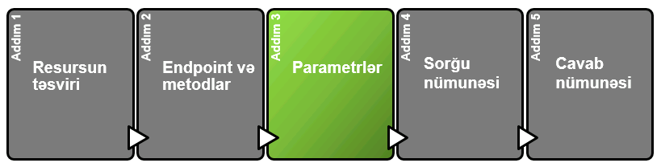

# Parametrlər

> **Parameter**-lər **Endpoint** ilə göndərə biləcəyiniz dəyərlərdir. Bu dəyərlər qayıdan cavabda (bundan sonra **Response**) hansı dəyərlərin olmasını və ya **Response**-un formatını təyin edir.&#x20;
>
> Bir neçə **parametr** növü vardır:
>
> * **Header parameter.**
> * **Path parameter.**
> * **Query string parameter.**
>
> Bunlardan əlavə olaraq, [**Request body**](parametrl-r.md#request\_bodies) (sorğunun mətni) də vardır və parametr funskiyasını daşıyır, amma texniki olaraq parametr deyildir.&#x20;
>
> Yuxarıda göstərdiyimiz **Parameterin** müxtəlif növləri adətən sənədləşmələrdə növlərinə aid qruplaşmalarda göstərilir. Məsələn **Header parameter**-ləri.


Nəzərə alın ki, **Endpoint**-lərdə 3 növ Parametrin də eyni anda göstərilməsi məcburi deyil. API Dizayn edərkən buna **Tech Writer** qərar verir.


### Parametr nümunələri

> Aşağıdakı şəkildə [Mailchimp üzrə](https://mailchimp.com/developer/marketing/api/campaigns/get-campaign-info/) dizayn olunmuş **Parameter** nümunələrini göstərmişəm.

> Bu nümunədə **Parameter**-lər növlər üzrə qruplaşdırılmışdır. **Path parameter-**ləri və **Query Parameter**-ləri. Həmçinin də, gördüyünüz kimi **Path parametr**i olan <mark style="color:orange;">`{campaign_id}`</mark> **Endpoint**-də tanınması üçün <mark style="color:orange;">{fərqli verilmişdir}</mark> (fiqurlu mötərizədə).

#### [YouTube Parameters](https://developers.google.com/youtube/v3/docs/comments/list)

> Aşağıdakı nümunə YouTube-dandır. Gördüyünüz kimi burada **Parameter**-lər fərqli formada verilmiş və `required`, `optional` olmasına görə qruplaşdırılmışdır. Parameter növü şərh daxilində göstərilmişdir (<mark style="color:green;">yaşıl ilə işarələmişəm</mark>).

> Siz fərqli formalarda **Parametrləri** göstərə bilərsiniz. Bu mövzumuzun məqsədi **Parametrləri** öyrənmək və onların fərqlərini bilməkdir. Bu səbəbdən də, növbəti mövzularda "**Best Practice**" sənədləşmələri göstərəcəm.


**Parameter**-ləri hansı formada verməyinizdən asılı olmayaraq tövsiyyə edirəm ki, onları qruplaşdırıb gözə çarpan formada istifadəçilərə çatdırasınız.&#x20;


### Parameter növləri

> REST API-nin qeyd etdiyimiz kimi bir neçə parameter növü vardır:
>
> * **Header parameter:** Request header-ə əlavə olunan dəyərlərdir və adətən avtorizasiya/autentifikasiya ilə əlaqəli olur. Bundan əvvəlki [API təhlükəsizlik mövzusunda](https://multibank.gitbook.io/api-security/) buna istinad etmişdik.
> * **Path parameter:** Endpoint daxilində query string <mark style="color:orange;">**(?)**</mark> işarəsindən əvvəl gələn dəyərlərdir. Adətən fiqurlu mötərizə <mark style="color:orange;">**({})**</mark> ilə göstərirlər.
> * **Query string parameter:** Endpoint-in query string dəyərləridir. Query string <mark style="color:orange;">**(?)**</mark> işarəsindən sonra gəlir.


**Request body** adətən yalnız **`POST`** və **`PUT`** metodları ilə istifadə olunaraq **JSON** obyektində göstərilir.


### Header parameter-i

> **Header parametr**-ləri adətən sorğunun başlığına (**request header**) əlavə edilir.&#x20;
>
> Adətən bu dəyərlər bütün **endpoint**-lərə aid olmaqla avtorizasiya parametrləri və sorğunun strukturun (JSON və ya XML) təyin edir.&#x20;
>
> Məsələn,
>
> `Content-type` - application/json
>
> `Authorisation` - Basic Auth
>
> Request Header parametri sənədləşmədə bir dəfə göstərilir və o bütün endpoint-lərdə təkrar göstərilmir.&#x20;
>
> Buna baxmayaq, Request header parametrləri üzrə avtorizasiya detalları sənədləşmədə ayrıca bölmə kimi adətən **avtorizasiya tələbləri** bölməsində də göstərilir.
>
> Bunlardan əlavə digər həsas məlumatlarda header parametrlərində göstərilə bilər.


Avtorizasiya və Authentifikasiya üzrə detallı məlumat ilə bundan əvvəlki mövzumda tanış ola bilərsiniz. [API Təhlükəsizliyi](https://multibank.gitbook.io/api-security/)


### Path parameter-i

> **Path parametri endpoint**-in bir hissəsi olur və daxil edilməsi zəruridir. Məsələn, aşağıdakı mailchimp endpointində <mark style="color:orange;">`{campaignId}`</mark> dəyərləri path parameter kimi zəruri dəyərlərdir.

> **Path parameter**-ləri adətən qeyd etdiyimiz kimi fiqurlu mötərizədə <mark style="color:orange;">{}</mark> göstərilir. Amma bu mütləq qayda deyil, bəzi API doc dizaynında path parametri iki nöqtədən <mark style="color:orange;">:</mark> sonra, bəzilərində isə fərqli formada göstərilir.
>
> Aşağıdakı şəkildə Stripe API üzrə path parametrinin iki nöqtədən <mark style="color:orange;">:</mark> sonra əlavə edildiyini görə bilərsiniz.&#x20;

### Query string parameter-i

> Query string parametr-ləri endpoint-ə sual işarəsindən <mark style="color:orange;"></mark> <mark style="color:orange;"></mark><mark style="color:orange;">`(?)`</mark> <mark style="color:orange;"></mark><mark style="color:orange;"></mark> sonra əlavə edilir. Sual işarəsindən <mark style="color:orange;"></mark> <mark style="color:orange;"></mark><mark style="color:orange;">`(?)`</mark> sonra gələn parametrlər və onların dəyərləri **"query string"** adlanır.&#x20;
>
> **Query string**-də hər bir parametr bir birinin ardınca siyahılanır və  ampersand <mark style="color:orange;">(</mark><mark style="color:orange;">`&`</mark><mark style="color:orange;">)</mark> işarəsi ilə bir-birindən ayrılır.


Query string parameter-lərinin sıra ardıcıllığı zəruri deyildir.


> Məsələn:

> `/surfreport/{beachId}?days=3`<mark style="color:orange;">`&`</mark>`units=metric`<mark style="color:orange;">`&`</mark>`time=1400`

> və ya

`/surfreport/{beachId}?time=1400`<mark style="color:orange;">`&`</mark>`units=metric`<mark style="color:orange;">`&`</mark>`days=3`

> _hər iki endpoint eyni nəticəni qaytaracaqdır._


Unutmayın ki, Path parametrlərində sıralamadakı dəyərlərin yeri dəyişdirilə bilməz.&#x20;


> **Nümunələrdə paraemtrlərin hansı formada verildiyini görə bilərsiz**

#### Path parametrinin rəngli formada göstərilməsi 

> Endpoint-də Path parameter-lərini fərqli rənglə göstərməyiniz onları daha başa düşülən formaya salacaqdır. Path parametrlərini rəngli göstərəndə dərhal bilmək olur ki, endpoint-də path parametrləri hansılardır.&#x20;
>
> Məsələn sizin aşağıdakı Mailchimp API nümunəsindəki kimi path parameter-ləri göstərməyinizi tövsiyyə edirəm.&#x20;

> Sonrada bu rənglər ilə parametrlərin təsvirini verə bilərsiniz. Məsələn,

| Path Parameter	                                  | Description        |
| ------------------------------------------------ | ------------------ |
| <mark style="color:orange;">**user**</mark>      | Description user   |
| <mark style="color:orange;">**bicycleId**</mark> | Description bcycle |

### [Tapşırıq](../tapsiriq.md#s-n-dl-sdirm-k-uecuen-m-lumat) üçün parameterlər

> İndi isə `Get account balance API` **endpoint**-i üçün Parametr-ləri hazırlayaq.

> Bizə [təqdim olunan məlumatlarda](../tapsiriq.md#s-n-dl-sdirm-k-uecuen-m-lumat) parametr-lər üzrə yalnız bu məlumatlar qeyd edilmişdir.
>
> Mandatory parameter-lər:
>
> * AccountId:&#x20;
> * Receiver-Participant-Code:&#x20;
> * PSU-Device-ID-Type:&#x20;
> * PSU-Device-ID
> * PSU-IP-Address
> * Consent-ID
>
> Optional parameter-lər.
>
> * Sender-Participant-Code
>
> Bundan əlavə olaraq, həm də bilirik ki, endpointimiz bu formadadır -  /accounts/<mark style="color:orange;">{AccountId}</mark>/balances.
>
> Biz burdan [Parameter növlərini ](parametrl-r.md#parameter-noevl-ri)təyin etməliyik.
>
> Bu mövzuda öyrəndik ki, _**Path parameteri** Endpoint daxilində query string **(?)** işarəsindən əvvəl gəlir və adətən fiqurlu mötərizə <mark style="color:orange;">**({})**</mark> ilə göstərilir._ Deməli burada __ <mark style="color:orange;">{AccountId}</mark> Path parametridir.
>
> _**Query string parameteri isə** Endpointdə query string **(?)** işarəsindən sonra gələn parametrlər olur. Bu endpoint-də isə elə dəyərlər yoxdur._ Demək burada **Query string parametrləri** iştirak etmir.
>
> Deməli, digər parametrlər **Header parametrləridir.**
>
> Qeyd etdiyimiz kimi, əgər əlimizdə heç bir tool yoxdursa parametrləri cədvəl formasında göstərmək ən yaxşı variantlardan biridir. Ona görə də cədvəl formasında göstərək.



### <mark style="color:blue;">**Parameter-lər**</mark>

<mark style="color:blue;">**Path parameter-ləri**</mark>

| Path parametri                                 | Məlumat növü | Təsviri              |   |
| ---------------------------------------------- | ------------ | -------------------- | - |
| <mark style="color:orange;">{AccountId}</mark> | String (28)  | Hesab nömrəsi (IBAN) |   |


Path parametri qeyd etdiyimiz kimi hər zaman mandatory olur. Bu səbəbdən də burada field-in mandatory və ya optional olmasını qeyd etməyə ehtiyac yoxdur


####

#### <mark style="color:blue;">Header parameter-ləri</mark>

| Header parametri                                             | Zəruriliyi   | Məlumat növü      | Təsviri                                                                   |
| ------------------------------------------------------------ | ------------ | ----------------- | ------------------------------------------------------------------------- |
| <mark style="color:orange;">Sender-Participant-Code</mark>   | Zəruri deyil | Integer (8)       | Göndərən təşkilatın kodu                                                  |
| <mark style="color:orange;">Receiver-Participant-Code</mark> | Zəruridir    | Integer (8)       | Qəbul edən təşkilatın kodu                                                |
| <mark style="color:orange;">PSU-Device-ID</mark>             | Zəruridir    | String (up to 25) | Mobil tətbiqin IMEI kodu və ya WEB saytın IP ünvanı                       |
| <mark style="color:orange;">Consent-ID</mark>                | Zəruridir    | String (up to 30) | Consent identifikator. `Consent registration` sorğusu zamanı əldə olunur. |


Gördüyünüz kimi bəzi field-lərin təsvirində qeyd etmişəm ki, bu field haradan əldə olunmalıdır və ya nədir.  Bizə verilən məlumatlarda isə bu yox idi. Siz bu məlumatları sizə tapşırığı verən Layihə meneceri və ya Product Owner-dən **mütləq almalısınız.**

Hər zaman sənədləşmədə özünüzü proqramçıların yerinə qoyun və əmin olun ki, onlar field-lərin hardan əldə olunmasını dərhal başa düşəcəklər.




### Növbəti addım

> Növbəti bölmədə resurs üzrə [Sorğu nümunələri](sorgu-nuemun-si.md)ilə tanış olacağıq.&#x20;
