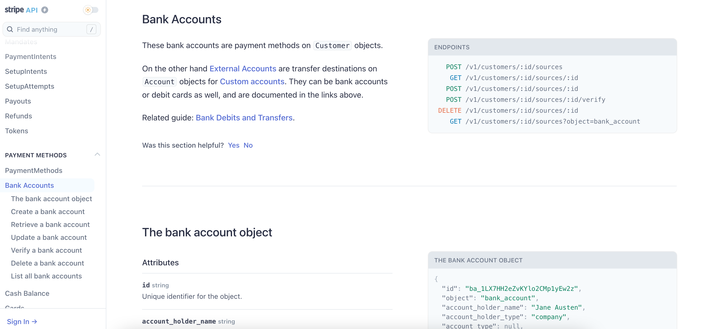

# Step 3: Parameters (API reference tutorial)

> Parameter-lər Endpoint ilə göndərə biləcəyiniz dəyərlərdir. Bu dəyərlər qayıdan cavabda (bundan sonra Response) hansı dəyərlərin olmasını və ya Response-un formatını təyin edir.&#x20;
>
> Br neçə parameter növü vardır:
>
> * Header parameter
> * Path parameter
> * Query string parameter.
>
> Request body (sorğunun mətni) parametr funskiyasını daşıyır amma texniki olaraq parametr deyildir.&#x20;
>
> Yuxarıda göstərdiymiz Parameterin müxtəlif növləri adətən sənədləşmələrdə növlərinə aid qruplaşmalarda göstərilir. Məsələn Header parameter-ləri.
>
> Endpoint-lərdə göstərilən 3 növ Parametrin olması məcburi deyil.

### Examples of parameters <a href="#examples-of-parameters" id="examples-of-parameters"></a>

> The following screenshot shows a sample parameters section with the Box API:
>
> Aşağıdakı şəkildə [Mailchimp üzrə](https://mailchimp.com/developer/marketing/api/campaigns/get-campaign-info/) dizayn olunmuş Parameter nümunələrin yerləşdirmişəm.


> Bu nümunədə Parameter-lər növlər üzrə qruplaşdırılmışdır. Path parameter və Query Parameter-ləri. Həmçinin də Path parametri olan `campaign_id` Endpoint-də tanınması üçün fərqli verilmişdir (fiqurlu mötərizədə).

#### [YouTube Parameters](https://developers.google.com/youtube/v3/docs/comments/list)

> Aşağıdakı nümunə YouTube-dandır. Gördüyünüz kimi burada Parameter-lər fərqli formada verilmişi və Required, optional olmasına görə qruplaşdırılmışdır. Parameter növü isə yaşıl ilə işarələdiyim kimi şərh daxilində göstərilmişdir.


> You can format the values in a variety of ways (aside from a table). If you’re using a definition list or other non-table format, be sure to develop styles that make the values easily readable.
>
> Siz fərqli formalarda bunu göstərə bilərsiniz. Bu mövzumuzun məqsədi Parametr-ləri öyrənmək və onların fərqlərini bilməkdir. Bu səbəbdən də, növbəti mövzularda "Best Practice" sənədləşmələri göstərəcəm.
>
>


Parameter-ləri hansı formada verməyinizdən asılı olarmayaraq tövsiyyə edirəm ki, onları qruplaşdırıb gözə çarpan formada Developerlərə çatdırasınız.&#x20;


### Parameter növləri

> REST API-nin qeyd etdiyimiz kimi bir neçə parameter növü vardır:
>
> * **Header parameter:** Request header-ə əlavə olunan dəyərlərdir və adətən avtorizasiya/autentifikasiya ilə əlaqəli olur. Bundan əvvəlki API təhlükəsizlik mövzusunda buna istinad etmişdik.
> * **Path parameter:** Endpoint daxilində query string **(?)** işarəsindən əvvəl gələn dəyərlərdir. Adətən fiqurlu mötərizə **({})** ilə göstərirlər.
> * **Query string parameter:** Endpoint-in query string dəyərləridir. !uery string **(?)** işarəsindən sonra gəlir.
>
> Another property closely related to parameters, and which used to be [referred to as a parameter in OpenAPI v2.0](https://swagger.io/docs/specification/2-0/describing-request-body/), is the request body, or [`requestBody`](https://swagger.io/docs/specification/describing-request-body/) in OpenAPI code form. The request body is usually only used with CREATE or PUT methods and often includes a JSON object included in the body of the request. More details are provided in [Request bodies](https://idratherbewriting.com/learnapidoc/docapis\_doc\_parameters.html#request\_bodies).

### What to note in parameter documentation <a href="#what-to-note-in-parameter-documentation" id="what-to-note-in-parameter-documentation"></a>

> Parametr-ləri göstərərkən onların aşağıdakı xassələrinidə mütləq qedy edin.
>
> * [Data type](https://idratherbewriting.com/learnapidoc/docapis\_doc\_parameters.html#data\_types\_parameters) (Məlumüt növü)
> * [Max və min dəyər](https://idratherbewriting.com/learnapidoc/docapis\_doc\_parameters.html#max\_min\_values)
>
> #### Parametrlər üçün Data type-lar
>
> Əgər API parametrinin Data type-ı və ya formatı düzgün olmazsa, bu zaman API-lar proqramlaşdırıldıqdan sonra dəyərlər emal olunmayacaqdır. Bütün dəyərlərin Data type-larını qeyd etmək lazımdır.&#x20;


Əgər sizin Parameter-lərinizdən birinin formatı **string** olmalıdırsa və siz sənədləşmədə onu **integer** göstərirsinizsə, API hazırlandıqdan sonra ora daxil edilmiş dəyər emal olunmayacaq və nəticədə Proqram təminatı işləməyəcəkdir.&#x20;

Məsələn, nümunədə bizə Credit kartımızın balansı lazımdır və biz parameter kimi CreditCard yazıb göndəririk. Amma yazılmış proqram bu Parameter üçün bizdən yalnız rəqəm gözləyir və CreditCard sözünə error qaytarır.


> REST API-lər üzrə ən çox istifadə edilən data type-lar:
>
> * **string**: An alphanumeric sequence of letters and/or numbers
> * **integer**: A whole number — can be positive or negative
> * **boolean**: True or false value
> * **object**: Key-value pairs in JSON format
> * **array**: A list of values


Proqramlaşdırmada daha çox Məlumat növləri vardır. Əgər sizdə xüsusi ilə qeyd etmək istədiyiniz məlumat növü varsa bunu mütləq sənədləşmədə qeyd edin.&#x20;

Məsələn, Java dili üzrə proqramlaşdırma edərkən icazə verilən məlumat növünü qeyd etmək vacibdir, çünki Java verilənlərin ölçüsünə əsasən yaddaş sahəsi ayırır. Beləliklə, Java ölçülərin daha dəqiq olmasını xoşlayır. Məsələn, byte, short, int, double, long, float, char, boolean, və s. var.&#x20;

Bununla belə, siz REST API sənədləşməsində bu səviyyədə detala düşməli deyilsiniz. bunları proqramçı arxitektlər təyin edirlər. Amma proqramlaşdırma bilyiniz varsa və əminsinizsə, qeyd etməyiniz çox yaxşı olar.

Məsələn mən hər zaman sənədləşmələrdə enum məlumat növünü göstərirəm. Enum məlumat növü o halda istifadə olunurki, sizin daxil etmək üçün bəlli sayda dəyəriniz olur. Məsələn, nümunədəki kimi, hansı kartın abalansın əldə etmək üçün, sizdə 4 seçim var CreditCard, DebitCard and others. Bu səbəbdəndə CardType filed-nin məlumat növü enumdır.&#x20;


#### Max and min values for parameters <a href="#max_min_values" id="max_min_values"></a>

>
>
> Data type-ları müəyyən etməkdən savayı, həmçinin də parametrlər üzrə minimum, maximum və olduğu təqdirdə icazə verilən dəyərləri göstərməliyik. For example, if the weather API allows only longitude and latitude coordinates of specific countries, these limits should be described in the parameters documentation. Omitting information about max/min values or other prohibited values (when applicable) is a common pitfall in docs.,&#x20;
>
> Not every parameter needs max and min values, however. Note these exceptions:
>
> Bununla belə, hər parametrin maksimum və min dəyərlərini göstərməyə bəzən ehtiyac olmur: Məsələn,
>
> * **Booleans**: Bu dəyər üzrə yeganə seçimlər true və ya false-dur. Bu səbəbdən də burada max/min göstərməyə ehtiyac yoxdur.
> * **Strings that use enums**: If a string restricts possible values to enums (an enumerated list), the max/min values wouldn’t be appropriate. For example, a geo-related enum might allow only these values: north, south, east, west. There is no max/min value in this case.
>
> Ümumiyyətlə proqram ilkin testləşdirmə üçün hazır olduqdan sonra, Boolean və enum-dan fərqli data type-lara icazə verilən parameter-ləri (məs, string, integer) yoxlayın. məsələn, API-da ID sahəsi olarsa həmin sayə 300 simvol uzunluğunda, əgər fayl əlavə edə bilərsinizsə 100 MB həcmində əlavə etməyə çalışın. Əmin olun ki, API normal qaydada sorğularınızı emal edəcəkdir.

> Bizim vəzifəmiz proqramçıların işini tam rahatlaşdırmaq və dəqiq tələblər verməklə sonradan yaranacaq qarışıq situasiyaların qarşısını almaqdır. Bu səbəbdəndə, sahələr üzrə tətbiq olunan məhdudiyyətləri mütləq göstərin. Çünki onları sizdən yaxşı bilən olmayacaq.
>
> Çox vaxt nə proqramçılar nə məhsul komandanız nə də QA komandanız bu məhdudiyyətləri bilmir və nəticədə əsas mühitdə istifadəçilər kobud səhvlər ilə qarşılaşırlar.\
>


API-ları prqramçılardan təhvil alıb testləşdirən zaman mütləq fərqli formalarda parameterlər ilə yoxlayın. Məsələn, tələb olunan parametrdən az və ya çox, səhv parametter və s. Baxın görən hansı formada error cavabları qaydacaqdır.&#x20;

Tesləşdirmə, qayıdan error kodları və s.haqqında növbəti məqalələrimizdə danışacağıq.



### Header parameters

> Header parametr-ləri sorğu başlığına (request header) əlavə edilir. Adətən bu dəyərlər bütün endpoint-lərə aid olmaqla avtorizasiya parametrləri olur və bütün endpointlərə aid olur; yəni header parametrin sənədləşmədə bir dəfə göstərilir və o bütün endpoint-lərdə təkara göstərilmir. Buna baxmayaq, Header parametrləri üzrə avtorizasiya detalları sənədləşmədə ayrıca bölmə kimi adətən **avtorizasiya tələbləri** bölməsində göstərilir.


Avtorizasiya və Authentifikasiya üzrə detallı məlumat ilə bundan əvvəlki mövzumda tanış ola bilərsiniz. [API Təhlükəsizliyi](https://multibank.gitbook.io/api-security/)


### Path parameters

> Path parametri endpointin bir hissəsi olaraq daxil edilməsi zəruridir. Məsələn, aşağıdakı endpoint-də <mark style="color:orange;">`{user}`</mark> və <mark style="color:orange;">`{bicycleId}`</mark> dəyərləri path parameter-ləri kimi zəruri dəyərlərdir.


```json
/service/myresource/user/{user}/bicycles/{bicycleId}
```


> Path parameters are usually set off with curly braces, but some API doc styles precede the value with a colon or use a different syntax. When you document path parameters, indicate the default values, the allowed values, and other details.
>
> Path parameter-ləri adətən qeyd etdiyimiz kimi fiqurlu mötərizədə <mark style="color:orange;">{}</mark> göstərilir. Amma bu mütlə qayda deyil, bəzi API doc dizaynda path parametri iki nöqtədən <mark style="color:orange;">:</mark> sonra, bəzilərində isə fərqli formada göstərilir.
>
> Aşağıdakı şəkildə Stripe API üzrə path parametrinin iki nöqtədən <mark style="color:orange;">:</mark> sonra əlavə edildiyini görə bilərsiniz.&#x20;



#### Color coding the path parameters <a href="#color-coding-the-path-parameters" id="color-coding-the-path-parameters"></a>

> Endpoint-də Path parameter-lərin fərqli rənglə göstərməyiniz onları daha başa düşülən formaya salacaqdır. Path parametrlərin rəngli göstərəndə dərhal bilmək olur ki, endpoint-də path parametrləri hansılardır.&#x20;
>
> Məsələn siz aşağıdakı şəkildəki kimi path parameter-ləri göstərməyiniz məsləhətdir.&#x20;


> You could then use the same color for these parameters in later descriptions:

| Path Parameter	                                  | Description        |
| ------------------------------------------------ | ------------------ |
| <mark style="color:orange;">**user**</mark>      | Description user   |
| <mark style="color:orange;">**bicycleId**</mark> | Description bcycle |
|                                                  |                    |

> By color coding the parameters, it’s easy to see the parameter being defined and how it relates to the endpoint definition.

### Query string parameters

> Query string paramter-ləri endpoint-ə sual işarəsindən <mark style="color:orange;"></mark> <mark style="color:orange;"></mark><mark style="color:orange;">`(?)`</mark> <mark style="color:orange;"></mark><mark style="color:orange;"></mark> sonra əlavə edilir. sual işarəsindən <mark style="color:orange;"></mark> <mark style="color:orange;"></mark><mark style="color:orange;">`(?)`</mark> sonra gələn parameterlər və onların dəyərləri "query string" adlanır.&#x20;
>
> Query string-də hər bir parametr bir birinin ardınca siyahılanır və  ampersand <mark style="color:orange;">(</mark><mark style="color:orange;">`&`</mark><mark style="color:orange;">)</mark> işarəsi ilə bir birindən ayrılır.


Query string parameter-lərinin sıra ardıcıllığı zəruri deyildir.


> For example:

> `/surfreport/{beachId}?days=3`<mark style="color:orange;">`&`</mark>`units=metric`<mark style="color:orange;">`&`</mark>`time=1400`

> və ya

`/surfreport/{beachId}?time=1400`<mark style="color:orange;">`&`</mark>`units=metric`<mark style="color:orange;">`&`</mark>`days=3`

> eyni nəticəni qaytaracaqdır.


However, with path parameters, the order _does_ matter. If the parameter is part of the actual endpoint (not added after the query string), you usually describe this value in the description of the endpoint itself.

Unutmayın ki, Path parametrlərində sırlamadakı dəyərlərin yeri dəyişdirilə bilməz.&#x20;


### Request bodies <a href="#request_bodies" id="request_bodies"></a>

> Frequently, with POST requests (where you’re creating something), you submit a JSON object in the request body. This is known as a request body, and the format is usually JSON. This JSON object may be a lengthy list of key-value pairs with multiple levels of nesting.
>
> Məsələn, endpoint sadə ola bilər - `/surfreport/`<mark style="color:orange;">`{beachId}`</mark>. Amma siz sorğu mətnində (request body) JSON obyekt ilə xeyli sayda dəyərlər göndərə bilərsiniz. Aşağıdakı formada^

```javascript
{
"days": 2,
"units": "imperial",
"time": 1433524597
}
```

> In OpenAPI v2.0, request bodies were classified as a type of parameter, but in v3.0, they are not considered a parameter but rather a path property. Given that the request body functions like a parameter, I’ve decided to leave them classified as a parameter for now. However, note that in the OpenAPI spec, request bodies are technically not a parameter.

#### Documenting complex request bodies <a href="#documenting-complex-request-bodies" id="documenting-complex-request-bodies"></a>

> JSON məlumatları (sorğu və cavabda) API sənədləşməsində ən çətin hissələrindən biridir. JSON obyektləri sadə olarsa,məsələn eyni səviyyəli bir neçə key-value cütlüyü o zaman onların sənədləməsidə çox sadə olar. Amma JSOn obyektində bir neçə obyektlər bir birinin içərisində olarsa, uzun şərti məlumatlar olarsa belə API-ların sənədləşməsi də çətin olur. Və sizin 100 sətr və ya 1000 sətr məlumatlarınız olarsa çox ehtiyatla fikirləşməlisinizki, bunları hansı formada verək.
>
> Cədvəllər JSON-u sənədləşdirmək üçün yaxşı vasitədir, lakin cədvəldə yuxarı səviyyəli və alt səviyyəli elementləri ayırd etmək çətin ola bilər.Belə ki, bir obyekt digər bir obyektdən, digər obyekt isə digər obyektdən iibarət olarsa onları cədvəl şəklində göstərmək çaşqınlıq yarada bilər.
>
> Hər bir halda, əgər JSON obyekti nisbətən kiçikdirsə, cədvəl yəqin ki, ən yaxşı seçiminizdir. Lakin dizaynerlərin qəbul etdiyi başqa yanaşmalar da var.
>
> Take a look at eBay’s resource. Here’s the request body (in this case, the format is XML):
>
> eBay-in [findItemsByProduct](https://developer.ebay.com/DevZone/finding/CallRef/findItemsByProduct.html)  resursuna nəzər salın. Burada request body göstərilmişdir (bu keysdə format XML-dir):

### Parameters for the surfreport endpoint <a href="#parameters-for-the-surfreport-endpoint" id="parameters-for-the-surfreport-endpoint"></a>

### Get account balance üçün parameterlər

> Bizə t[əqdim olunan məlumatlarda](a-new-endpoint-to-document.md#the-wiki-page-get-account-balance-api) parametr-lər üzrə yalnız bu məlumatlar qeyd edilmişdir.
>
> Mandatory parameter-lər:
>
> * AccountId:&#x20;
> * Receiver-Participant-Code:&#x20;
> * PSU-Device-ID-Type:&#x20;
> * PSU-Device-ID
> * PSU-IP-Address
> * Consent-ID
>
> Optional parameter-lər.
>
> * Sender-Participant-Code
>
> Bundan əlavə olaraq, həm də bilirik ki, endpointimiz bu formadadır -  /accounts/<mark style="color:orange;">{AccountId}</mark>/balances.
>
> Biz burdan [Parameter növlərini ](step-3-parameters-api-reference-tutorial.md#parameter-noevl-ri)təyin etməliyik.
>
> Bu mövzuda öyrəndik ki, _**Path parameteri** Endpoint daxilində query string **(?)** işarəsindən əvvəl gəlir və adətən fiqurlu mötərizə <mark style="color:orange;">**({})**</mark> ilə göstərilir._ Deməli burada __ <mark style="color:orange;">{AccountId}</mark> Path parametridir.
>
> _**Query string parameteri isə** Endpointdə query string **(?)** işarəsindən sonra gələn parametrlər olur. Bu endpoint-də isə elə dəyərlər yoxdur._ Demək burada **Query string parameterləri** iştirak etmir.
>
> Deməli, digər parametrlər **Header parametrləridir.**



### <mark style="color:blue;">**Parameter-lər**</mark>

<mark style="color:blue;">**Path parameter-ləri**</mark>

| Path parameter                                 | Description                                                                                                       |   |
| ---------------------------------------------- | ----------------------------------------------------------------------------------------------------------------- | - |
| <mark style="color:orange;">{AccountId}</mark> | Account identification                                                                                            |   |
|                                                | The value for the beach you want to look up. Valid `beachId` values are available from our site at sampleurl.com. |   |


Path parametri qeyd etdiyimiz kimi hər zaman mandatory olur. O səbəbdən də burada filed-in mandatory və ya optional olmasını qeyd etməyə ehtiyac yoxdur


####

#### <mark style="color:blue;">Header parameter-ləri</mark>

| Header parameter                                             | Required / optional | Type   | Description                                                                                                                                                                                         |
| ------------------------------------------------------------ | ------------------- | ------ | --------------------------------------------------------------------------------------------------------------------------------------------------------------------------------------------------- |
| <mark style="color:orange;">Sender-Participant-Code</mark>   | Optional            | String | BIC/pseudoBIC of sending participant                                                                                                                                                                |
| <mark style="color:orange;">Receiver-Participant-Code</mark> | Mandatory           | String | BIC/pseudoBIC of receiving participant                                                                                                                                                              |
| <mark style="color:orange;">PSU-Device-ID-Type</mark>        | Mandatory           | String | <p></p><p>UUID (Universally Unique Identifier) type for a device, which is used by the customer type. Supported values are:</p><ul><li>IMEI</li><li>TERMINAL</li><li>WEB</li><li>MERCHANT</li></ul> |
| <mark style="color:orange;">PSU-Device-ID</mark>             |                     |        | UUID (Universally Unique Identifier) for a device, which is used by the customer, i.e. IMEI value of mobile phone                                                                                   |
| <mark style="color:orange;">PSU-IP-Address</mark>            | Mandatory           | String | IP address of a device, which is used by the customer                                                                                                                                               |
| <mark style="color:orange;">Consent-ID</mark>                | Mandatory           | String | Consent identification                                                                                                                                                                              |


Gördüyünüz kimi bəzi field-lərin təsvirində qeyd etmişəmki bu field haradan əldə olunmalıdır və ya nədir.  Bizə verilən məlumatlarda isə bu yox idi. Siz bu məlumatları sizə tapşırığı verən Layihə meneceri və ya Product ovner-dən almalısınız.

Hər zaman səndələşmədə özünüzü proqramçıların yerinə qoyun və əmin olun ki, onlar field-lərin hardan əldə olunmasını dərhal başa düşəcəklər.




<mark style="color:blue;"></mark>



### Next step

> Now that we’ve documented the parameters, it’s time to show a [sample request](https://idratherbewriting.com/learnapidoc/docapis\_doc\_sample\_requests.html) for the resource.
