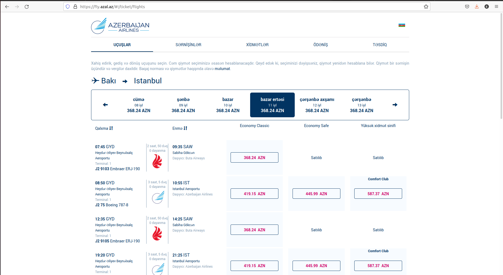
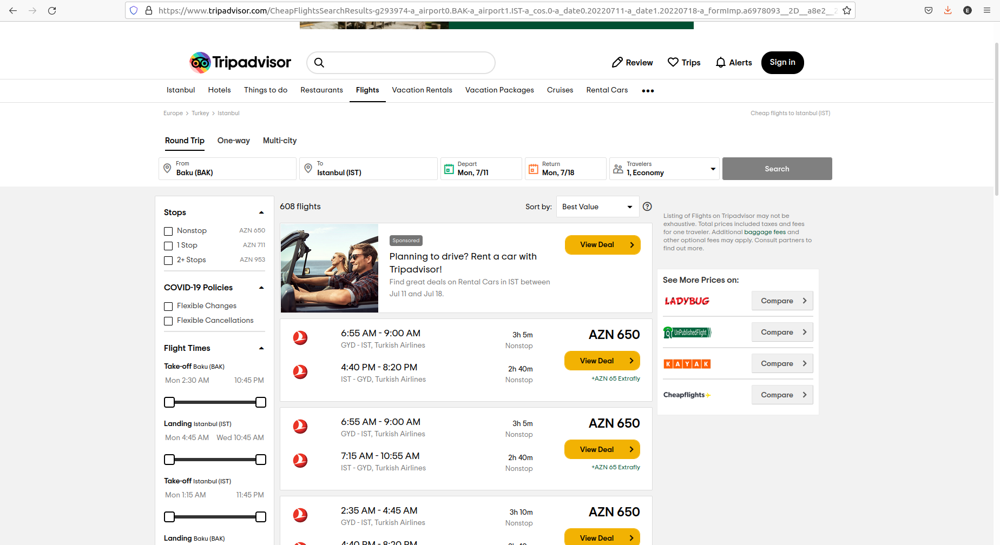

# Aviabilet senarisi üzrə izah

### Ümumi məlumat&#x20;

> Özünüzü proqramçıların yerinə qoymaqla onların ehtiyacların daha yaxşı başa düşəcəksiniz və onlara API sənədləşdirilməsində nələr lazım olduğunu daha yaxşı anlayacaqsınız. Proqramçılar adətən **Postman** və **cURL** tool-larından istifadə edərək sorğu nəticəsində əldə etdikləri cavab strukturu ilə tanış olurlar və dinamik olaraq sadə formada lazımı məlumatları veb səhifələr və ya digər tətbiqlər ilə inteqrasiya edib yoxlayırlar.
>
> Gəlin real API nümunəsi ilə tanış olaq.&#x20;
>
> Yəqin ki, hamımız onlayn aviabiletlərin axtarışı prosesi ilə yaxından tanışıq. [Əvvəlki nümunədə göstərdiyimiz restoran API nümunəsində](../#api-nuemun-li-izah) biz menyudan müxtəlif parametrlər ilə yeməklər sifariş edə bilirdik, həmçinin də burada müxtəlif parametrlər ilə (müxtəlif şəhərlər, gediş və qayıdış tarixləri və s.) aviabilet seçməyimiz üçün seçimlərimiz olur.
>
> Təsəvvür edək ki, bir aviaşirkətin saytında (məs, [https://www.azal.az/az/](https://www.azal.az/az/)) biletinizi bron edirsiniz. Siz gediş şəhəri və tarixini, qayıdış şəhərini və tarixini, kabin sinfini, həmçinin digər dəyişənləri seçirsiniz. Uçuşunuzu bron etmək üçün siz aviaşirkətin vebsaytı vasitəsilə onların məlumat bazası ilə əlaqə yaradıb həmin tarixlərdə hər hansı biletin olub olmadığını və ya bilet qiymətlərini görürsünüz.



> Bu nümunədə məsələ bizə aydındır. Belə ki, Azal-ın öz məlumat bazası vardır və rahatlıqla bizə öz daxili bazasından məlumatları göstərir. Bəs aviabilet üzrə məlumat bazası olmayan, məsələn [https://www.expedia.com](https://www.expedia.com/), [https://www.tripadvisor.com](https://www.tripadvisor.com) kimi səyahət xidməti təklif edə platformalar nə etməlidirlər?&#x20;
>
> Proses çox sadədir, bu halda səyahət xidmətləri təmin edən saytlar müxtəlif aviabilet API-larını təmin edən platformalara müraciət edir və alınan cavabı müvafiq formada istifadəçiyə göstərir. Həmin platformalar müxtəlif avia şirkətin məlumat bazası ilə inteqrasiya olunduğu üçün real rejimdə cari məlumatları səyahət xidməti verən saytlara göndərə bilirlər.



### Nümunə senari. Ən ucuz bilet neçiyədir?

> Deyək ki, siz veb proqramçısınız və sizdən aviabilet satışını həyata keçirən sayt yaratmaq sifariş olunub. Əsas tələb olunan tapşırıq istifadəçilərə ən ucuz bileti tapması üçün imkanın yaradılmasıdır. Məsələn belə tipdə məlumatları verən bir sayt yaradılmasını istəyiblər:&#x20;


Amma sizdə səyahət xidmətləri verən şirkətlər kimi öz avia məlumatlar datanız yoxdur və buna görə də bu məlumatı əldə etmək üçün digər servislərə müraciət etməlisiniz. Aldığınız məlumatları isə istifadəçilərin başa düşəcəyi formada onlara göstərməlisiniz.

### Haradan başlamaq lazımdır?

> Məsələnin mahiyyətin tam anlamaq üçün bu nümunədəki HTML-i olduğu kimi komputerinizdə saxlayıb sonra onu aça bilərsiniz. Burada səhifənin gözəlliyi bizə maraqlı deyil, əsas odurki məlumatları göstərə bilək. Axtar düyməsinə klik edən kimi [travelpayouts API](https://support.travelpayouts.com/hc/en-us/articles/203956163) sorğu gedir və qayıdan cavabı JavaScript kodları interfeysdə göstərir.&#x20;

```javascript
<!DOCTYPE html>
 <html>
   <head>
      <script src="https://code.jquery.com/jquery-2.1.1.min.js"></script>
      <meta charset="utf-8">
      <link rel="stylesheet"  href='https://maxcdn.bootstrapcdn.com/bootstrap/3.3.4/css/bootstrap.min.css' rel='stylesheet' type='text/css'>
      <title>travelpayouts Integration</title>
      <style>
         #origin_airport, #destination_airport, #flight_number, #flight_price {color: red; font-weight: bold;};
         #origin_airport_desc, #destination_airport_desc, #price_ccy {color: darkblue;  font-weight: bold;}
         body {margin:20px;}
         .button {
                background-color: #4CAF50;
                border: none;
                color: white;
                padding: 15px 32px;
                text-align: center;
                text-decoration: none;
                display: inline-block;
                font-size: 16px;
                margin: 4px 2px;
                cursor: pointer;
                border-radius: 12px;
                width: 100%;
                }
      </style>
   </head>
   <body>
      <script>
         function checkWind() {
          var settings = {
             "url": "https://api.travelpayouts.com/aviasales/v3/prices_for_dates?origin=GYD&destination=IST&departure_at=2023-03-23&return_at=2023-03-26&currency=azn&limit=1&token=3c63416a24d3b969da6df9271faa9d6e",
             "method": "GET",
             "timeout": 0,
};
           $.ajax(settings)
           .done(function (response) {
             console.log(response);
         $("#origin_airport").append (response.data[0].origin_airport);
         $("#destination_airport").append (response.data[0].destination_airport);
         $("#flight_number").append (response.data[0].flight_number);
         $("#flight_price").append (response.data[0].price);
         $("#destination_airport_desc").append (" (Istanbul Airport)");
         $("#price_ccy").append (" (AZN)");
         $("#origin_airport_desc").append (" (Heydar Aliyev International Airport)");
         });
         }
      </script>
      <!-- <button type="button" onclick="checkWind()" class="btn btn-success weatherbutton">Axtar</button>  -->
      <input type="button" onclick="checkWind()" class="button" value="Axtar">
      <h2>İstanbula ən ucuz bilet (İyul 11 2022 gediş - İyul 18 2022 dönüş)</h2>
      <span><b>Gediş aeroportu: </b></span><span id="origin_airport"></span><span id="origin_airport_desc"></span><br/>
      <span><b>Eniş aeroportu: </b></span><span id="destination_airport"></span> <span id="destination_airport_desc"></span><br/>
      <span><b>Qiymət: </b></span><span id="flight_price"></span><span id="price_ccy"></span><br/>
      <span><b>Uçuş nömrəsi: </b></span><span id="flight_number"></span>
   </body>
</html>


```

> Bizə ümumi proseslər və məlumat mübadiləsi maraqlı olduğundan göstərilən nümunədəki interfeysin dizaynı ilə çox məşğul olmaq lazım deyil. İstədiyiniz gözəllikdə interfeysi yarada bilərsiniz. Məsələn bu formada:


> Demək olar ki, API-ların ümumi konsepsiya alt-üst eynidir. Arxa tərəfdə lazımı məlumatları almaq üçün API-lara müraciət edilir və əldə olunan məlumatlar dizayn edilərək istifadəçilərə təqdim edilir. Bəs bizim HTML faylımız hansı formada müraciət edib cavabı əldə edir? Hazırda biz bu taskın həlli yollarına baxacağıq.
>
> Növbəti dərslərdə bu mövzuların dərinliyinə enəcəyimiz üçün, burada çox detala girmirəm.

****
