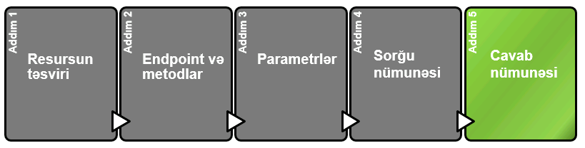

# Cavab nümunəsi




> **Response example** - cavab nümunəsi olub sorğu əsasında qayıdan cavab üzrə nümunəni göstərir.&#x20;
>
> **Cavab nümunəsi** bütün parametr konfiqurasiyalarını və ya əməliyyatlarını əhatə etmir, lakin sorğu nümunəsində ötürülən parametrlərə uyğun qayıdan cavabı göstərməlidir. Nümunə proqramçılara resurs üzrə məlumatları, formatı və bu məlumatın necə strukturlaşdırıldığını və s. bilməyə imkan verir.
>
> Cavabın təsviri **cavab sxemi (response scheme)** kimi tanınır. **Cavab sxemi** cavabı daha əhatəli, ümumi şəkildə sənədləşdirir, geri qaytarıla bilən hər bir xassə, hər bir xassə nələri ehtiva edir, dəyərlərin məlumat formatı, strukturu və digər təfərrüatları göstərir.

### Cavab nümunəsi və sxemi üzrə nümunələr

> Aşağıdakı nümunə [Mailchimp API](https://mailchimp.com/developer/marketing/api/campaigns/get-campaign-info/) üzrədir. Onlar cavab üzrə nümunəni sağ tərəfdə göstərərək ortada hər bir field-in izahın və məlumat növünü (**data type**) göstəriblər.&#x20;


> Aşağıdakı şəkildən göründüyü kimi burada qayıdan cavabda [**JSON**](../api-dizayn/parametrl-r.md#json-uezr-uemumi-m-lumat) field-lərin hamsı eyni səviyyəli deyil. Yəni `recepients` obyektinin daxilində bir neçə obyekt yer alır. Qeyd etdiyimiz kimi buna `nested object` deyilir. Mailchimp rahat başa düşülə bilinməsi üçün `recepients` obeyktinin altındakı field-ləri əlaqəli şəkildə "expand" formasında göstərmişdir.


### Cavab sxeminə və nümunəsinə ehtiyac varmı? <a href="#do-you-need-to-define-the-response" id="do-you-need-to-define-the-response"></a>

> Bəzi API dizaynlarda cavab sxemlərin vermirlər.&#x20;
>
> Amma, cavabın təsvirini vermək məqsədə uyğundur. Ən əsası da cavabda abbreviaturalar olduqda. API Tech Writer-lər bəzən field-ləri qısalatmaqla API həcmin azaldırlar. Hər bir abbreviaturanın nə demək olduğunu aydınlaşdırmaq üçün də xeyli vaxt lazım olur.


#### Cavab nümunələrində reala uyğun məlumatlardan istifadə edin. <a href="#use-realistic-values-in-the-example-response" id="use-realistic-values-in-the-example-response"></a>

Cavab nümunəsində dəyərlər real məlumatlara uyğun olmalıdır, amma real olmamlıdır. Əgər proqramçılar sizə nümunə cavab verirsə, dəyərlərin ağlabatan olduğundan və diqqətinizi yayındıracaq qədər saxta olmadığından əmin olun (məsələn, komiks personajlarının adları və s.).&#x20;

Həmçinin də, əmin olun ki, response məlumatlarının içərisində real müştəri məlumatları yoxdur. Əgər **API** nümunələri sizə təqdim ediblərsə və nümunələrdəki məlumatlar real məlumatlara oxşayırsa əmin olun ki, bunlar production database-dən deyildir. Adətən production verilənlər bazasının nüsxəsin (clone) çıxarıb onun üzərində development aparırlar. Belə olanda da real datalar nümunələrdə işitrak edir.&#x20;


### JSON Formatter and Validator <a href="#format-the-json-and-use-code-syntax-highlighting" id="format-the-json-and-use-code-syntax-highlighting"></a>

> Qeyd etdiyimiz kimi, əksər API-larda cavab **JSON** formatında olur. Ona görə də, response nümunəsi hazırlayarkən [JSON Formatter and Validator](http://jsonformatter.curiousconcept.com/) istifadə edib cavabı səqliəli formada göstərin.
>
> Əgər "syntax highlighting" istifadə edə bilirsinizsə mütləq edin.&#x20;

> Gəlin, [bizim tapşırığımızda ](a-new-endpoint-to-document.md#get-account-balance-api-nuemun-si)olan cavab nümunəsində format səhvi olmadığını yoxlayaq, həm dəsə səliqəli formaya salmağa çalışaq.
>
> Mən bunun üçün [https://jsonformatter.curiousconcept.com/](https://jsonformatter.curiousconcept.com/) saytdan istifadə edirəm. Amma xeyli sayda belə platformalar vardır.&#x20;

#### Tapşırıqdakı cavab nümunəsi

> { "Data":{ "Balance":\[ { "AccountId":"AZ29VTBA00000000000160209170", "Amount":{ "Amount":"1230.00", "Currency":"AZN" }, "CreditDebitIndicator":"Credit", "Type":"InterimAvailable", "DateTime":"2017-04-05T10:43:07+00:00", "CreditLine":\[ { "Included":true, "Amount":{ "Amount":"1000.00", "Currency":"AZN" }, "Type":"Pre-Agreed" } ] } ] }&#x20;

#### Hazırladığımız cavab nümunəsi

```javascript
{
   "Data":{
      "Balance":[
         {
            "AccountId":"AZ29VTBA00000000000160209170",
            "Amount":{
               "Amount":"1230.00",
               "Currency":"AZN"
            },
            "CreditDebitIndicator":"Credit",
            "Type":"InterimAvailable",
            "DateTime":"2017-04-05T10:43:07+00:00",
            "CreditLine":[
               {
                  "Included":true,
                  "Amount":{
                     "Amount":"1000.00",
                     "Currency":"AZN"
                  },
                  "Type":"Pre-Agreed"
               }
            ]
         }
      ]
   }
}
```


Nümunədə 1 səhv tapıldı. Belə ki, sonda obyket bağlanmamışdı. Yəni fiqurlu mötərizə qoyulmamışdı }.

Gördüyünüz kimi cavabımızda səliqəli və anlaşıqlı formada oldu.



Növbəti mövzularda static site genrator platformaları olan (Jekyll, GitHub, GitBook vəs.) haqqında danışacağıq. Orada görəcəksiniz ki, syntax highlighting hansı fromada olur.


### Status kodları

> Response bölməsində bir çox hallarda mümkün statusu və qaytarılan xəta kodları göstərilir. Bununla belə, bu kodlar adətən API-nin bütün son nöqtələrinə aid olduğu üçün çox vaxt ayrıca bölmələrdə sənədləşdirilir. Bu səbəbdən də, bunları ayrıca mövzuda müzakirə edəcəyik.

### Get balance API üzrə cavab nümunəsi və sxemi

> Son olaraq bizə verilən tapşırıq olan /accounts/<mark style="color:orange;">{AccountId}</mark>/balances endpointi üçün response nümunəsi və sxemi hazırlayaq.&#x20;


### Cavab nümunəsi

/accounts/<mark style="color:orange;">{AccountId}</mark>/balances üçün cavab nümunəsi:

```json
{
   "Data":{
      "Balance":[
         {
            "AccountId":"AZ29VTBA00000000000160209170",
            "Amount":{
               "Amount":"1230.00",
               "Currency":"AZN"
            },
            "CreditDebitIndicator":"Credit",
            "Type":"InterimAvailable",
            "DateTime":"2017-04-05T10:43:07+00:00",
            "CreditLine":[
               {
                  "Included":true,
                  "Amount":{
                     "Amount":"1000.00",
                     "Currency":"AZN"
                  },
                  "Type":"Pre-Agreed"
               }
            ]
         }
      ]
   }
}
```

#### Cavbın təsviri

The following table describes each item in the response.

*
*
[ ]   *
*




|   |   |
| - | - |
|   |   |
|   |   |
|   |   |

\


\


\


\
