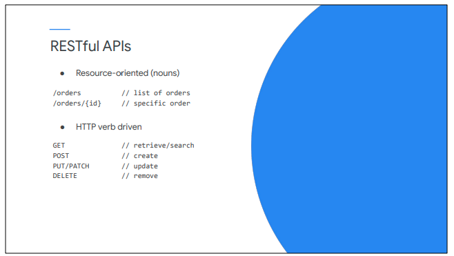

# REST API Dizayn Part I


> This lecture is the first of three on REST API Design.&#x20;
>
> We'll discuss the primary features of REST APIs, and you'll learn how to leverage HTTP concepts for those APIs.

#### What is REST?

> ● REST is an <mark style="color:blue;">architectural style, not a standard.</mark>&#x20;
>
> ● REST APIs typically <mark style="color:blue;">adhere to common web HTTP concepts.</mark>&#x20;
>
> ● Message payloads generally <mark style="color:blue;">use JSON</mark> (Javascript Object Notation).&#x20;
>
> ● REST is currently the most common style of web API.&#x20;
>
> ● APIs that follow the REST architectural style are called <mark style="color:blue;">RESTful.</mark>



> RESTful APIs are resource-oriented, focusing on the resources being acted upon, instead of focusing on a list of operations or actions.&#x20;
>
> Resources are specified in API URLs by using resource names and IDs. For example, to access a list of orders, you would make a request to "/orders." To access order 1234, you would make a request to "/orders/1234."&#x20;
>
> The request's HTTP verb, or method, specifies the type of operation that is being performed on the resource or list of resources.&#x20;
>
> Normal browser requests to retrieve web pages use the verb GET. A GET request for a RESTful API therefore retrieves details about the resource or resources specified in the URL.&#x20;
>
> POST is used to create a new entity. POSTing to "/orders" would typically create a new order with an auto-generated ID.&#x20;
>
> PUT or PATCH to "/orders/id" is used to update an existing order, and DELETE on "/orders/id" would remove the order.

#### Example 1

```
https://api.example.com/sales/customers
```

> See if you can figure out what this API request means.&#x20;
>
> What do you think this request is trying to achieve?


```javascript
GET https://api.example.com/sales/customers
```


```java
200 OK
Content-Type: application/json
Cache-Control: max-age=3600
{
 "entries": [
 {"id": "A14", "name": "Julio Lopez",
 "href": "https://.../customers/A14" },
 {"id": "C72", "name": "Joe Apigeek",
 "href": "https://.../customers/C72" },
 ⋮ {"id": "L64", "name": "Florence Jones",
 "href": "https://.../customers/V64" }
 ],
 "offset": 1,
 "count": 100,
 "total": 542
}
```

> If you said that this URL retrieves a list of customers, you'd be correct.&#x20;
>
> Look at the beginning of the request URL. This API request is using the domain name api.example.com, and the beginning of the URL path is "/sales." For a REST API, the first part of the URL specifies the particular API that is being called. So this is example.com's sales API.&#x20;
>
> After "/sales," we see "/customers." This follows the resource pattern we saw earlier. "/customers" represents a list of customers. We are using the GET verb, so this request is fetching a list of customers.&#x20;
>
> On the right is a typical response for the GET customers call.&#x20;
>
> 200 is the response status code, and OK is the reason phrase. The status code indicates the success or failure of the request, as well as the type of failure, if the request failed. Since the API returned 200 OK, the API call succeeded.&#x20;
>
> The next two lines are headers. The Content-Type header specifies the type of data returned in the payload: JSON, in this case. The Cache-Control header specifies how long the requestor can cache and use this response instead of having to make the same request again.&#x20;
>
> After the headers is the response payload. The JSON response is showing a list of customers, with an ID, name, and reference for each. The href reference is a URL that can be used to retrieve more details about that customer.&#x20;
>
> We also see additional metadata about the response: the offset of the first customer retrieved and the number of customers in the payload.&#x20;
>
> According to the count, 100 customers were returned. The response is truncated to show only a few entries. The offset to the first customer is 1, so this response is listing the first 100 customers. The total number of customers, according to the metadata, is 542.&#x20;
>
> Remember that REST is an architectural style, not a standard. The payloads of REST responses do not have a required format, but you should try to keep responses consistent for all of your APIs, and especially within an API.

### Example 2

```uri
GET https://api.example.com/sales/customers/C72
```

> OK, here's another one.&#x20;
>
> We know from the previous example that <mark style="color:blue;">https://api.example.com/sales</mark> is the root URL of example.com's sales API.&#x20;
>
> When we are specifying calls in the context of an API, we often shorten this by removing the root URL. We would call this a GET on "/customers/C72.

```
GET /customers/C72
```

> What would GET on "/customers/C72" signify?

```
GET /customers/C72
```

```javascript
200 OK
Content-Type: application/json
Cache-Control: max-age=3600
Last-Modified: Wed, 20 Mar 2019 03:44:21 GMT
{
 "firstName": "Joe",
 "lastName": "Apigeek",
 "address": {
 "addr1": "1155 Borregas Ave",
 "city": "Sunnyvale",
 "state": "CA",
 "zip": "94089",
 "country": "United States"
 },
 "links": {
 "orders": "https://.../customers/C72/orders",
 "wishlist": "https://.../customers/C72/wishlist"
 }
}
```

> This retrieves information for a specific customer, in this case Joe Apigeek, who has an ID of C72.&#x20;
>
> In this example, we retrieve much more than just the name, ID, and a reference, since we are requesting the details of a single customer instead of up to 100 of them. This response also includes links, which allow us to easily retrieve the orders or wishlist of Joe Apigeek.&#x20;
>
> When you design your own APIs, think about how your app developers would want to consume your APIs, and what data would be useful to them. Remember, your app developers are your customers.
