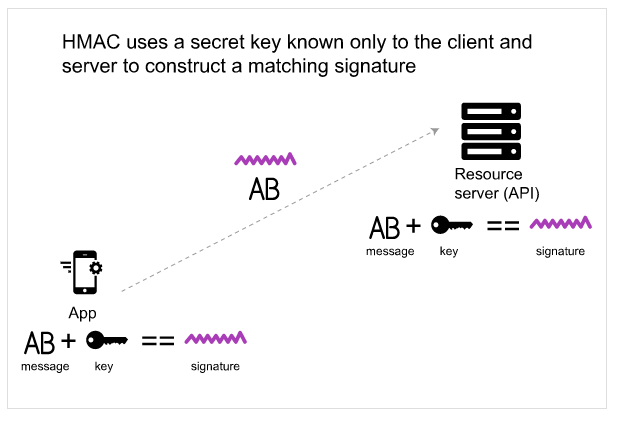

# HMAC

### HMAC nədir?

> **HMAC** açılışı `Hash-based message authorization code` deməkdir və daha etibarlı autentifikasiya metodu kimi tanınır.
>
> Əsasən maliyyə API-larında istifadə olunur. **HMAC** autentifikasiya növündə gizli açarı -  `secret key` yalnız sorğunu göndərən və qəbul edən bilir.&#x20;
>
> API sorğu göndərən zaman sorğunu göndərən tərəf sistem parametrlərindən və ya sorğudakı məlumatlardan istifadə etməklə (məsələn, sorğunun göndərilmə `timestamp-i + account ID`) bir dəyər formalaşdırır. Daha sonra bu dəyər `secret key` vasitəsilə **encode** olunur və `secure hashing algorithm (SHA)` şifrələnir. Nəticədə yaradılmış yekun dəyər (**signature**) `request header`-ə əlavə edilir və sorğunu qəbul edən tərəfə (API server) göndərilir.
>
> Qəbul edən tərəf (API server) sorğunu qəbul etdikdə eyni dəyərləri (sorğunun göndərilmə `timestamp-i + account ID`) götürüb `secret key` və `SHA` istifadə edərək eyni dəyəri (string) formalaşdırır. Əgər formalaşdırılmış dəyər (signature)`request header`-dəki  dəyər ilə eyni olarsa server sorğunu qəbul edir. Əks halda imtina edir.
>
> Aşağıda prosesi təsvir edən diaqram göstərilmişdir

> Burada ən vacib məsələ odur ki, `secret key` yalnız göndərən və qəbul edən tərəfə məlum olur. `Secret key` API sorğusuna daxil edilmir.&#x20;
>
> Sorğunun həm autentifikasiyası üçün, həm də məlumatların dəyişdirilmədiyindən əmin olmaq üçün **HMAC** təhlükəsizlikdən istifadə edə bilərsiniz.&#x20;
>
> Məsələn, sorğuda qəbul edəcəyiniz məbləğin dəyişməməyindən əmin olmaq istədikdə yaradılmış dəyərdəki məlumatlardan biri də **məbləğ** olmalıdır.
>
> Bu metoddan istifadə zamanı `secret key` dediyimiz açarları təhlükəsiz formada iştirakçılarla paylaşmalısınız.
