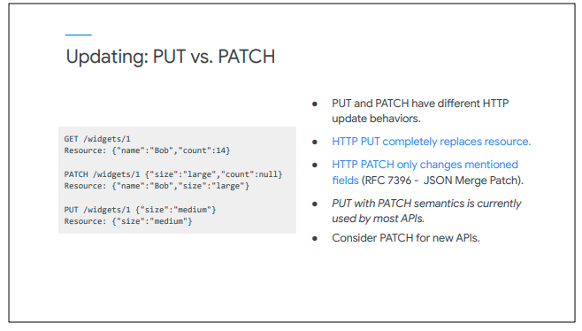
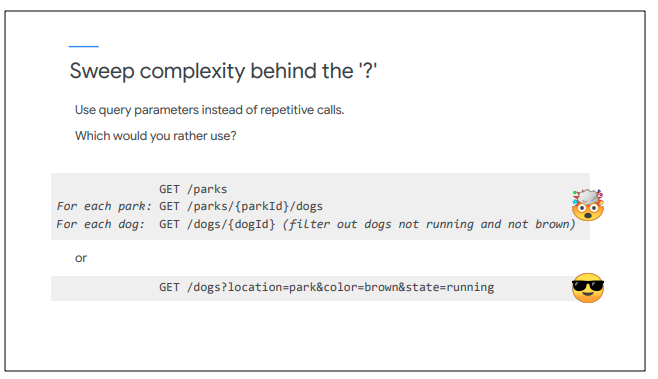
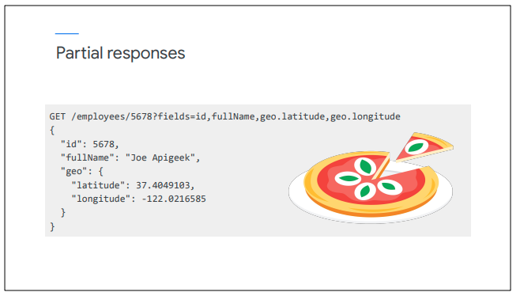

# Keep verbs out of URLs


> URLs with verbs are difficult to remember.&#x20;
>
> ● Use primary verbs (<mark style="color:blue;">GET, POST, PUT/PATCH, DELETE</mark>) with noun-oriented resources for CRUD operations.&#x20;
>
> ● For non-CRUD operations, consider using a query parameter to perform an <mark style="color:blue;">action</mark> on a resource:

```
POST /dogs/1234?action=walk
POST /dogs/1234?action=feed&object=treat
```

```
/giveBoneToDog
/getAllLeashedDogs
/getBigRedDogs
/isDogSick
/getDog
/petDog
/yellAtDog
/getDogsAtPark
/getDogsChasingSquirrels
/getSquirrelsChasingPuppies
```

####

> If you have focused on SOAP services in the past, you may not be used to thinking first about resources, and then choosing operations that can be performed upon them, as we recommend for REST APIs. SOAP specifies operations in the URL, but this is an anti-pattern for REST APIs.&#x20;
>
> Operation names in URLs tend to have inconsistent patterns, making the calls difficult to remember and the API hard to use and learn.&#x20;
>
> For CRUD operations, we recommend that you use the primary HTTP verbs to operate on the resource.&#x20;
>
> Operations will occasionally not fit into the CRUD model. For these cases, you can consider using POST with an action or operation query parameter to specify the operation on the resource. For example, "POST /dogs/1234" with an action parameter set to walk could represent walking the dog.


> Here's the updated operation matrix: "POST /dogs/1234" with an action or operation query parameter can be used for non-CRUD operations.



> The HTTP PUT and PATCH verbs are both used to update resources, but for HTTP they have different behaviors.&#x20;
>
> PUT completely replaces a resource with the provided payload.&#x20;
>
> PATCH should only be used to modify a subset of the resource. The JSON Merge Patch specification specifies how PATCH can be used for partial updates. Fields with a value are added or modified, and fields specified as null are deleted. Fields not mentioned in the PATCH request are not modified.&#x20;
>
> Let's look at an example.&#x20;
>
> Performing a GET on the widget with id of 1, we see that the widget's name is Bob, and its count is 14.&#x20;
>
> The PATCH call updates resource 1, setting the size field to large, and removing the count field since it is null. The name field is unchanged.&#x20;
>
> The PUT call replaces the entire resource with the request payload.&#x20;
>
> When you look at public REST APIs, most tend to use the PUT verb, even though they are actually using the semantics of HTTP PATCH, where fields that are not present in the request payload are not modified. Although this is not the standard HTTP use of PUT, it is very common in REST APIs.&#x20;
>
> When you are creating your own APIs, consider using PATCH for partial updates.&#x20;
>
> However, it helps your app developers if you maintain consistency for your APIs, so you may decide to use PUT for partial updates if other APIs are also using PUT in this way



> When we offer complex functionality in our APIs, we need to think about the app and developer experience.&#x20;
>
> For example, we need to find dogs based on factors like color, location, and action being performed. A simple design using only standard URL resources would allow this ability. But what would the app developer experience be?&#x20;
>
> To find brown dogs running in a park, the developer would first need to get all parks. Depending upon how many parks there are, it might take many API calls. Once she had all the parks, the developer would make a request for each park to find all the dogs in the park. She would then need to retrieve each dog found in each park, and keep a list of only those dogs that are running and are brown.&#x20;
>
> Obviously, this solution would require lots of programming for the developer. Even worse, it could result in a huge number of round trips as she retrieved all the dogs one by one. The user would have to wait a long time to get the results.&#x20;
>
> Now look at the bottom request, which can be viewed as "give me all the dogs that are in a park, and are brown, and are running."&#x20;
>
> Which pattern would you rather use? And which is more likely to perform well?&#x20;
>
> Coming up with the second solution requires the API developer to think like the app developer, and think about the experience of a user of an app that consumes your � API. It is worth your time to think and design your APIs using this mindset.&#x20;
>
> Also, APIs may be used by apps in ways you didn't originally expect. You can add features to your APIs to address needs as you learn of them, either when requested by your app developers, or by analyzing API call patterns.



> Another way to deliver an optimized experience to your app developers is to allow the selection of partial responses. Instead of returning the entire response every time, you can give the developer control over which fields to return.&#x20;
>
> This feature should definitely be considered for APIs that are designed for usage in low bandwidth apps, like mobile apps, or for APIs with large response payloads.&#x20;
>
> In this example, a list of comma-separated fields is specified using a query parameter, and only the requested fields are returned in the response.
