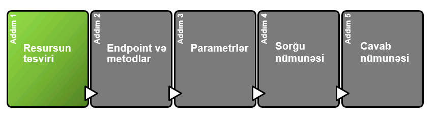
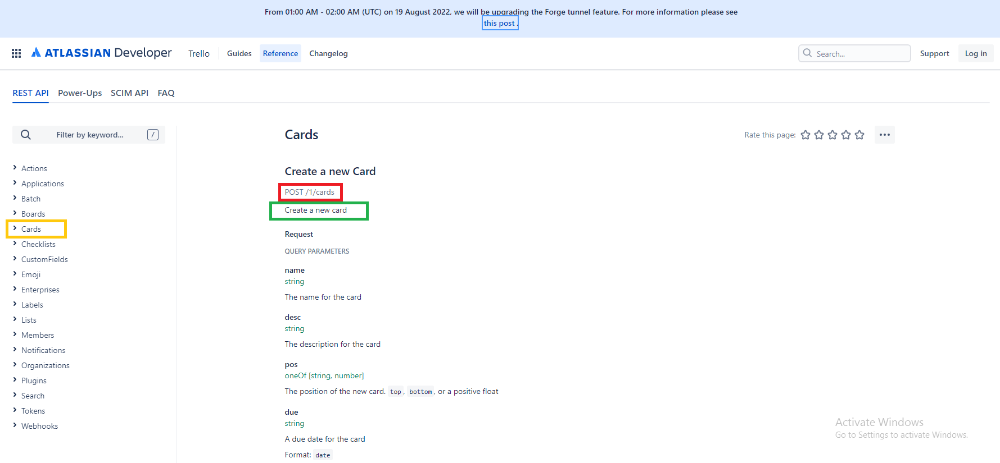

# Resursun təsviri




> **Resurs** - API-dan qayıdan məlumatlara deyilir. Bir çox API-larda müxtəlif kateqoriyalı məlumatlar və ya müxtəlif resurslar qayıda bilər.
>
> API sənədləşməsində **Resursun təsviri** qısa olur (1-3 cümləlik). Adətən **resurslara** giriş üçün müxtəlif **endpoint**-lər olur və hər bir **endpoint** üzrə də bir neçə metodlar mövcud olur.&#x20;
>
> Adətən 1-ci səhifədə resurslara giriş üçün istifadə olunan enpoint-lər ümumi resursun təsviri ilə birgə göstərilir.&#x20;


Bilirəm qarışıq oldu. Narahat olmayın indi hamısını başa düşəcəksiniz.


### Resurs təsviri üzrə nümunə

> Aşağıda [Mailchimp Campaigns resource API](https://developer.mailchimp.com/documentation/mailchimp/reference/campaigns/) üzrə nümunə göstərilmişdir.

.png>)


Mailchim API - e-mail göndərmək üçün marketing platformasıdır.


> Adətən API-larda eyni **resurs** daxilində bir çox **endpoint**-lər olur. Bu senaridə ümumi resurs `Campaingns` və resurs üzrə **endpoint**-lər göstərilmişdir. Yəni `Campaings` resursu daxilində bir neçə enpoint vardır.
>
> Bir sözlə burada resurslar çox ola bilər, məsələn - **kompaniya** `Campaigns` resursu, **endirimlər** resursu və s. Resurs bir platforma üzrə müxtəlif istiqamətləri göstərir.
>
> Aşağıda `Campaings` resursu üzrə **endpoint**-lər göstərilmişdir.


```javascript
POST /campaigns
GET /campaigns
GET /campaigns/{campaign_id}
PATCH /campaigns/{campaign_id}
DELETE /campaigns/{campaign_id}
POST /campaigns/{campaign_id}/actions/cancel-send
POST /campaigns/{campaign_id}/actions/pause
POST /campaigns/{campaign_id}/actions/replicate
POST /campaigns/{campaign_id}/actions/resume
POST /campaigns/{campaign_id}/actions/schedule
POST /campaigns/{campaign_id}/actions/send
POST /campaigns/{campaign_id}/actions/test
POST /campaigns/{campaign_id}/actions/unschedule
```


#### [YouTube](https://developers.google.com/youtube/v3/docs/comments)


> ****[**YouTube**](https://developers.google.com/youtube/v3/docs/comments) üzrə də gördüyünüz kimi `Comment` resursunu işarələmişəm. Bu resursla yanaşı sol tərəfdə YouTube üzrə bir neçə resurs vardır. Məsələn - `Members`**,** `Playlist` **** və s.
>
> `Comment` resursu üzrə də bir neçə metod (**list, insert, update** və s.) mövcuddur.

#### [Trello](https://developer.atlassian.com/cloud/trello/rest/api-group-cards/#api-group-cards)



> Digər nümunə isə [Trello](https://developer.atlassian.com/cloud/trello/rest/api-group-cards/#api-group-cards)-dur. Burada da gördüyünüz kimi sol tərəfdə bir çox resurslar mövcuddur. bizim seçdiyimiz resurs `Cards`-dır və onun üzrə aşağıdakı metdolar mövcuddur.


```java
POST /1/cards
GET /1/cards/{id}
PUT /1/cards/{id}
DELETE /1/cards/{id}
GET /1/cards/{id}/{field}
GET /1/cards/{id}/actions
və digərləri
```



**Trello** - Task management sistemidir. Təqdim etdiyi API-ları öz platformanıza inteqrasiya edib task management-i birbaşa oradan idarə edə bilərsiniz.



Resursun təsviri çox vacibdir və ondan müxtəlif yerlərdə istifadə edəcəksiniz. Bu səbəbdən də onu hazırlayarkən elə edin ki, qısa olsun və resursun mahiyyətini mümkün qədər aydın göstərsin.&#x20;


### API Referens sənədi (Reference docs) və istifadəçi bələdçisi (User guides) arasındakı fərqlər <a href="#recognize-the-difference-between-reference-docs-versus-user-guides" id="recognize-the-difference-between-reference-docs-versus-user-guides"></a>

> **Resursun** təsviri (həmçinin də **endpoint** təsviri) qeyd etdiyimiz kimi, adətən qısa olur və 1-3 cümlə ilə göstərilir. Bəs 3 cümlə ilə bütün fikri tam izah edə bilməyəndə və daha çox detalların əlavə edilməsi lazım olanda nə edə bilərik?&#x20;
>
> Belə olduqda bilin ki, bunun üçün user guide-lar/tutorial-lar mövcuddur. Gəlin **Referens sənədləşməsi** ilə **istifadəçi bələdçisi** arasında nə fərqlər var baxaq.
>
> * **Referens sənədləşməsi -** proqramçıların oxuyaraq ümumi mənzərəni, resursun nəyi ifadə etməsini dərhal başa düşəcəyi prinsipləri özündə saxlayır. Məsələn, [YouTube](step-1-resource-description-api-reference-tutorial.md#youtube) nümunəsində  ümumi olaraq `Comment` resursunun nəyə xidmət etdiyi göstərilir amma API-dan necə istifadə edilməlidir, **autentifikasiya** metodları hansılardır və digər istifadə qaydaları göstərilmir.
> * **İstifadəçi bələdçisi** -  bu bölməyə addım-addım təlimatlar, kod nümunələri, konsepsiyalar və prosedurlar daxil olmaqla API-dən necə istifadə olunacağına dair ətraflı məlumatlar qeyd olunur. _Bunun haqqında növbəti bölmələrdə daha geniş danışacağıq və başa düşəcəyik ki, bu səndələşməni hansı formada daha effektiv etmək olar._
>
> **API referens bölməsinin təsvirində** resursun ehtiva etdiyi məlumatlar üzrə 1-3 cümləlik xülasisəni təqdim edib, **istifadəçi bələdçisində** bu barədə daha ətraflı məlumat verə bilərsiniz.&#x20;


Siz referens bölməsində istifadəçi bələdçisinə **** <mark style="color:blue;">link</mark> verərək daha detallı məlumatın alınması üçün şərait yarada bilərsiniz.&#x20;


### [Tapşırıq ](../tapsiriq.md)üçün resurs təsviri <a href="#resource-description-for-the-surfreport-endpoint" id="resource-description-for-the-surfreport-endpoint"></a>

> `Get account balance API` tapşırığını analiz edib, 1-3 cümlə ilə **resursu** təsvir etməyə çalışaq.&#x20;


## Balance

**`Balans`** resursu 1 hesab üzrə balansı əldə etmək üçün istifadə edilir. Həmçinin də, bu API-dan istifadə edərək hesabın valyutasını, kredit xətti üzrə limiti, istifadə olunmuş balansı, overdraft xəttini və s. öyrənmək mümkündür.


### Növbəti addım

> Növbəti bölmədə resurs üzrə [Endpoint və metdolar ](step-2-endpoints-and-methods-api-reference-tutorial.md)ilə tanış olacağıq.&#x20;

\
