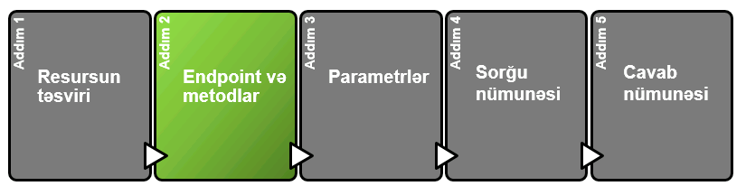
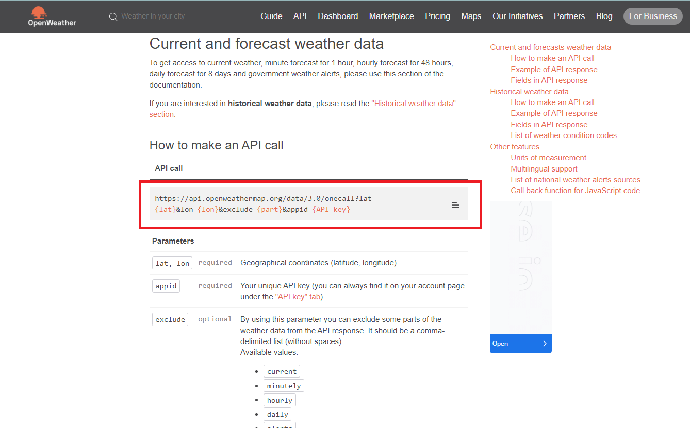

# Endpoint və metodlar

## Endpoint və metod nədir?

### Endpoint nədir?

> **Endpoint** resursa necə giriş əldə edə biləcəyimizi, **metod** isə resurs üzərində hansı əməliyyatları (`GET`, `POST`, `DELETE` və s) icra edə biləcəyimizi göstərir.
>
> **Resurslar** müxtəlif **Endpoint**-lərə malik olur. **Endpoint**-lərin müxtəlif **Path (yəni URL-ləri)** və **metodları** olsa da onların hamısı **Resurs** üzrə müxtəlif məlumatları qaytarırlar.&#x20;
>
> **Endpoint**-lərin təsviri adətən ümumi **resursun** təsvirinə oxşar, lakin daha qısa təsvirlərə malik olur.&#x20;
>
> Daha yaxşı başa düşmək üçün nümunəyə baxaq.&#x20;

> Bizə tanış olan travelpayouts nümunəsində baxdıqda endpointi daha yaxşı anlamaq olur.&#x20;
>
> 1. Burada travelpayoutsa brauzerdən sorğu edəndə, onun gateveyi, yəni ilk sorğunu qəbul edən proqram təminarı sorğunun hansı Endpointə aid olduğun analiz edib sorğunu ora yönləndirir. Məsələn travelpayoutsda bir neçə endpoitnint ola bilrə. Biri biletlərə, biri isə hotellərə baxa bilər. Məhz gatevey sorğunu analiz edərək hansı endpointə göndərməlli olduğu qərarı verir.
>
> Bu gün tez tez eşitdiyimiz microservis arxitekturasınında özəyi budurki hər bir funksionallıq üçün ayrıca endpoint olur. Belə olanda bir endpointdə problem olanda digərinə təsir etmir. məsələn bu nümunədə, travel endpointində problem olsa, istifadəçilər Hotel məlumatların hotel endpointi ilə ala biləcəklər.


Məsələn, aşağıda [Mailchimp API](step-2-endpoints-and-methods-api-reference-tutorial.md#mailchimp-api) **** üzrə nümunədə görə bilərsiniz ki, ümumi resurs **Campaings** adlanır və onun təsviri belə göstərilir:

<mark style="color:orange;">`Campaigns are how you send emails to your Mailchimp list. Use the Campaigns API calls to manage campaigns in your Mailchimp account.`</mark>

**Campaings** resursunun Endpoint-lərindən biri olan ** `GET /campaigns`** təsviri isə resursa nəzərən qısa olaraq belə göstərilir:

<mark style="color:orange;">`Get all campaigns in an account.`</mark>


> Həmçinin, **Endpoint** bütün **Endpoint**-lər üçün ümumi olan əsas **Path**-i (yol) deyil, yalnız resurs **URL**-in **Path**-in (yolunu) göstərir.&#x20;
>
> Cümlə çətindir bilirəm, narahat olmayın [aşağıdakı bölmədə](step-2-endpoints-and-methods-api-reference-tutorial.md#endpoint-yalniz-end-path-i-goest-rir) izahı vermişəm.

### Endpointlər üzrə nümunə

#### [Mailchimp API](https://mailchimp.com/developer/marketing/api/campaigns/)

> Aşağıda [Mailchimp APı-ın "Campaings"](https://mailchimp.com/developer/marketing/api/campaigns/) resursu üzrə **endpoint**-lər göstərilmişdir.

> **Endpoint**-lər adətən gözə daha tez çarpması üçün xüsusi dizaynla interfeysdə göstərilir. API sənədləşmələrinin əksəriyyətinin əsas məğzini **Endpoint**-lər təşkil edir. Bu səbəbdən də sənədləşmənizdə **Endpoint**-ləri xüsusi formada göstərməyiniz tövsiyyə olunur. &#x20;
>
> Çünki proqramçılar test sorğuları etmək üçün dərhal **Endpoint**-ləri axtaracaqlar.&#x20;

### Path parametrlərini fərqləndirin

> Əgər sizin **endpoint**-də [**path parameter**](../api-dizayn/parametrl-r.md#path-parameters) **** varsa onları _<mark style="color:orange;">fiqurlu mötərizə</mark>_ <mark style="color:orange;"></mark><mark style="color:orange;">(</mark>_<mark style="color:orange;">curly braces</mark>_<mark style="color:orange;">)</mark> ilə göstərin. Məsələn aşağıda **Mailchimp API** üzrə nümunə göstərilmişdir.


**/campaigns/**<mark style="color:orange;">**{campaign\_id}**</mark>


> <mark style="color:orange;">{Fiqurlu mötərizədən}</mark> istifadə edərək **path parametrini** göstərmək mütləq bir qayda deyildir. Sadəcə bu formada edildikdə gözə daha tez çarpır.&#x20;
>
> Məsələn, yuxarıdakı nümunədə yalnız <mark style="color:orange;">`{campaign_id}`</mark> <mark style="color:orange;"></mark><mark style="color:orange;"></mark> üzrə bu formadan istifadə edildiyi üçün dərhal başa düşülür ki, bu dəyərin ümumi **endpoint** üzrə fərqliliyi vardır.

> Aşağıdakı digər bir nümunədə görürük ki, [OpenWeather API](https://openweathermap.org/api/one-call-3) platforması da **path parametrini** dediyimiz qaydada fərqli formada göstərmişdir.

#### [OpenWeather API](https://openweathermap.org/api/one-call-3)


#### [OpenWeather API](https://openweathermap.org/api/one-call-3)-dan istifadə edərək siz hava haqqında məlumatları pulsuz formada alıb öz platformanız ilə inteqrasiya edə bilərsiniz.


> Qeyd etdiyimiz kimi, **path parameterlərinin** standart təyin edilən bir rəngi yoxdur. Məsələn aşağıda [Amazon API-](step-2-endpoints-and-methods-api-reference-tutorial.md#amazon-api)larında şahidi oluruq ki, path parametri olan <mark style="color:orange;">`{eventGroupId}`</mark>  **URL**-dəki digər dəyərlərdən seçilmir. &#x20;


Amma siz sənədləşmə edərkən, bu parametrlərin dərhal gözə çarpası üçün fərqli formada və fərqli rəngdən istifadə edin.&#x20;

Mən standart olaraq [OpenWeather API](https://openweathermap.org/api/one-call-3)-da olduğu kimi <mark style="color:orange;">narıncı rəngdən</mark> istifadə edirəm.


#### [Amazon API](https://developer-docs.amazon.com/sp-api/docs/finances-api-reference#get-financesv0financialeventgroupseventgroupidfinancialevents)

<figure><figcaption></figcaption></figure>

Bəs Postmanda gördüyümüz və ya **endpoint**-lərin qarşısında olan **GET, POST, PUT** və s. bunlar nədir?

### Metodların təyini

> Bunlar **HTTP metodlardır** və **endpoint**-lərin qarşısında verilməsi qəbul olunmuş praktikadır. Metodlar resurslar ilə nə iş görə biləcəyimizi təyin edir. Qısa olaraq, metodları aşağıda qeyd edib nə iş gördüyünü qeyd edirəm:
>
> Məslən travelpayouts nümunəsində GET metodu ilə məlumatları alırıq. Gördüyünüz kimi sorğu göndərilir və travel payouts metoda əsəasən məlumatları bizə qaytarır.
>
> * <mark style="color:orange;">**GET**</mark>: **Resursu** qaytarır. Yəni **Resurs** haqqında hansısa məlumatı əldə etmək istədikdə <mark style="color:orange;">**GET**</mark>-dən istifadə edilir.
> * <mark style="color:orange;">**POST**</mark>: **Resursu** yaradır.&#x20;
> * <mark style="color:orange;">**PUT**</mark>: Mövcud **resursu** və ya **resurs** daxilindəki hansısa hissələri yeniləyir.&#x20;
> * <mark style="color:orange;">**PATCH**</mark>: Mövcud **resursu** qismən dəyişdirir.
> * <mark style="color:orange;">**DELETE**</mark>: **Resursu** silir.
>
> Ətraflı məlumat üçün Vikipediyanın HTTP məqaləsində [Request methods](https://en.wikipedia.org/wiki/Hypertext\_Transfer\_Protocol#Request\_methods)-a baxın. Bəzi əlavə **metodlar** da var, lakin onlar nadir hallarda istifadə olunur.

### CRUD əməliyyatı üçün HTTP metodlarından (verbs) istifadə

<figure><figcaption></figcaption></figure>

> Metodları nümunə üzərində daha aydın başa düşməyə çalışaq. Bundan əvvəlki nümunəmizdəki metod Get metodu idi və biz onunla aviabilet haqqında məlumat alırdıq.&#x20;
>
> Burada dogs bizim resursumuzdur. Gəlin onun üzərində baxaqki HTTP metodların tələb olunan əməliyyatlar ilə necə map edə bilərik.

<figure><figcaption></figcaption></figure>

> Biz gördüyümüz HTTP metodların (verbs)  əməliyyatlar ilə necə əlaqələndirildiyinə baxaq. Create, Read, Update and Delete.
>
> Biz adətən bu əməliyyatlara CRUD deyirik
>
> CRUD ilə tez tez qarşılaşcaqsız. CRUD akrominin açılışı - Create, Read, Update və delete-dir.

<figure><figcaption></figcaption></figure>

> Gördüyünüz kimi resursumuz üçün 2 əsas URL miz/endpointimiz mövcuddur. /dogs itlərin ümumi siyahısa istinad edir /dogs/1234isə spesifik olaraq 1234 nömrəli itə istinad edir.
>
> Gəlin indi baxaq ki, HTTP metodlarından istifadə edərək itlər üzərində hansı əməliyyatları keçirmək olar.
>
>

<figure><figcaption></figcaption></figure>

> Gördüyünüz kimi ilk öncə POST dan yox GET dən başladım. Çünki baxdığımız avibile nümunəsi GET idi və demək olarki ən çox istifadə olunan metoduur.
>
> GET bütün resurslar üzrə məlumatı və ya bir resurs üzrə məlumatı qaytarmaq üçün istifadə edilir.&#x20;
>
> Buna yaxşı bir misal kimi brauzeri göstərmək olar. Siz brauzerdə hansısa saytı açarkən orda HTTP GET metodundan istifadə edilir. Məsələn cbar.az açanda görəcəksizki Get ilə müraciət edir.
>
> GET məlumatları update yəni dəyişdirə bilməz. Buna görə də, ən təhlükəsiz metod hesab edilir. Belə ki, məlumatları dəyişdirməyən metodlar təhlükəszidir çünki onlar təhlükəli məlumatları göndərib sistemi çökdürə və ya digər fraud edə bilməzlər.
>
> Belə ki digər metodlar hər sorğu zamanı bizim resursumuzun məlumatların dəyişə bilər amma GET sorğusunu nə qədər təkrarlasaqda nəticə eyni olacaqdır.&#x20;
>
> Təkrar sorğular nəticəsində eyni nəticəni almaq **idempotent** adlanır. Qarşınıza çox çıxacaq.
>
> &#x20;HTTP GET metodunun təhlükəzi və idempotent olmasını təyin edir. Ona görədə gələcəkdə API dizayn edərək APIlarının bu standartlara cavab verməsindən əmin olun.

<figure><figcaption></figcaption></figure>

> /dogs Endpointi üçün POST metodu yeni itin yaradılması üçün istifadə eidlir. URL də heç bir ıd tgöndərilmir. ID avtomatik olaraq sistem tərəfindən yaradılır.
>
> POST metodu resursumuzun vəziyyətini dəyişir, bələki o bizim resursumuzda yeni it yaradır. Buna görə də POST təhlükəsiz metod deyildir.
>
> POST metodunu təkrarlamaq bir neçə itin yaranmasına səbəb olacaqdır ona görə də idempotent deyildir.&#x20;

<figure><figcaption></figcaption></figure>

> Update (yeniləmə üçün) bizim iki metodumuz mövcuddur: PUT və PATCH.&#x20;
>
> PUT /dogs/1234 id nömrəsi 1234 olan Toto adlı iti update edəcəkdir.
>
> Gələcəkdə biznes tələblərinizə görə elə API tələb yaza bilərsiz, PUT sorğusu zamanı 1234 nömrəli it olmasa avtomatik onu yaratsın yəni POST dan əlavə olaraq istifadə edilməsin. Belə hallar bir qədər nadir olur. Bu da o zaman olur ki, resurs ID unikal olur.
>
> Sorğunuzda konkret itləri göstərməsəniz, "PUT /dogs" bütün itləri və ya uyğun itləri toplu şəkildə yeniləyir. Lazım olmadıqca bu əməliyyata icazə verməyin, çünki çoxlu itləri təsadüfən toplu yeniləmək çox asan ola bilər.
>
> PUT təhlükəsiz metod deyil, çünki o, resursları yeniləmək üçün nəzərdə tutulub.
>
> Amma Bununla belə, PUT HTTP tərəfindən idempotent metod kimi müəyyən edilir. Buna görə də ikinci eyni PUT çağırışı resurs və ya resursları yenidən dəyişdirməməli və eyni vəziyyətdə saxamalıdır. Bunu proqramçıdan alanda mütləq yoxlayın və API tələblərinizdə bunu mütləq qeyd edin. Əks ahlda halda hər dəfə PUT metodu ilə məlumatlar yenilənəcək və servisiniz üçün lazımsız iş yükü yaranacaqdır.
>
> PUT və PATCH arasında fərq ondan ibarətdir ki, PUT bütün resursu update etmək üçün nəzərdə tutulub, PATCh isə seçilmiş fieldləri.
>
> Amma təcrübədə bütün update-lər PUT ilə göstərilir. Sizdə PUT ilə göstərə bilərsiz. Çox dərinliyə getmək çox vaxtı developerləridə çaşqın vəziyyətə salır.

<figure><figcaption></figcaption></figure>

> DELETE metodu resursu silmək üçün istifadə edilir.
>
> DELETE /dogs/1234 1234 id ilə olan Toto itini silir.&#x20;
>
> "DELETE /dogs" bütün itləri və ya axtarışa və ya təqdim edilmiş filtrlərə uyğun gələn bütün itləri siləcək. Əksər API-lər kolleksiyada DELETE-ə icazə vermir, çünki kolleksiyadakı hər şeyi təsadüfən silmək çox asan və çox təhlükəlidir olardı. Ona görə bu məsələni mütləq yadınızda saxlayın
>
> Delete təhlükəszi metod deyil belə ki, o resursu silərək yeniləyir. Updates by removing. İkinci eyni DELETE-in heç bir təsiri yoxdur, çünki resurs artıq silinmişdir, ona görə də DELETE idempotentdir.
>
>


**Metodların** **endpoint**-lər ilə sıx əlaqəsi olduğu üçün onları bir yerdə göstərdim.&#x20;

Əlavə olaraq aşağıda [Stripe API](step-2-endpoints-and-methods-api-reference-tutorial.md#stripe-api)-da metodları endpoint-lərin əvvəlində hansı formada qruplaşdırdıqlarını da görə bilərsiniz.


### [Tapşırıq](../tapsiriq.md#s-n-dl-sdirm-k-uecuen-m-lumat) üzrə metodu təyin edək

> Məlumatlarda qeyd edildiyi kimi, 3-cü tərəf təşkilatlar banklardan hesab üzrə balansları əldə edəcəklər. Məlumatın əldə edilməsi üçündə <mark style="color:orange;">**GET**</mark> metodundan istifadə edilir.


Deməli **endpointimiz** üçün metod - <mark style="color:orange;">**GET**</mark>


### Endpoint yalnız "<mark style="color:orange;">end path</mark>"i göstərir

> **Endpoint**-i göstərdiyiniz zaman yalnız "**end path**"-i göstərin. "**Full path**" - "Base Path və Endpoint-dən ibarət olur və bunlar ümumilikdə **resurs URL** adlanır.&#x20;
>
> Yuxarıdakı Stripe nümunəmizdə də endpoint  `/v1/customers/:id/sources` kimi göstərilir. Burada Stripe hər dəfə resurs URL-ni tam formada, yəni bu formada `https://api.stripe.com/v1/customers/:id/sources` göstərmir. yuxarıdakı qeydimizi bu nümunə üzrə izah etsək burada `https://api.stripe.com` **Base path** `/v1/customers/:id/sources isə` **Endpoint-dir.**  Bunların ikisi bir yerdə isə `https://api.stripe.com/v1/customers/:id/sources` **Full path yəni Resurs URL-dir.**


Tam **resurs URL**-nin sənədləşməyə daxil edilməsi, istifadəçilərin lazımı **Endpoint**-lərə diqqətini yönəltməkdən yayındırır.&#x20;

Adətən **resurs URL** user guide-ın giriş hissəsində (məsələn, getting starting tutorial) avtorizasiya metodları ilə birgə göstərilir.

Bu səbəbdən də, hər dəfə **Endpoint** yazarkən **full resurs URL** göstərməyiniz lazım deyil.


### Endpoint-lərin qruplaşdırılması 

> **Endpoint**-lərin və **metodların** sənədləşdirilməsində diqqət yetirilməli olan digər məqam onları necə qruplaşdırmaq və başa düşülən formada göstərməkdir, xüsusən də eyni resurs üzrə çoxlu sayda **endpoint**-ləriniz olarsa.&#x20;
>
> [Resursun təsviri](step-1-resource-description-api-reference-tutorial.md) bölməsində biz müxtəlif API nümunələrinə baxdıq. Bir çox platformalar **resurs** üzrə hər bir **endpoint**-i qruplaşdırmaq və ya sənədləşdirmək üçün müxtəlif dizayndan istifadə edirlər, buna görə də eyni nümunələrə yenidən baxmayacağıq.
>
> Amma ümumi konsepsiyaya nəzər salaq. Məsələn, deyək ki, sizin üç <mark style="color:orange;">**GET**</mark> və bir <mark style="color:orange;">**POST**</mark> **endpoint**-niz var və bunların hamısı eyni **resursa** aiddir.&#x20;
>
> Belə olan halda, bəzi platformalar eyni **resurs** üzrə bütün **endpoint**-ləri bir qrupda, digərləri isə müxtəlif qruplarda - məsələn, <mark style="color:orange;">**GET**</mark> üçün bir qrup, <mark style="color:orange;">**POST**</mark> üçün başqa bir qrupda və ya başqa səhifələrdə verə bilərlər.&#x20;
>
> Əgər endpoint-lər mahiyyətcə eynidirlərsə, onları bir qrupda və ya bir səhifədə vermək daha məntiqli olar. Lakin onlar əhəmiyyətli dərəcədə unikaldırsa (müxtəlif cavablar, parametrlər və error mesajları ilə), onları müxtəlif qruplara və ya səhifələrə ayırmaq daha uyğun olar.&#x20;


Hazırkı dövrdə, siz daha yaxşı veb sayt dizaynı ilə eyni səhifədə bütün məlumatları da verə bilərsiniz. Çünki biz adətən lazım olan məlumatı səhifədə `control+F` ilə axtarırıq.



Mən eyni **resursa** aid olan müxtəlif **endpoint**-ləri bir qrupda toplayıb verirəm. Aşağıdakı Stripe nümunəsində olduğu kimi.


#### [Stripe API](https://stripe.com/docs/api/customer\_bank\_accounts)

<figure><figcaption></figcaption></figure>

### [Tapşırıq](../tapsiriq.md#s-n-dl-sdirm-k-uecuen-m-lumat) üçün Endpoint 

> Bizə verilmiş məlumat əsasında **Endpoint**-imizi hazırlayaq. **Endpoint** üçün çox fikirləşməyə dəyməz çünki bizə təqdim ediblər.&#x20;
>
> Qeyd etdiyimiz kimi **endpointi** təsvir edən 1 cümlə də əlavə edək.


<mark style="color:green;">**Endpoint**</mark>

<mark style="color:orange;">**GET**</mark>**   **<mark style="color:blue;">****</mark>**   /accounts/**<mark style="color:orange;">**{AccountId}/**</mark>**balances**

**Hesab üzrə balansı əldə et (Request to get account balance)**


### Növbəti addım

> Hazırda biz resursumuzun təsvirini verdik, endpoint və metodu təyin etdik. İndi isə gəlin API üzrə **ən əsas bölmə** olan [Parametrlərə](../api-dizayn/parametrl-r.md) keçək.
