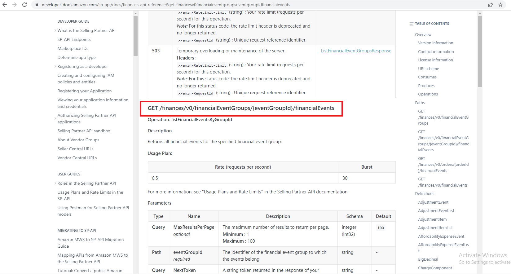
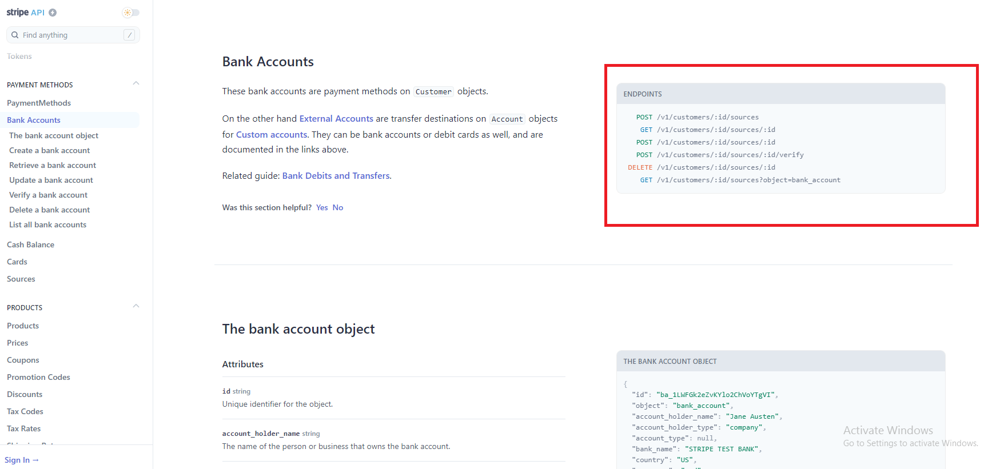

# Endpoint və metodlar

|                                                       |                                                                                                                                                                                                                                                                                                                                                                                                                                                    |   |
| ----------------------------------------------------- | -------------------------------------------------------------------------------------------------------------------------------------------------------------------------------------------------------------------------------------------------------------------------------------------------------------------------------------------------------------------------------------------------------------------------------------------------- | - |
| <mark style="color:blue;">**Resursun təsviri**</mark> | 
<mark style="color:orange;"></mark><a href="step-2-endpoints-and-methods-api-reference-tutorial.md"><mark style="color:orange;"><strong>Endpoint</strong></mark> </a><mark style="color:orange;"></mark>

<mark style="color:orange;"></mark><a href="step-2-endpoints-and-methods-api-reference-tutorial.md"><mark style="color:orange;"><strong>və metodlar</strong></mark> </a><mark style="color:orange;"><strong></strong></mark>
 |   |

### Endpoint və metod nədir?

> **Endpoint** resursa necə giriş əldə edə biləcəyinizi, **metod** isə resurs üzərində hansı əməliyyatları (`GET`, `POST`, `DELETE` və s) icra edə biləcəyinizi göstərir.
>
> **Resurslar** müxtəlif **Endpoint**-lərə malik olur. **Endpoint**-lərin müxtəlif **Path (yəni URL-ləri)** və **metodları** olsa da onların hamsı **Resurs** üzrə müxtəlif məlumatları qaytarırlar.&#x20;
>
> **Endpoint**-lərin təsviri adətən ümumi **resursun** təsvirinə oxşar, lakin daha qısa təsvirlərə malik olur.&#x20;


Məsələn, aşağıda **Mailchimp API** üzrə nümunədə görə bilərsiniz ki, ümumi resurs **Campaings** adlanır və onun təsviri belə göstərilir:

<mark style="color:orange;">`Campaigns are how you send emails to your Mailchimp list. Use the Campaigns API calls to manage campaigns in your Mailchimp account.`</mark>

**Campaings** resursunun Endpoint-lərindən biri olan ** `GET /campaigns`** təsviri isə resursa nəzərən qısa olaraq belə göstərilir:

<mark style="color:orange;">`Get all campaigns in an account.`</mark>


> Həmçinin, **Endpoint** bütün **Endpoint**-lər üçün ümumi olan əsas **Path**-i (yol) deyil, yalnız resurs **URL**-in **Path**-in (yolun) göstərir.&#x20;
>
> Cümlə çətindir bilirəm, narahat olmayın [aşağıdakı bölmədə](step-2-endpoints-and-methods-api-reference-tutorial.md#endpoint-yalniz-end-path-i-goest-rir) izahı vermişəm.

### Endpointlər üzrə nümunə

#### [Mailchimp API](https://mailchimp.com/developer/marketing/api/campaigns/)

> Aşağıda [Mailchimp APı-ın "Campaings"](https://mailchimp.com/developer/marketing/api/campaigns/) resursu üzrə **endpoint**-lər göstərilmişdir.

> **Endpoint**-lər adətən gözə daha tez çarpması üçün xüsusi dizaynla interfeysdə göstərilir. API sənədləşmələrinin əksəriyyətinin əsas məğzini **Endpoint**-lər təşkil edir. Bu səbəbdəndə sənədləşmənizdə **Endpoint**-ləri xüsusi formada göstərməyiniz tövsiyyə olunur. &#x20;
>
> Çünki proqramçılar test sorğuları etmək üçün dərhal **Endpoint**-ləri axtaracaqlar.&#x20;

### Path parametrlərini fərqləndirin

> Əgər sizin **endpoint**-də [**path parameter**](step-3-parameters-api-reference-tutorial.md#path-parameters) **** varsa onları _<mark style="color:orange;">fiqurlu mötərizə</mark>_ <mark style="color:orange;"></mark><mark style="color:orange;">(</mark>_<mark style="color:orange;">curly braces</mark>_<mark style="color:orange;">)</mark> ilə göstərin. Məsələn aşağıda **Mailchimp API** üzrə nümunə göstərilmişdir.


<mark style="color:blue;">**GET**</mark>** /campaigns/**<mark style="color:orange;">**{campaign\_id}**</mark>


> <mark style="color:orange;">{Fiqurlu mötərizdən}</mark> istifadə edərək **path parametrin** göstərmək mütləq bir qayda deyildir. Sadəcə bu formada edildikdə gözə daha tez çarpır.&#x20;
>
> Məsələn, yuxarıdakı nümunədə yalnız <mark style="color:orange;">`{campaign_id}`</mark> <mark style="color:orange;"></mark><mark style="color:orange;"></mark> üzrə bu formadan istifadə edildiyi üçün dərhal başa düşülür ki, bu dəyərin ümumi **endpoint** üzrə fərqliliyi vardır.

> Aşağıdakı digər bir nümunədə görürük ki, [OpenWeather API](https://openweathermap.org/api/one-call-3) platforması da **path parametrini** dediyimiz qaydada fərqli formada göstərmişdir.

#### [OpenWeather API](https://openweathermap.org/api/one-call-3)


#### [OpenWeather API](https://openweathermap.org/api/one-call-3)**-dan istifadə edərək siz hava haqqında məlumatları pulsuz formada alıb öz platformanız ilə inteqrasiya edə bilərsiniz.**


> Qeyd etdiyimiz kimi, **path parameterlərinin** standart təyin edilən bir rəngi yoxdur. Məsələn aşağıda [Amazon API-](step-2-endpoints-and-methods-api-reference-tutorial.md#undefined)larında şahidi oluruq ki, path parametri olan <mark style="color:orange;">`{eventGroupId}`</mark>  **URL**-dəki digər dəyərlərdən seçilmir. &#x20;


Amma siz sənədləşmə edərkən, bu parametrlərin dərhal gözə çarpası üçün fərqli formada və fərqli rəngdən istifadə edin.&#x20;

Mən standart olaraq [OpenWeather API](https://openweathermap.org/api/one-call-3)-da olduğu kimi <mark style="color:orange;">narıncı rəngdən</mark> istifadə edirəm.


#### [Amazon API](https://developer-docs.amazon.com/sp-api/docs/finances-api-reference#get-financesv0financialeventgroupseventgroupidfinancialevents)

### Metodların təyini

> **Metodların** (GET, POST və s.) **endpoint**-lərin qarşısında verilməsi qəbul olunmuş praktikadır. Metodlar resurslar ilə nə iş görə biləcəyimizi təyin edir. Qısa olaraq, metodları aşağıda qeyd edib nə iş gördüyünü qeyd edirəm:
>
> * <mark style="color:blue;">**GET**</mark>: **Resursu** qaytarır. Yəni **Resurs** haqqında hansısa məlumatı əldə etmək istədikdə <mark style="color:blue;">**GET**</mark>-dən istifadə edilir.
> * <mark style="color:blue;">**POST**</mark>: **Resursu** yaradır.&#x20;
> * <mark style="color:blue;">**PUT**</mark>: Mövcud **resursu** və ya **resurs** daxilindəki hansısa hissələri yeniləyir.&#x20;
> * <mark style="color:blue;">**PATCH**</mark>: Mövcud **resursu** qismən dəyişdirir.
> * <mark style="color:blue;">**DELETE**</mark>: **Resursu** silir.
>
> Ətraflı məlumat üçün Vikipediyanın HTTP məqaləsində [Request methods](https://en.wikipedia.org/wiki/Hypertext\_Transfer\_Protocol#Request\_methods) baxın. Bəzi əlavə **metodlar** da var, lakin onlar nadir hallarda istifadə olunur.

> Since there’s not much to say about the method itself, it makes sense to group the method with the endpoint. Here’s an example from the Box API:

#### Endpointimiz üzrə metodu təyin edək

> Məlumatlarda qeyd edildiyi kimi, 3-cü tərəf təşkilatlar banklardan hesab üzrə balansları əldə edəcəklər. Məlumatın əldə edilməsi üçündə **GET** metodundan istifadə edilir.


Endpointimiz üçün metod - <mark style="color:blue;">**GET**</mark>


#### [Stripe API](https://stripe.com/docs/api/customer\_bank\_accounts)


Sometimes the method is referred to as the “verb.” GET, PUT, POST, PATCH, and DELETE are all verbs or actions.


### Endpoint yalnız "end path"i göstərir

> Endpoint-i göstərdiyiniz zaman yalnız "end path"-i göstərin. "Full path" "Base Path və Endpoint-dən ibarət olur və bunların ümumilikdə resurs URL adlanır.&#x20;
>
> Yuxarıdakı Stripe nümunəmizdə də endpoint  `/v1/customers/:id/sources` kimi göstərilir. Burada Stripe hər dəfə resurs URL-ni tam formada, yəni bu formada `https://api.stripe.com/v1/customers/:id/sources` göstərmir. yuxarıdakı qeydimizi bu nümunə üzrə izah etsək burada `https://api.stripe.com` **Base path** `/v1/customers/:id/sources isə` **Endpoint-dir.**  Bunların ikisi bir yerdə isə `https://api.stripe.com/v1/customers/:id/sources` **Resurs URL-dir.**


Tam resurs URL-nin sənədləşməyə daxil edilməsi, istifadəçilər üçün lazım olan Endpoint-lərə diqqətini yönəltməkdən yayındırır.&#x20;

Adətən resurs URL user guide-dın giriş hissəsində (məsələn, getting starting tutorial) avtorizasiya metodları ilə birgə göstərilir.

Bu səbəbdəndə, hər dəfə Endpoint yazarkən full resurs URL göstərməyiniz lazım deyil.


### How to group multiple endpoints for the same resource 

> Another consideration in documenting endpoints and methods is how to group and list the endpoints, particularly if you have a lot of endpoints for the same resource. In [Examples of resource descriptions](https://idratherbewriting.com/learnapidoc/docapis\_resource\_descriptions.html#examples), we looked at a variety of APIs. Many doc sites provide different designs for grouping or listing each endpoint for the resource, so I won’t revisit all the same examples. Group the endpoints in some way that makes sense, such as by method or by the type of information returned.
>
> **Endpoint**-lərin və **metodların** sənədləşdirilməsində diqqət yetirilməli olan digər məqam onları necə qruplaşdırmaq və başa düşülən formada göstərməkdir, xüsusən də eyni resurs üzrə çoxlu sayda **endpoint**-ləriniz olarsa.&#x20;
>
> [Resursun təsviri](step-1-resource-description-api-reference-tutorial.md) bölməsində biz müxtəlif API nümunələrinə baxdıq. Bir çox  platformalar **resurs** üzrə hər bir **endpoint**-i qruplaşdırmaq və ya sənədləşdirmək üçün müxtəlif dizayndan istifadə edirlər, buna görə də eyni nümunələrə yenidən baxmayacağıq.
>
> &#x20;<mark style="color:red;">Son nöqtələri məntiqli şəkildə qruplaşdırın, məsələn, metod və ya qaytarılan məlumatın növü.</mark>
>
> <mark style="color:red;">Endpoint-ləri mə</mark>
>
> For example, suppose you have three GET endpoints and one POST endpoint, all of which relate to the same resource. Some doc sites might list all the endpoints for the same resource on the same page. Others might break them into separate pages. Others might create one group for the GET endpoints and another for the POST endpoints. It depends how much you have to say about each endpoint.
>
> Amma ümumi konsepsiyaya nəzər salaq. Məsələn, deyək ki, sizin üç <mark style="color:blue;">**GET**</mark> və bir <mark style="color:blue;">**POST**</mark> **endpoint**-niz var və bunların hamısı eyni **resursa** aiddir.&#x20;
>
> Belə olan halda, bəzi platformalar eyni **resurs** üzrə bütün **endpoint**-ləri bir qrupda, digərləri isə müxtəlif qruplarda - məsələn, <mark style="color:blue;">**GET**</mark> üçün bir qrup, <mark style="color:blue;">**POST**</mark> üçün başqa bir qrupda verə bilərlər.&#x20;
>
> If the endpoints are mostly the same, consolidating them on a single page could make sense. But if they’re substantially unique (with different responses, parameters, and error messages), separating them onto different pages is probably better (and easier to manage). Then again, with a more sophisticated website design, you can make lengthy information navigable on the same page.

> In a later section on [design patterns](https://idratherbewriting.com/learnapidoc/pubapis\_design\_patterns.html), I explain that [long pages](https://idratherbewriting.com/learnapidoc/pubapis\_design\_patterns.html#longish\_pages) are common pattern with developer docs, in part because they make content easily findable for developers using Ctrl + F.&#x20;

### Endpoint for surfreport API 

> Let’s create the Endpoints and methods section for our [fictitious surfreport API](https://idratherbewriting.com/learnapidoc/docapis\_new\_endpoint\_to\_doc.html). Here’s my approach:


<mark style="color:green;">**Endpoint**</mark>

<mark style="color:blue;">**GET**</mark>**   /accounts/**<mark style="color:orange;">**{AccountId}/**</mark>**balances**

**Hesab üzrə balansı əldə et (Request to get account balance)**


### Next step

> Now that we’ve described the resource and listed the endpoints and methods, it’s time to tackle one of the most important parts of an API reference topic: the [parameters section](https://idratherbewriting.com/learnapidoc/docapis\_doc\_parameters.html).
