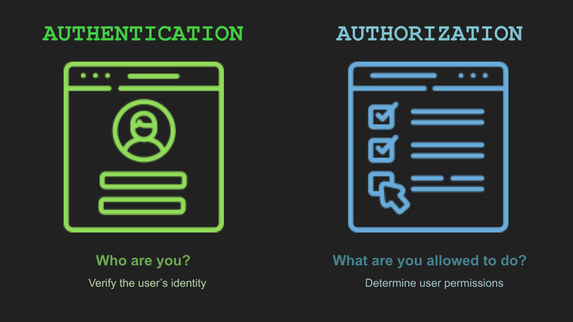

# Overview

> In this module, you'll learn the basics of REST APIs and how we design them.&#x20;
>
> This module will teach you about API-first development, which recommends that you design APIs with the app developer in mind.&#x20;
>
> You'll also learn about OpenAPI specifications, which are used to document APIs and provide live documentation in an Apigee developer portal.

### Autentifikasiya və Avtorizasiya fərqi

> Gəlin, ilk öncə hər zaman rastlaşdığımız çox yaxın olan iki terminin fərqini başa düşək.
>
> * **Authentication**: Kimliyi təsdiqləməyi ehtiva edir. Yəni, API-lara müraciət edən həqiqətən də sənsən yoxsa yox.
> * **Authorization**: Müəyyən icazələri ehtiva edir. yəni API-ın müraciət edildiyi metodundan (bölməsindən) istifadə etməyə icazən var ya yox.
>
> Belə nəticəyə gəlirik ki, API səni autentifikasiya edib içəri buraxa bilər, amma avtorizasiya etməyərək oradakı məlumatlardan istifadə etməyə qoymaz.

### API-da təhlükəsizlik olmasa idi

> Ümumiyyətlə API-larda **autentifikasiya** və ya **avtorizasiya** olmasa idi nə olardı?!
>
> _Nə üçün API-lara autentifikasiya lazımdır?_&#x20;

> Bəzən API-ları sorğulamaq üçün `API Key` və digər avtorizasiya növlərinə ehtiyac olmur.  Belə API-lara çox nadir hallarda rast gələ bilərsiniz. Amma demək olar ki, əksər API-lar `API Key` və digər metodlardan istifadə edərək **autentifikasiya və avtorizasiya** tələb edirlər.&#x20;
>
> Əgər API-larda heç bir təhlükəsizlik məsələsi olmasa, ən azından istifadəçilər qeydiyyat etmədən limitsiz API sorğuları göndərə bilər və sistemin işini bloklaya bilərlər. Hələ digər təhdidləri qeyd etmirəm.&#x20;
>
> Digər məsələ isə, Biz əgər API üçün təhlükəsizlik tədbirləri görməsək və kim gəldi API-ı sorğulasa onda biz bilməyəcəyik ki, kimdən nə qədər xidmət haqqı alaq.&#x20;


Adətən API-lar üzrə qazanc göndərilən sorğuların sayına əsasən hesablanır, məsələn, bu API üçün aylıq 1000 sorğu x manat, 1000-dən artıq sorğu isə y manat olacaqdır.  &#x20;


> Əlavə olaraq, autentifikasiya olmadan istifadəçinin yalnız özünə aid olan məlumatlarına çıxışını rahat yolla təmin edə bilməyəcəyik. Və bir istifadəçinin səhvən digər istifadəçi məlumatlarını silməsinin qarşısını rahatlıqla ala bilməyəcəyik (məsələn, bir istifadəçi digər istifadəçi adından **DELETE** sorğusu göndərib onun məlumatlarını silə bilər).
>
> Ən əsas məsələlərdən biri isə, siz API-larınızı izləyə bilməyəcəksiniz ki, kim onlardan istifadə edir, hansı sorğulara daha çox tələbat var və s.&#x20;
>
> Qeyd edilənləri nəzərə alaraq, belə qənaətə gəlirik ki, API dizaynerlər (Tech Writer-lar) hazırladıqları API-lar üçün mütləq **autentifikasiya** və **avtorizasiyanı tətbiq etməlidirlər.**
>
> Ümumiləşdirsək, API-ların **autentifikasiya** və **avtorizasiyası** aşağıdakı məqsədlər üçün istifadə olunur:
>
> * Yalnız qeydiyyatdan keçmiş istifadəçilərin API sorğuları göndərə bilməsi üçün
> * Kimin sorğu göndərməsinin müəyyən edilə bilinməsi üçün
> * API istifadəsinin izlənə bilinməsi üçün
> * API üzrə tətbiq olunan limiti keçən istifadəçilərin bloklanması/aşkar edilməsi üçün
> * Fərqli istifadəçilər üçün fərqli icazələrin tətbiq edilə bilinməsi üçün
