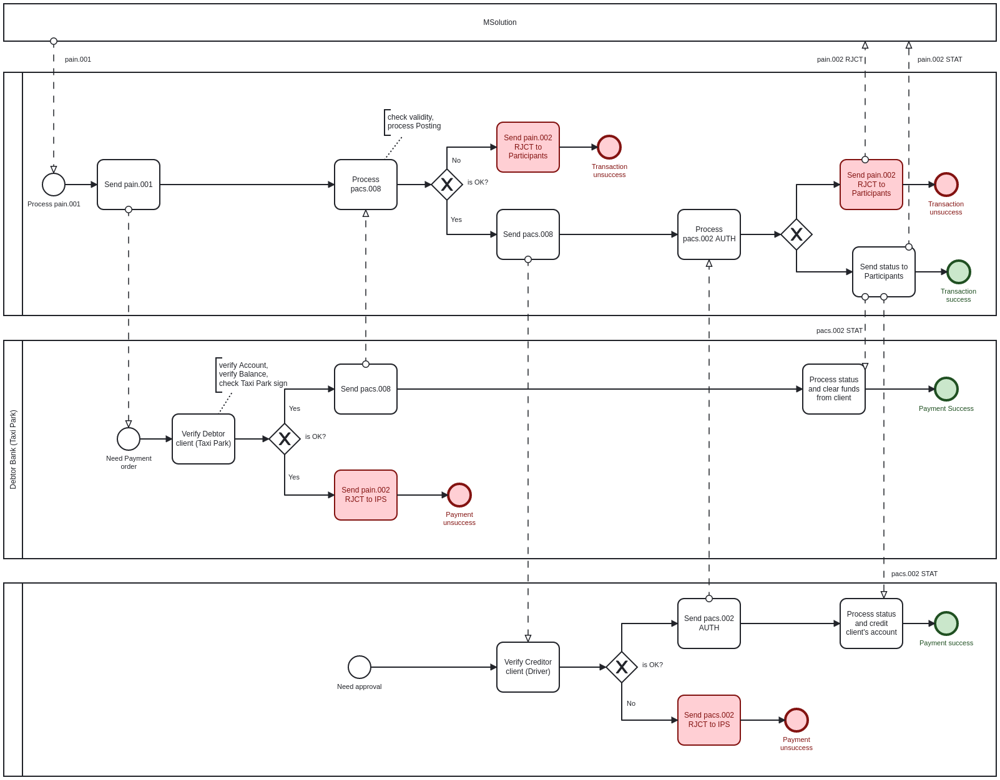

# JSON Dot notation

## Inspect the JSON from the response payload

> Xatırlayırsınızsa ilk dərsdə kiçik bir sayt düzəltmişdik və aviabilet üzrə nəticə tarixə görə syatda əks olunurdur. Əslində bu frontned developerlərin işidir. Beləki onlar backenddən aldıqları JSOn response un fieldlərin lazımı xanalarda çıxarmalıdırlar.
>
> Amma bizim məqsədimiz developer gözü ilə məsələlərə baxmaq və prosesləri başa düşməkdir. Ona görə ilk dərsdə göstərdiyimiz nümunənin necə ərsəyə gəlməsinə baxaq.

### &#x20;Activity: Make an API request on a web page

> Burada biz JavaScript dən istifadə edərək API response-dan qayıdan cavabları web page də göstərəcyik. Konkret olaraq seçdiyimiz tarix üzrə Bakı - İstanbul biletinin qiymətinə baxacağıq.&#x20;
>
> 1. Gəlin Text editorda yeni HTML faylımızı yaradaq və adını `flight_test.html` adlandıraq və içərisinə göstərdiyimiz kodu əlavə edək


Sizcə biz API request üçün JavaScript kodun hardan əldə edə bilərik? API Request JSON da bizə məlumdur



```html
<html>
   <meta charset="UTF-8">
   <head>
      <title>Sample page</title>
      <script src="https://ajax.googleapis.com/ajax/libs/jquery/1.11.1/jquery.min.js"></script>
      <script>
      POSTMAN CODE GOES HERE
      </script>
   </head>
   <body>
      <h1>Sample Page</h1>
      flight_price: <span id="flightPrice"></span>
   </body>
</html>
```

> Burada gördüyümüz sadə HTML səhifəsidir. Bunu İnternetdə açsanız görünüş bu formada olacaqdır.



\


\
