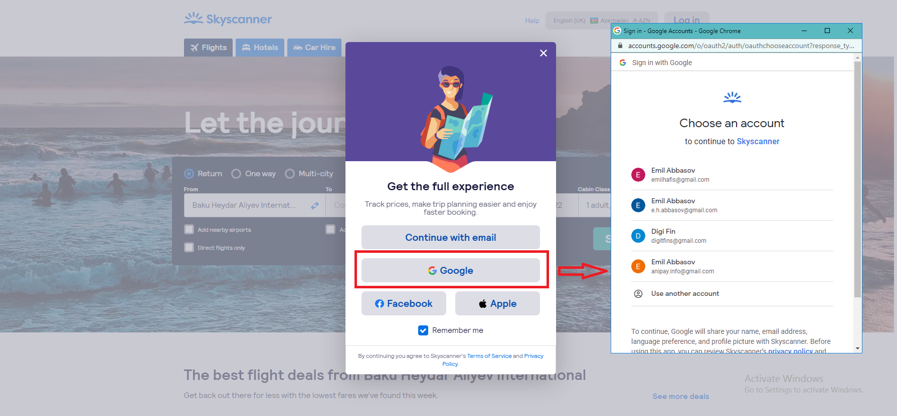

# Authorization Code

### Ümumi məlumat

> Veb tətbiqlər (saytlar) istifadəçilərin platformaya girişini sadələşidirmək və özlərinin əlavə autentifikasiya mexanizmlərini hazırlamamaq üçün **Authorization code grant** növündən istifadə edə bilərlər.&#x20;
>
> Bu tətbiqlər həmçinində digər təhlükəsizlik tələblərini qarşılamalıdırlar, çünki Auth servisindən alınmış olan  `Clent ID` və `Client Secret-i` təhlükəsiz formada saxlamağı bacarmalıdırlar.


**Client ID** və **Client Secret** dəyərləri tətbiqi OAuth protokolu əsasında autentifikasiyanı dəstəkləyən platformalarda qeydiyyatdan keçirdikdə baş verir.

Məsələn, şirkət öz saytını Google-da authentifikaisya üçün qeydiyyatdan keçirdikdə Google bu məlumatları sayta verir.


> Qeyd etdiyimiz kimi, hazırda istifadəçilərin digər servislərdə olan məlumatları ilə 3-cü tərəf Application-lara daxil olması üçün bu növdən çox geniş istifadə olunur.

### Nümunələr

> Bundan əvvəl nümunə kimi göstərdiyimiz [Rapid API ](../overview.md#authorization-code-grant-type)nümunəsində də bu növdən istifadə olunur.

> Digər bir nümunə kimidə [Skyscanner](https://www.skyscanner.net/) platformasını qeyd etmək olar.&#x20;


[Skyscanner](https://www.skyscanner.net/) platformasıda qeydiyyatdan keçərək onların təqdim etdikləri API-lar ilə tanış olub API dizayn zamanı bilet haqqında lazımı məlumatların alınmasında istifadə edə bilərsiniz.


> Siz [Skyscanner](https://www.skyscanner.net/) saytına daxil olanda qeydiyyat üçün əlavə seçim kimi Google təklif olunur.

> Bu seçimi seçdikdən sonra, şəkildə sağ tərəfd göstərdiyim kimi pop-up pəncərə açılır.&#x20;

#### Pop-up

> Əgər siz bundan əvvəl gmail-ə daxil olub öz məlumatlarınızı saxlamışdınızsa onlar sizə avtomatik təklif olunur, həmçinin də yeni e-mail ünvanı və şifrəni daxil etmək üçündə seçim verilir.

> Əlavə olaraq, göstərilən məlumatlarınızı Skyscanner ilə paylaşması üçün sizdən icazə alır.

#### İcazə

> Hər hansı bir e-mail ünvanın seçib davam etdikdə siz həm Skyscanner-ə daxil olursunuz, həm də göstərilən məlumatları sayta vermiş olursunuz.


Siz sayta daxil olan kimi ad, soyad və digər məlumatlarınızı dərhal orda görürsünüzsə, "bu məni hardan tanıdı deyərək" - təəccüblənməyin, buna siz icazə vermisiniz və Google məlumatları göndərib.&#x20;


> Gördüyünüz bu proses **Authorization code grant** növünə əsaslanan OAuth autentifikasiya növüdür.

## Necə işləyir?

> Proses aşağıdakı formada həyata keçirilir:
>
> 1. İstifadəçi tətbiq və ya sayt daxilində **Login** bölməsin seçir.
> 2. Sayt istifadəçini **API Gateway / Auth server**-nin login və avtorizasiya bölməsinə yönləndirir&#x20;
> 3. Login bölməsi isitfadəçiyə çıxarılır (yuxarıdakı nümunədə [pop-up](./#pop-up) açılan səhifə).
> 4. İstifadəçi göstərilən login metodlarından birini seçir və həmçinində, tələb edilirsə bəzi məlumatlarının götürülməsi üçün icazəni təsdiq edir (yuxarıdakı nümunədə [icazə](./#icaz) verilən səhifə).
> 5. İstifadəçi icazəni təsdiq edərsə və girişi uğurlu olarsa, **API Gateway / Auth server-i istifadəçini sayta yönləndirir və sayta** `authorization code` təqdim edir.
> 6. Sayt `authorization code` dəyərini `Client ID` və `Client Secret` (bu dəyərlər Skyscanner Google-da bu xidmtə üçün qeydiyyatdan keçirilərkən verilir) ilə birlikdə **API Gateway / Auth server-**nə göndərir.
> 7. **API Gateway / Auth server** `authorization code` , `Client ID` və `Client Secret` dəyərlərini yoxlayır.
> 8. Yoxlama uğurlu olduqda **API Gateway / Auth server** **Access token** (lazım olduqda R**efresh token**) generasiya edib sayta qaytarır.
> 9. **Application** access token-dən istifadə edərək lazımı məlumatı əldə etmək üçün sorğu göndərir.
> 10. **API Gateway / Auth server** token-i yoxlayır.&#x20;
> 11. Token etibarlı olarsa **API Gateway / Auth server** sorğunu **Backend API / Backend Servis**-ə göndərir.
> 12. **Backend API / Backend Servis** lazımı məlumatları **API Gateway / Auth server**-nə qaytarır.
> 13. **API Gateway / Auth server** məlumatları **Application**-a göndərir.


Yuxarıdakı **** [**Skyscanner**](https://www.skyscanner.net/) **** variantında**, istifadəçi -** User**,** [**Skyscanner**](https://www.skyscanner.net/)-Sayt (Regular web app), **Google** isə - API Gateway / Auth server və Backend API / Backend Servis **** rolunda çıxış edir.



Nəzərə almaq lazımdır ki, bu növdə **Client** tərəf, yəni sayt tərəf qeydiyyat zamanı təqdim olunan `Client ID` və `Client Secret` dəyərlərini təhlükəsiz formada saxlamalıdır.

