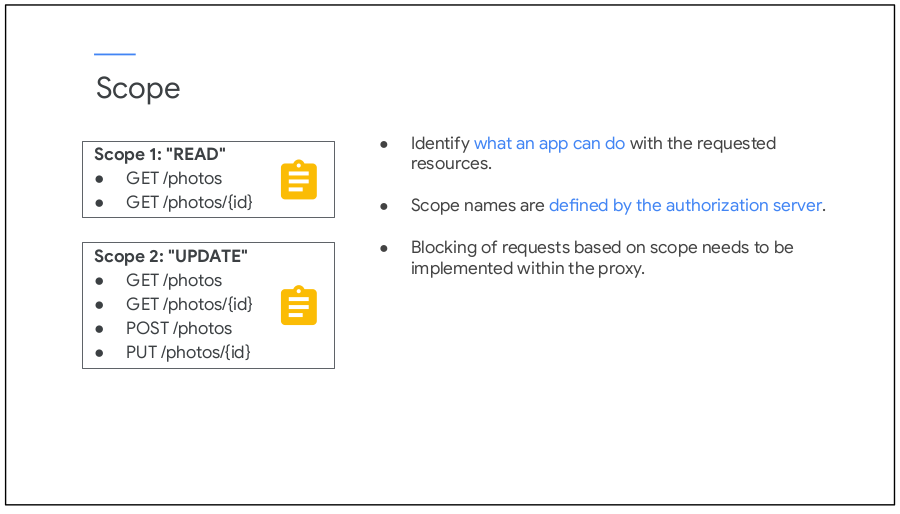

# Scope

### Scope nədir

> **Scope** **Access token**-dən istifadə edərkən tətbiqin tələb olunan resurslarla nə edə biləcəyini müəyyən edir.&#x20;
>
> **Avtorizasiya servisi** müraciət olunan resursa giriş icazəsini müəyyən edir. Sorğularda **Access token** olmasına baxmayaraq, əgər **Scope** düzgün təyin olunmayıbsa, sorğu yerinə yetirilməyəcəkdir.

> Gəlin, nümunə üzərindən baxaq.

> Deyək ki, şəkil yükləmə servisimiz vardır. Burada 2 **Scope** mövcuddur.&#x20;
>
> Birinci **Scope** **READ** adlandırılır və o yalnız istifadəçinin şəkilləri üzərində **read-only** əməliyyatını keçirməyə icazə verir. Yəni, bizə bu **Scope** çəçivəsində alınmış **Token** ilə yalnız şəkli əldə etmək sorğusu gələ bilər. Əgər şəkli dəyişmək və silmək sorğusu gələrsə bizim servisimiz onu icra etməkdən imtina edəcəkdir.
>
> İkinci **Scope** isə **UPDATE** adlanır və o, istifadəçinin şəkillərini əldə etmək, həm yeni şəkil əlavə etmək, həm də yeni şəkli dəyişmək icazəsini verir. Yəni, bizə bu **Scope** çəçivəsində alınmış **Token** ilə sorğu gəlsə qeyd etdiklərimizi bizim servis icra edə biləcəkdir.
