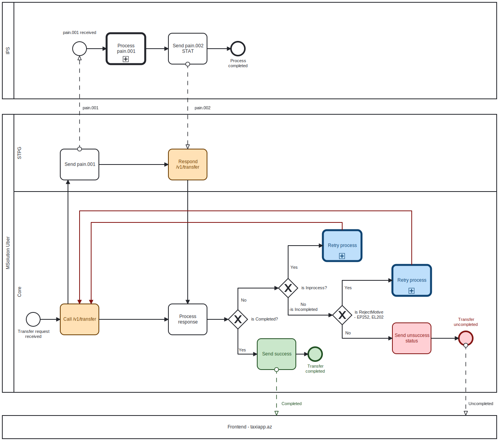

# Processing pain.002 STAT

## Overview

After receiving pain.001 message from MSolution:

1. IPS processes pain.001 and send pain.002 status to MSolution
2. MSolution process pain.002 status [as described diagram below](processing-pain.002-stat.md#pain.002-processing-by-msolution)


Timeout is 5 minutes in IPS for pain.001 processing.&#x20;

So IPS must receive answer from each bank within 5 minutes.&#x20;

If IPS not receives response from Debtor bank (Taxi Park's bank) within 5 minutes then sends pain.002 STAT to MSolution with rejection motive:

**`EP252`**` `` ```&#x20;

**`Query rejected by timeout`**` ```&#x20;

If IPS not receives response from Creditor bank (Driver's bank) within 5 minutes then sends pain.002 STAT to MSolution with rejection motive::

**`EL202`**`  ``` &#x20;

**`NRT - Rejected by timeout`**


## Pain.002 processing by MSolution

<figure><figcaption></figcaption></figure>

<details>

<summary>BPMN code blocks</summary>

```xml
<definitions id="sid-38422fae-e03e-43a3-bef4-bd33b32041b2" targetNamespace="http://bpmn.io/bpmn" exporter="bpmn-js (https://demo.bpmn.io)" exporterVersion="11.1.0">
<collaboration id="Collaboration_0ucamso">
<participant id="Participant_1t24dmf" name="MSolution Uber" processRef="Process_1"/>
<participant id="Participant_1ae3xgy" name="IPS" processRef="Process_1sw4pq5"/>
<participant id="Participant_10pz5db" name="Frontend - taxiapp.az"/>
<messageFlow id="Flow_039jo7o" name="pain.001" sourceRef="Activity_1sbi7a3" targetRef="Event_0grnfkz"/>
<messageFlow id="Flow_1uk11p4" name="pain.002" sourceRef="Activity_1numhp0" targetRef="Activity_0r1pe4h"/>
<messageFlow id="Flow_1krfes4" name="Completed" sourceRef="Activity_1ct4bjt" targetRef="Participant_10pz5db"/>
<messageFlow id="Flow_13j4zto" name="Uncompleted" sourceRef="Event_0ayleoa" targetRef="Participant_10pz5db"/>
</collaboration>
<process id="Process_1" isExecutable="false">
<laneSet id="LaneSet_0v0bxjd">
<lane id="Lane_1wyb45h" name="STPG">
<flowNodeRef>Activity_1sbi7a3</flowNodeRef>
<flowNodeRef>Activity_0r1pe4h</flowNodeRef>
</lane>
<lane id="Lane_0cmu2c6" name="Core">
<flowNodeRef>Event_0s873fj</flowNodeRef>
<flowNodeRef>Gateway_1t2zsk0</flowNodeRef>
<flowNodeRef>Activity_1ct4bjt</flowNodeRef>
<flowNodeRef>Activity_12708ws</flowNodeRef>
<flowNodeRef>Activity_0syi6cs</flowNodeRef>
<flowNodeRef>Gateway_0v804kn</flowNodeRef>
<flowNodeRef>Gateway_17ivw9p</flowNodeRef>
<flowNodeRef>Activity_0ohxd04</flowNodeRef>
<flowNodeRef>Event_0ayleoa</flowNodeRef>
<flowNodeRef>Activity_0a30qvb</flowNodeRef>
<flowNodeRef>Activity_1u2dbje</flowNodeRef>
<flowNodeRef>Event_09nv1fc</flowNodeRef>
</lane>
</laneSet>
<task id="Activity_1sbi7a3" name="Send pain.001">
<incoming>Flow_0mz0o55</incoming>
<outgoing>Flow_1nfzear</outgoing>
</task>
<task id="Activity_0r1pe4h" name="Respond /v1/transfer">
<incoming>Flow_1nfzear</incoming>
<outgoing>Flow_1qsu34s</outgoing>
</task>
<startEvent id="Event_0s873fj" name="Transfer request received">
<outgoing>Flow_0i0b7hf</outgoing>
</startEvent>
<exclusiveGateway id="Gateway_1t2zsk0" name="is Completed?">
<incoming>Flow_0h7c0vm</incoming>
<outgoing>Flow_16q5da7</outgoing>
<outgoing>Flow_0qia094</outgoing>
</exclusiveGateway>
<task id="Activity_1ct4bjt" name="Send success">
<incoming>Flow_16q5da7</incoming>
<outgoing>Flow_1duvplw</outgoing>
</task>
<task id="Activity_12708ws" name="Call /v1/transfer">
<incoming>Flow_0i0b7hf</incoming>
<incoming>Flow_1qxdpuv</incoming>
<incoming>Flow_1vk8g4d</incoming>
<outgoing>Flow_0mz0o55</outgoing>
<outgoing>Flow_10y7u0b</outgoing>
</task>
<task id="Activity_0syi6cs" name="Process response">
<incoming>Flow_10y7u0b</incoming>
<incoming>Flow_1qsu34s</incoming>
<outgoing>Flow_0h7c0vm</outgoing>
</task>
<exclusiveGateway id="Gateway_0v804kn" name="is Inprocess?">
<incoming>Flow_0qia094</incoming>
<outgoing>Flow_0h6obrv</outgoing>
<outgoing>Flow_0qgyjw4</outgoing>
</exclusiveGateway>
<exclusiveGateway id="Gateway_17ivw9p" name="is RejectMotive - EP252, EL202">
<incoming>Flow_0qgyjw4</incoming>
<outgoing>Flow_1els85j</outgoing>
<outgoing>Flow_1dewmkq</outgoing>
</exclusiveGateway>
<sequenceFlow id="Flow_0mz0o55" sourceRef="Activity_12708ws" targetRef="Activity_1sbi7a3"/>
<sequenceFlow id="Flow_1nfzear" sourceRef="Activity_1sbi7a3" targetRef="Activity_0r1pe4h"/>
<sequenceFlow id="Flow_1qsu34s" sourceRef="Activity_0r1pe4h" targetRef="Activity_0syi6cs"/>
<sequenceFlow id="Flow_0i0b7hf" sourceRef="Event_0s873fj" targetRef="Activity_12708ws"/>
<sequenceFlow id="Flow_0h7c0vm" sourceRef="Activity_0syi6cs" targetRef="Gateway_1t2zsk0"/>
<sequenceFlow id="Flow_16q5da7" name="Yes" sourceRef="Gateway_1t2zsk0" targetRef="Activity_1ct4bjt"/>
<sequenceFlow id="Flow_0qia094" name="No" sourceRef="Gateway_1t2zsk0" targetRef="Gateway_0v804kn"/>
<sequenceFlow id="Flow_1qxdpuv" sourceRef="Activity_1u2dbje" targetRef="Activity_12708ws"/>
<sequenceFlow id="Flow_10y7u0b" sourceRef="Activity_12708ws" targetRef="Activity_0syi6cs"/>
<sequenceFlow id="Flow_0h6obrv" name="Yes" sourceRef="Gateway_0v804kn" targetRef="Activity_1u2dbje"/>
<sequenceFlow id="Flow_0qgyjw4" name="No -is Incompleted" sourceRef="Gateway_0v804kn" targetRef="Gateway_17ivw9p"/>
<sequenceFlow id="Flow_1els85j" name="Yes" sourceRef="Gateway_17ivw9p" targetRef="Activity_0a30qvb"/>
<sequenceFlow id="Flow_1dewmkq" name="No" sourceRef="Gateway_17ivw9p" targetRef="Activity_0ohxd04"/>
<task id="Activity_0ohxd04" name="Send unsuccess status">
<incoming>Flow_1dewmkq</incoming>
<outgoing>Flow_1gfviko</outgoing>
</task>
<sequenceFlow id="Flow_1gfviko" sourceRef="Activity_0ohxd04" targetRef="Event_0ayleoa"/>
<endEvent id="Event_0ayleoa" name="Transfer uncompleted">
<incoming>Flow_1gfviko</incoming>
</endEvent>
<callActivity id="Activity_0a30qvb" name="Retry process">
<incoming>Flow_1els85j</incoming>
<outgoing>Flow_1vk8g4d</outgoing>
</callActivity>
<callActivity id="Activity_1u2dbje" name="Retry process">
<incoming>Flow_0h6obrv</incoming>
<outgoing>Flow_1qxdpuv</outgoing>
</callActivity>
<sequenceFlow id="Flow_1vk8g4d" sourceRef="Activity_0a30qvb" targetRef="Activity_12708ws"/>
<endEvent id="Event_09nv1fc" name="Transfer completed">
<incoming>Flow_1duvplw</incoming>
</endEvent>
<sequenceFlow id="Flow_1duvplw" sourceRef="Activity_1ct4bjt" targetRef="Event_09nv1fc"/>
</process>
<process id="Process_1sw4pq5">
<startEvent id="Event_0grnfkz" name="pain.001 received">
<outgoing>Flow_1jwgx74</outgoing>
</startEvent>
<callActivity id="Activity_09icciv" name="Process pain.001">
<incoming>Flow_1jwgx74</incoming>
<outgoing>Flow_0f0wt2q</outgoing>
</callActivity>
<task id="Activity_1numhp0" name="Send pain.002 STAT">
<incoming>Flow_0f0wt2q</incoming>
<outgoing>Flow_0m09se5</outgoing>
</task>
<sequenceFlow id="Flow_1jwgx74" sourceRef="Event_0grnfkz" targetRef="Activity_09icciv"/>
<sequenceFlow id="Flow_0f0wt2q" sourceRef="Activity_09icciv" targetRef="Activity_1numhp0"/>
<endEvent id="Event_1r3kgqf" name="Process completed">
<incoming>Flow_0m09se5</incoming>
</endEvent>
<sequenceFlow id="Flow_0m09se5" sourceRef="Activity_1numhp0" targetRef="Event_1r3kgqf"/>
</process>
<bpmndi:BPMNDiagram id="BpmnDiagram_1">
<bpmndi:BPMNPlane id="BpmnPlane_1" bpmnElement="Collaboration_0ucamso">
<bpmndi:BPMNShape id="Participant_1t24dmf_di" bpmnElement="Participant_1t24dmf" isHorizontal="true">
<omgdc:Bounds x="160" y="370" width="1280" height="720"/>
<bpmndi:BPMNLabel/>
</bpmndi:BPMNShape>
<bpmndi:BPMNShape id="Lane_1wyb45h_di" bpmnElement="Lane_1wyb45h" isHorizontal="true">
<omgdc:Bounds x="190" y="370" width="1250" height="200"/>
<bpmndi:BPMNLabel/>
</bpmndi:BPMNShape>
<bpmndi:BPMNShape id="Lane_0cmu2c6_di" bpmnElement="Lane_0cmu2c6" isHorizontal="true">
<omgdc:Bounds x="190" y="570" width="1250" height="520"/>
<bpmndi:BPMNLabel/>
</bpmndi:BPMNShape>
<bpmndi:BPMNShape id="Activity_1sbi7a3_di" bpmnElement="Activity_1sbi7a3">
<omgdc:Bounds x="310" y="460" width="100" height="80"/>
<bpmndi:BPMNLabel/>
</bpmndi:BPMNShape>
<bpmndi:BPMNShape id="Activity_0r1pe4h_di" bpmnElement="Activity_0r1pe4h" bioc:stroke="#6b3c00" bioc:fill="#ffe0b2" color:background-color="#ffe0b2" color:border-color="#6b3c00">
<omgdc:Bounds x="590" y="460" width="100" height="80"/>
<bpmndi:BPMNLabel/>
</bpmndi:BPMNShape>
<bpmndi:BPMNShape id="Event_0s873fj_di" bpmnElement="Event_0s873fj">
<omgdc:Bounds x="222" y="883" width="36" height="36"/>
<bpmndi:BPMNLabel>
<omgdc:Bounds x="200" y="926" width="81" height="27"/>
</bpmndi:BPMNLabel>
</bpmndi:BPMNShape>
<bpmndi:BPMNShape id="Gateway_1t2zsk0_di" bpmnElement="Gateway_1t2zsk0" isMarkerVisible="true">
<omgdc:Bounds x="745" y="876" width="50" height="50"/>
<bpmndi:BPMNLabel>
<omgdc:Bounds x="804.5" y="894" width="71" height="14"/>
</bpmndi:BPMNLabel>
</bpmndi:BPMNShape>
<bpmndi:BPMNShape id="Activity_1ct4bjt_di" bpmnElement="Activity_1ct4bjt" bioc:stroke="#205022" bioc:fill="#c8e6c9" color:background-color="#c8e6c9" color:border-color="#205022">
<omgdc:Bounds x="820" y="951" width="100" height="80"/>
<bpmndi:BPMNLabel/>
</bpmndi:BPMNShape>
<bpmndi:BPMNShape id="Activity_12708ws_di" bpmnElement="Activity_12708ws" bioc:stroke="#6b3c00" bioc:fill="#ffe0b2" color:background-color="#ffe0b2" color:border-color="#6b3c00">
<omgdc:Bounds x="310" y="861" width="100" height="80"/>
<bpmndi:BPMNLabel/>
</bpmndi:BPMNShape>
<bpmndi:BPMNShape id="Activity_0syi6cs_di" bpmnElement="Activity_0syi6cs">
<omgdc:Bounds x="590" y="861" width="100" height="80"/>
<bpmndi:BPMNLabel/>
</bpmndi:BPMNShape>
<bpmndi:BPMNShape id="Gateway_0v804kn_di" bpmnElement="Gateway_0v804kn" isMarkerVisible="true">
<omgdc:Bounds x="875" y="795" width="50" height="50"/>
<bpmndi:BPMNLabel>
<omgdc:Bounds x="934.5" y="813" width="65" height="14"/>
</bpmndi:BPMNLabel>
</bpmndi:BPMNShape>
<bpmndi:BPMNShape id="Gateway_17ivw9p_di" bpmnElement="Gateway_17ivw9p" isMarkerVisible="true">
<omgdc:Bounds x="1015" y="865" width="50" height="50"/>
<bpmndi:BPMNLabel>
<omgdc:Bounds x="1071" y="876" width="78" height="27"/>
</bpmndi:BPMNLabel>
</bpmndi:BPMNShape>
<bpmndi:BPMNShape id="Activity_0ohxd04_di" bpmnElement="Activity_0ohxd04" bioc:stroke="#831311" bioc:fill="#ffcdd2" color:background-color="#ffcdd2" color:border-color="#831311">
<omgdc:Bounds x="1170" y="910" width="100" height="80"/>
<bpmndi:BPMNLabel/>
</bpmndi:BPMNShape>
<bpmndi:BPMNShape id="Event_0ayleoa_di" bpmnElement="Event_0ayleoa" bioc:stroke="#831311" bioc:fill="#ffcdd2" color:background-color="#ffcdd2" color:border-color="#831311">
<omgdc:Bounds x="1342" y="932" width="36" height="36"/>
<bpmndi:BPMNLabel>
<omgdc:Bounds x="1329" y="895" width="63" height="27"/>
</bpmndi:BPMNLabel>
</bpmndi:BPMNShape>
<bpmndi:BPMNShape id="Activity_0ihy1aq_di" bpmnElement="Activity_0a30qvb" bioc:stroke="#0d4372" bioc:fill="#bbdefb" color:background-color="#bbdefb" color:border-color="#0d4372">
<omgdc:Bounds x="1170" y="760" width="100" height="80"/>
</bpmndi:BPMNShape>
<bpmndi:BPMNShape id="Activity_1ld48w8_di" bpmnElement="Activity_1u2dbje" bioc:stroke="#0d4372" bioc:fill="#bbdefb" color:background-color="#bbdefb" color:border-color="#0d4372">
<omgdc:Bounds x="990" y="670" width="100" height="80"/>
</bpmndi:BPMNShape>
<bpmndi:BPMNShape id="Event_09nv1fc_di" bpmnElement="Event_09nv1fc" bioc:stroke="#205022" bioc:fill="#c8e6c9" color:background-color="#c8e6c9" color:border-color="#205022">
<omgdc:Bounds x="952" y="973" width="36" height="36"/>
<bpmndi:BPMNLabel>
<omgdc:Bounds x="945" y="1016" width="51" height="27"/>
</bpmndi:BPMNLabel>
</bpmndi:BPMNShape>
<bpmndi:BPMNEdge id="Flow_0mz0o55_di" bpmnElement="Flow_0mz0o55">
<omgdi:waypoint x="330" y="861"/>
<omgdi:waypoint x="330" y="540"/>
</bpmndi:BPMNEdge>
<bpmndi:BPMNEdge id="Flow_1nfzear_di" bpmnElement="Flow_1nfzear">
<omgdi:waypoint x="410" y="500"/>
<omgdi:waypoint x="590" y="500"/>
</bpmndi:BPMNEdge>
<bpmndi:BPMNEdge id="Flow_1qsu34s_di" bpmnElement="Flow_1qsu34s">
<omgdi:waypoint x="640" y="540"/>
<omgdi:waypoint x="640" y="861"/>
</bpmndi:BPMNEdge>
<bpmndi:BPMNEdge id="Flow_0i0b7hf_di" bpmnElement="Flow_0i0b7hf">
<omgdi:waypoint x="258" y="901"/>
<omgdi:waypoint x="310" y="901"/>
</bpmndi:BPMNEdge>
<bpmndi:BPMNEdge id="Flow_0h7c0vm_di" bpmnElement="Flow_0h7c0vm">
<omgdi:waypoint x="690" y="901"/>
<omgdi:waypoint x="745" y="901"/>
</bpmndi:BPMNEdge>
<bpmndi:BPMNEdge id="Flow_16q5da7_di" bpmnElement="Flow_16q5da7">
<omgdi:waypoint x="770" y="926"/>
<omgdi:waypoint x="770" y="991"/>
<omgdi:waypoint x="820" y="991"/>
<bpmndi:BPMNLabel>
<omgdc:Bounds x="772" y="974" width="18" height="14"/>
</bpmndi:BPMNLabel>
</bpmndi:BPMNEdge>
<bpmndi:BPMNEdge id="Flow_0qia094_di" bpmnElement="Flow_0qia094">
<omgdi:waypoint x="770" y="876"/>
<omgdi:waypoint x="770" y="820"/>
<omgdi:waypoint x="875" y="820"/>
<bpmndi:BPMNLabel>
<omgdc:Bounds x="778" y="845" width="15" height="14"/>
</bpmndi:BPMNLabel>
</bpmndi:BPMNEdge>
<bpmndi:BPMNEdge id="Flow_1qxdpuv_di" bpmnElement="Flow_1qxdpuv" bioc:stroke="#831311" color:border-color="#831311">
<omgdi:waypoint x="1040" y="670"/>
<omgdi:waypoint x="1040" y="650"/>
<omgdi:waypoint x="390" y="650"/>
<omgdi:waypoint x="390" y="861"/>
</bpmndi:BPMNEdge>
<bpmndi:BPMNEdge id="Flow_10y7u0b_di" bpmnElement="Flow_10y7u0b">
<omgdi:waypoint x="410" y="901"/>
<omgdi:waypoint x="590" y="901"/>
</bpmndi:BPMNEdge>
<bpmndi:BPMNEdge id="Flow_0h6obrv_di" bpmnElement="Flow_0h6obrv">
<omgdi:waypoint x="900" y="795"/>
<omgdi:waypoint x="900" y="710"/>
<omgdi:waypoint x="990" y="710"/>
<bpmndi:BPMNLabel>
<omgdc:Bounds x="906" y="760" width="18" height="14"/>
</bpmndi:BPMNLabel>
</bpmndi:BPMNEdge>
<bpmndi:BPMNEdge id="Flow_0qgyjw4_di" bpmnElement="Flow_0qgyjw4">
<omgdi:waypoint x="900" y="845"/>
<omgdi:waypoint x="900" y="890"/>
<omgdi:waypoint x="1015" y="890"/>
<bpmndi:BPMNLabel>
<omgdc:Bounds x="902" y="856" width="75" height="27"/>
</bpmndi:BPMNLabel>
</bpmndi:BPMNEdge>
<bpmndi:BPMNEdge id="Flow_1els85j_di" bpmnElement="Flow_1els85j">
<omgdi:waypoint x="1040" y="865"/>
<omgdi:waypoint x="1040" y="800"/>
<omgdi:waypoint x="1170" y="800"/>
<bpmndi:BPMNLabel>
<omgdc:Bounds x="1046" y="813" width="18" height="14"/>
</bpmndi:BPMNLabel>
</bpmndi:BPMNEdge>
<bpmndi:BPMNEdge id="Flow_1dewmkq_di" bpmnElement="Flow_1dewmkq">
<omgdi:waypoint x="1040" y="915"/>
<omgdi:waypoint x="1040" y="950"/>
<omgdi:waypoint x="1170" y="950"/>
<bpmndi:BPMNLabel>
<omgdc:Bounds x="1048" y="930" width="15" height="14"/>
</bpmndi:BPMNLabel>
</bpmndi:BPMNEdge>
<bpmndi:BPMNEdge id="Flow_1gfviko_di" bpmnElement="Flow_1gfviko">
<omgdi:waypoint x="1270" y="950"/>
<omgdi:waypoint x="1342" y="950"/>
</bpmndi:BPMNEdge>
<bpmndi:BPMNEdge id="Flow_1vk8g4d_di" bpmnElement="Flow_1vk8g4d" bioc:stroke="#831311" color:border-color="#831311">
<omgdi:waypoint x="1220" y="760"/>
<omgdi:waypoint x="1220" y="620"/>
<omgdi:waypoint x="360" y="620"/>
<omgdi:waypoint x="360" y="861"/>
</bpmndi:BPMNEdge>
<bpmndi:BPMNEdge id="Flow_1duvplw_di" bpmnElement="Flow_1duvplw">
<omgdi:waypoint x="920" y="991"/>
<omgdi:waypoint x="952" y="991"/>
</bpmndi:BPMNEdge>
<bpmndi:BPMNShape id="Participant_1ae3xgy_di" bpmnElement="Participant_1ae3xgy" isHorizontal="true">
<omgdc:Bounds x="160" y="80" width="1280" height="250"/>
<bpmndi:BPMNLabel/>
</bpmndi:BPMNShape>
<bpmndi:BPMNShape id="Event_0grnfkz_di" bpmnElement="Event_0grnfkz">
<omgdc:Bounds x="342" y="182" width="36" height="36"/>
<bpmndi:BPMNLabel>
<omgdc:Bounds x="317" y="152" width="87" height="14"/>
</bpmndi:BPMNLabel>
</bpmndi:BPMNShape>
<bpmndi:BPMNShape id="Activity_0h054jy_di" bpmnElement="Activity_09icciv">
<omgdc:Bounds x="430" y="160" width="100" height="80"/>
</bpmndi:BPMNShape>
<bpmndi:BPMNShape id="Activity_1numhp0_di" bpmnElement="Activity_1numhp0">
<omgdc:Bounds x="590" y="160" width="100" height="80"/>
<bpmndi:BPMNLabel/>
</bpmndi:BPMNShape>
<bpmndi:BPMNShape id="Event_1r3kgqf_di" bpmnElement="Event_1r3kgqf">
<omgdc:Bounds x="752" y="182" width="36" height="36"/>
<bpmndi:BPMNLabel>
<omgdc:Bounds x="745" y="225" width="51" height="27"/>
</bpmndi:BPMNLabel>
</bpmndi:BPMNShape>
<bpmndi:BPMNEdge id="Flow_1jwgx74_di" bpmnElement="Flow_1jwgx74">
<omgdi:waypoint x="378" y="200"/>
<omgdi:waypoint x="430" y="200"/>
</bpmndi:BPMNEdge>
<bpmndi:BPMNEdge id="Flow_0f0wt2q_di" bpmnElement="Flow_0f0wt2q">
<omgdi:waypoint x="530" y="200"/>
<omgdi:waypoint x="590" y="200"/>
</bpmndi:BPMNEdge>
<bpmndi:BPMNEdge id="Flow_0m09se5_di" bpmnElement="Flow_0m09se5">
<omgdi:waypoint x="690" y="200"/>
<omgdi:waypoint x="752" y="200"/>
</bpmndi:BPMNEdge>
<bpmndi:BPMNShape id="Participant_10pz5db_di" bpmnElement="Participant_10pz5db" isHorizontal="true">
<omgdc:Bounds x="160" y="1150" width="1280" height="60"/>
<bpmndi:BPMNLabel/>
</bpmndi:BPMNShape>
<bpmndi:BPMNEdge id="Flow_039jo7o_di" bpmnElement="Flow_039jo7o">
<omgdi:waypoint x="360" y="460"/>
<omgdi:waypoint x="360" y="218"/>
<bpmndi:BPMNLabel>
<omgdc:Bounds x="368" y="347" width="43" height="14"/>
</bpmndi:BPMNLabel>
</bpmndi:BPMNEdge>
<bpmndi:BPMNEdge id="Flow_1uk11p4_di" bpmnElement="Flow_1uk11p4">
<omgdi:waypoint x="640" y="240"/>
<omgdi:waypoint x="640" y="460"/>
<bpmndi:BPMNLabel>
<omgdc:Bounds x="658" y="347" width="43" height="14"/>
</bpmndi:BPMNLabel>
</bpmndi:BPMNEdge>
<bpmndi:BPMNEdge id="Flow_1krfes4_di" bpmnElement="Flow_1krfes4" bioc:stroke="#205022" color:border-color="#205022">
<omgdi:waypoint x="870" y="1031"/>
<omgdi:waypoint x="870" y="1150"/>
<bpmndi:BPMNLabel>
<omgdc:Bounds x="883" y="1113" width="54" height="14"/>
</bpmndi:BPMNLabel>
</bpmndi:BPMNEdge>
<bpmndi:BPMNEdge id="Flow_13j4zto_di" bpmnElement="Flow_13j4zto">
<omgdi:waypoint x="1360" y="968"/>
<omgdi:waypoint x="1360" y="1150"/>
<bpmndi:BPMNLabel>
<omgdc:Bounds x="1367" y="1113" width="65" height="14"/>
</bpmndi:BPMNLabel>
</bpmndi:BPMNEdge>
</bpmndi:BPMNPlane>
</bpmndi:BPMNDiagram>
</definitions>
```

</details>
