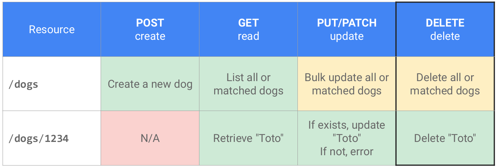

# Step 6: The security object (OpenAPI tutorial)

<figure><figcaption></figcaption></figure>

> Swagger UI  istifadəçilərin real sorğu göndərməsi üçün “Try it out” funksionallığı təqdim edir. API serveri tərəfindən göndərilən sonruğunnn avtorizasiyadan keçməsi üçün spesifikasiyada avtorizaiysa məlumatları olmadıır.he [`security` object](https://github.com/OAI/OpenAPI-Specification/blob/master/versions/3.1.0.md#securityRequirementObject) sorğu göndərən zaman avtorizaiy və ya təhlükəsizlik protokolunu müəyyənləşdirir.

### Which security scheme? 

> Bildiyimi zkimi REST API müxtəlif security yanaşmalarından istifadə edir.&#x20;
>
> Swagger UI supports four authorization schemes:
>
> * API key
> * HTTP
> * OAuth 2.0
> * Open ID Connect
>
> Bu bölmədə biz API Key yanaşmasından istifadə edəəyik. Çünki göstərdiyimiz nümunədə APİ Key dən istifadə edir. Əgər gələcəkdə başqa protokollar olarsa [Security Scheme information](https://github.com/OAI/OpenAPI-Specification/blob/master/versions/3.1.0.md#security-scheme-object) oxuyarsız. Amma bütün metodlar eyni formada qeyd edilir.

### API key authorization

The sample OpenWeatherMap API we’re using in this course uses an API key passed in the URL’s query string (rather than in the header). If you submit a request without the API key in the query string (or without a valid API key), the server denies the request. For details on the OpenWeatherMap’s authorization model, see [How to start](https://openweathermap.org/appid#use).

### Security object

> At the root level of your OpenAPI document, add a `security` object that defines the global method for the API’s security:

```
security:
- app_id: []
```

> All paths will use the `app_id` security method by default unless it’s overridden by a value at the [`path` object level](https://idratherbewriting.com/learnapidoc/pubapis\_openapi\_step4\_paths\_object.html). For example, at the path level, we could overwrite the global security method as follows:

```
/current:
  get:
    ...
    security:
    - some_other_key: []
```

> Then the `weather` path would use the `some_other_key` security method, while all other paths would use the globally declared security, `app_id`.


If you get stuck, see the [sample OpenAPI spec here](https://idratherbewriting.com/learnapidoc/docs/openapi\_spec\_and\_generated\_ref\_docs/openapi\_openweathermap.yml) for the fully working sample. This will help you spot and troubleshoot indentation or other errors.


### Referencing the security scheme in components

> In the [`components` object](https://idratherbewriting.com/learnapidoc/pubapis\_openapi\_step5\_components\_object.html), add a [`securitySchemes` object](https://github.com/OAI/OpenAPI-Specification/blob/master/versions/3.1.0.md#securitySchemeObject) that defines details about the security scheme the API uses:

```
components:
  ...

  securitySchemes:
    app_id:
      type: apiKey
      description: API key to authorize requests.
      name: appid
      in: query
```


Response schemedən sonra əlavə edilməldiir


>
>
> Properties you can use for each item in the `securitySchemes` object include the following:
>
> * `type`: The authorization protocol — `apiKey`, `http`, `oauth2`, or `openIdConnect`.
> * `description`: A description of your security method. In Swagger UI, this description appears in the Authorization modal (see the screenshot below). CommonMark Markdown is allowed.
> * `name`: The name of the header value submitted in the request. Used only for `apiKey` type security.
> * `in`: Specifies where the security key is applied. Options are `query`, `header` or `cookie`. Used only for `apiKey` type security.
> * `scheme`. Used with `http` type authorization.
> * `bearerFormat`. Used with `http` type authorization.
> * [`flows`](https://github.com/OAI/OpenAPI-Specification/blob/master/versions/3.1.0.md#oauthFlowsObject) (object): Used with `oauth2` type authorization.
> * `openIdConnectUrl`: Used with `openIdConnect` type authorization.

### &#x20;View the Appearance in Swagger UI

> In Swagger Editor, if you haven’t already done so, insert the `security` object at the root level:

```
security:
- app_id: []
```

> And insert the `securitySchemes` object into `components` (indented at the same level as `parameters` and `responses`):

```yaml
components:
  parameters:
  ...
  responses:
  ...

  securitySchemes:
    app_id:
      type: apiKey
      description: API key to authorize requests.
      name: appid
      in: query
```

> Then check out the Swagger UI display. You’ll see an “Authorize” button appear.


> When you click Authorize, the `description` and other security details appear:

<figure><figcaption></figcaption></figure>

> After users enter an API key and click **Authorize**, the authorization method is set for as many requests as they want to make. The authorization session expires only when users refresh the page.

\
\
